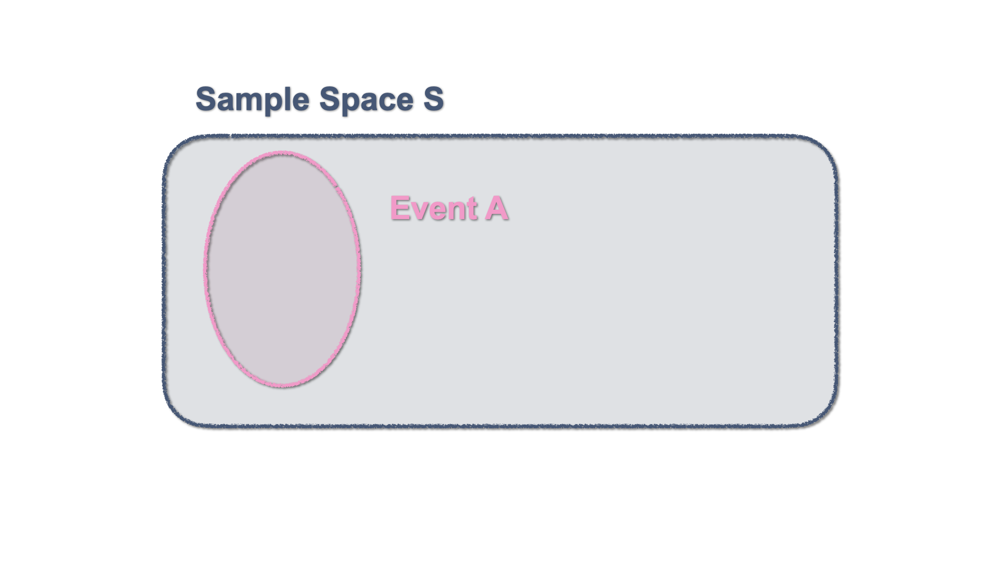

# Elements of Set Theory for Probability {#settheory}
 
## Definitions

In order to develop the Probability theory of this course we are going to need also some elements of set theory. To start our journey, let us introduce some definitions. 

```{definition, randomExperiment, name = "Random Experiment"}

A Random Experiment  is a process that can result in two or more different outcomes with uncertainty as to which will be observed.
```

```{definition, event, name = "Event"}

An Event is an uncertain outcome of a random experiment. 

An event can be: 

- Elementary: it includes only one particular outcome of the experiment
- Composite: it includes more than one elementary outcome in the possible sets of outcomes.
```

```{definition, sampleSpace, name = "Sample Space"}
The **Sample Space** is the complete listing of the elementary events that can occur in a random experiment. We will denote the sample space by $S$.
```

We encounter all these definitions in our everyday life. In particular, when we gather at home to play board games, such as the game of cards, or when we want to "let chance decide" who gets to kick the ball first in a football game... by flipping a coin. 

```{r ,echo = FALSE, fig.cap='Someone is lucky!', fig.align='center'}
  knitr::include_graphics("img/02_set_theory/CardDeck/aces.png")
```

```{example, cardGame, name = "A simple card game"}

When playing with a full deck of cards, we can characterise drawing a card as a random experiment, where we can identify a set of events and the sample space: 
  
Suppose we are to draw **one** card at random from a full deck of 52 playing cards.

The Sample Space $S$ consists of the values of the cards of all colors and suits. 

<div align="center">S = {<span style='color: black'>A&clubs;</span>, <span style='color: black'>2&clubs;</span>, ...,<span style='color: black'>K&clubs;</span>,<span style='color: red'>A&diams;</span>, <span style='color: red'>2&diams;</span>, ... ,<span style='color: red'>K&diams;</span> , <span style='color: red'>A&hearts;</span>, <span style='color: red'>2&hearts;</span>, ... ,<span style='color: red'>K&hearts;</span>, <span style='color: black'>A&spades;</span>, <span style='color: black'>2&spades;</span>, ... ,<span style='color: black'>K&spades;</span>}</div>

Here, we can define events as subsets of the sample space:

- $K$: _drawing a **King**_ 
  
<div align="center">K = {<span style='color: black'>K&clubs;</span>, <span style='color: red'>K&diams;</span>, <span style='color: red'>K&hearts;</span>, <span style='color: black'>K&spades;</span>}</div>

- $H$: Event of drawing a **Heart**
  
<div align="center">H = {<span style='color: red'>A&hearts;</span>, <span style='color: red'>2&hearts;</span>, ... ,<span style='color: red'>K&hearts;</span>}</div>
  
- $J$: drawing a **Jack or higher** 
  
<div align="center">J = {<span style='color: black'>J&clubs;</span>, <span style='color: black'>Q&clubs;</span>,<span style='color: black'>K&clubs;</span>,<span style='color: red'>J&diams;</span>, <span style='color: red'>Q&diams;</span>, <span style='color: red'>K&diams;</span> , <span style='color: red'>J&hearts;</span>, <span style='color: red'>Q&hearts;</span>, <span style='color: red'>K&hearts;</span>, <span style='color: black'>J&spades;</span>, <span style='color: black'>Q&spades;</span>, <span style='color: black'>K&spades;</span>}</div>
  
- $Q$: drawing a **Queen**
    
<div align="center">Q = {<span style='color: black'>Q&clubs;</span>, <span style='color: red'>Q&diams;</span>, <span style='color: red'>Q&hearts;</span>, <span style='color: black'>Q&spades;</span>}</div>

```

```{example, flipCoins, name = "Flipping Coins"}
Flipping a set of two coins can be characterised as another random experiment. In this case, let us denote the outcomes for each coin are $H$ for Head and $T$ for Tail. Hence, the sample space of the experiment "flipping two coins" contains the following four points:

$$S = \{ (HH),(HT),(TH),(TT)  \}.$$
```


```{example, timePhone, name = "Time on your phone"}
Say you are interested in measuring the time of your life spent on your phone. The measure of the time (in hours) can be considered as the outcome of a random experiment, and every measure of the time, an event. 

When you take a measure, you will be counting fractions of the hour spent on your phone (e.g. 20 minutes = 1/3 h). Therefore, the possible outcomes of this experiment are are _durations_ measured in fractions ranging from 0 to infinity. Hence, the sample space consists of all nonnegative real numbers:
$$ S = \{x: 0 \leq x < \infty \}$$
or, equivalently, $S\equiv \mathbb{R}^+$.
```


## Some definitions from set theory

The following definitions from set theory will be useful to deal with events.

```{definition, subsets}
If every element of a set $A$ is also an element of a set $B$, then **$A$ is a \textit{subset} of $B$**. We write this as : $$A \subset B$$ and we read it as **"$A$ is contained in $B$"**
```

```{definition, equality}
Two sets $A$ and $B$ are said to be **equal** if  $$A \subset B \text{ and } B \subset A;$$
```

```{definition, emptySet}
If a set $A$ contains no points, it will be called the **null set**, or **empty set**, and it is typically denoted by $\varnothing$.
```
 

## The Venn diagram

```{r, echo = FALSE, fig.align='center', fig.cap="_The beaverduck_ source: [Tenso Graphics](https://cargocollective.com/tensographics)"}
knitr::include_graphics("img/fun/R9mJR.jpeg")
```

The Venn diagram is an elementary schematic representation of sets and helps displaying their properties. As you might remember from your elementary mathematics classes, a Venn diagram represents a set with a closed figure and it is assumed that the set elements are in the surface contained by the figure. They are very useful to illustrate inclusion and equality as well as more abstract notions. 

```{r, echo = FALSE, fig.align='center', fig.cap="Inclusion and Equality of sets with Venn Diagrams"}
knitr::include_graphics("img/02_set_theory/charts/charts.001.png")
```

### Sample Space and Events

By definition, an event or several events, constitute a subset of the sample space. This can be represented in a Venn Diagram with a figure enclosed within the Sample Space. 

```{r, echo = FALSE, fig.align='center', fig.cap="Venn Diagram - An event within the Sample Space"}

```

### Exclusive and Non-Exclusive Events

Two events are mutually exclusive is they cannot occur jointly. This is represented by two separate enclosed surfaces within the sample space. 

```{r, echo = FALSE, fig.align='center', fig.cap='Venn Diagram - Two mutually exclusive events'}
knitr::include_graphics("img/02_set_theory/charts/charts.003.png")
```


For illustration, consider our simple card game example. The event "drawing a **King**" and "drawing a **Queen**" are mutually exclusive, as they can't happen at the same time. 

<mark>
  chart: Events of King and Queen
</mark>

Events that are not mutually exclusive have a shared area, which in set theory constitutes an **intersection** and gets shown in a Venn diagram by two <mark>colliding</mark> figures. Coming back to our example with the card game, consider the events "drawing a **King**" and "drawing a **Heart**". Here there is intersection, as one can obtain a **King of Hearts**. 
```{r, echo = FALSE, fig.align='center', fig.cap='Venn Diagram - Two Non-mutually exclusive events'}
knitr::include_graphics("img/02_set_theory/charts/charts.004.png")
```

### Union and Intersection of Events

The **union** of the events $A$ and $B$ is the event which occurs when either $A$ or $B$ occurs: $A \cup B$. In a Venn diagram, we can illustrate this by shading the area enclosed by both sets. 

```{r ,echo = FALSE, fig.cap='Venn Diagram - $A\\cup B$', fig.align='center'}
  knitr::include_graphics("img/02_set_theory/charts/charts.005.png")
```

The **intersection** of the events $A$ and $B$ is the event which occurs when both $A$ and $B$ occur: $A \cap B$. In a Venn diagram, we can illustrate this by shading the area shared by both sets. 

```{r ,echo = FALSE, fig.cap='Venn Diagram - $A\\cap B$', fig.align='center'}
  knitr::include_graphics("img/02_set_theory/charts/charts.006.png")
```

### Complement

The **complement** of an event $A$ is the event that occurs when $A$ does not occur: $A^{c}$ (or $\overline{A}$). A Venn diagram illustrates this by shading the area outside the set that defines the event $A$. 

```{r ,echo = FALSE, fig.cap='Venn Diagram - $A^{c}$', fig.align='center'}
  knitr::include_graphics("img/02_set_theory/charts/charts.007.png")
```

Let $S$ be the complete set of all possible events, i.e. the Sample Space. In such case, $A^c$ can be written as: $$A^c = S \setminus A = S-A.$$ and is such that $$A \cup A^c = S.$$

### Some Properties of union and intersection 

Let $A$, $B$, and $D$ be sets. The following laws hold:

- **Commutative laws**: Union and Intersection of sets are _commutative_, i.e. they produce the same outcome irrespective of the order in which the sets are written. 
\begin{eqnarray*}
A \cup B = B \cup A \\
A \cap B = B \cap A
\end{eqnarray*}

- **Associative laws**: Union and Intersection of more than two sets operate irrespective of the order. 
\begin{eqnarray*}
A \cup (B \cup C) = (A \cup C) \cup C \\
A \cap (B \cap C) = (A \cap C) \cap C
\end{eqnarray*}

- **Distributive laws**

  - **The intersection is _distributive_ with respect to the union**, i.e. the intersection between a set ($A$) and the union of two other sets ($B$ and $D$)  is the union of the intersections. 
$$ A \cap (B \cup C) = (A \cap B) \cup (A\cap C)$$
```{r ,echo = FALSE, fig.cap='', fig.align='center'}
  knitr::include_graphics("img/02_set_theory/charts/charts.008.png")
```
  - **The union is _distributive_ with respect to the intersection**, i.e. the union between a set ($A$) and an intersection of two others is the intersection of the unions. 
$$A \cup (B \cap C) = (A\cup C) \cap (A \cup C)$$
```{r ,echo = FALSE, fig.cap='', fig.align='center'}
  knitr::include_graphics("img/02_set_theory/charts/charts.009.png")
```


```{exercise}

Let $A$ and $B$ be two sets. Use Venn diagrams to represent:  

i) $\overline{A\cap B} = (A\cap B)^{c}$
ii) $B-A$

```

## Countable and Uncountable sets

Events can be represented by means of sets and sets can be either **countable** or **uncountable**. 

In mathematics, a **Countable Set** is a set with the same _cardinality_ (number of elements) as some subset of the set of natural numbers $\mathbb{N}= \{0, 1, 2, 3, \dots \}$. 

A countable set can be  **countably finite** or **countably infinite**. Whether finite or infinite, the elements of a countable set can always be counted one at a time and, although the counting may never finish, every element of the set is associated with a  natural number. Roughly speaking one can count the elements of the set using $1,2,3,..$ 

```{example, countableSet, name = "Our deck of cards and Finite Countable Sets"} 
Let's come back to our example with the deck of cards and the event. The following events can be considered countably finite sets as they have a limited and countable number of elements:

- $K \cup H$ = {<span style='color: black'>K&clubs;</span>, <span style='color: red'>K&diams;</span>, <span style='color: red'>K&hearts;</span>, <span style='color: black'>K&spades;</span>, <span style='color: red'>A&hearts;</span>, <span style='color: red'>2&hearts;</span>, ... , <span style='color: red'>Q&hearts;</span>}
- $J \cup H$ = {<span style='color: black'>J&clubs;</span>, <span style='color: black'>Q&clubs;</span>, <span style='color: black'>K&clubs;</span>, <span style='color: red'>J&diams;</span>, <span style='color: red'>Q&diams;</span>, <span style='color: red'>K&diams;</span>, <span style='color: red'>J&hearts;</span>, <span style='color: red'>Q&hearts;</span>, <span style='color: red'>K&hearts;</span>, <span style='color: black'>J&spades;</span>, <span style='color: black'>Q&spades;</span>, <span style='color: black'>K&spades;</span>, <span style='color: red'>A&hearts;</span>, <span style='color: red'>2&hearts;</span>, ... , <span style='color: red'>10&hearts;</span>}
- $H^{c}$ = {<span style='color: black'>A&clubs;</span>, <span style='color: black'>2&clubs;</span>, ...,<span style='color: black'>K&clubs;</span>,<span style='color: red'>A&diams;</span>, <span style='color: red'>2&diams;</span>, ... ,<span style='color: red'>K&diams;</span> ,<span style='color: black'>A&spades;</span>, <span style='color: black'>2&spades;</span>, ... ,<span style='color: black'>K&spades;</span>}
```


<!-- - G. Cantor introduced the term countable set, contrasting sets that are countable with those that are **uncountable** (i.e., nonenumerable or nondenumerable). -->


<!-- %Events can be represented by means of sets. -->


```{exercise, uncountableSet, name = "An illustration of an Uncountable Set"} 


and using the definition of $A$ and $B$ compute:


- $A^c$ 
- $B^c$
- $B^c \cup A$
- $B^c \cup A^c$
- $A \cup B$
- $A \cap B$
- $B \cup A^c$
- $A^c \cup A$
```


<!-- %\begin{figure}[h!] -->
<!-- %\centering                -->
<!-- %\includegraphics[width=0.6\textwidth,height=0.6\textheight]{Example3bis.pdf} -->
<!-- %\end{figure} -->


```{exercise, name = "flipping coins again"}

Let us consider the  experiment where we flip two coins. For each coin we have $H$ for Head and $T$ for Tail. Remember that the sample space contains the following four points  <mark> add reference here </mark>

$$ S = \{ (HH),(HT),(TH),(TT) \}.$$ 

Then, let us consider the events:

- $A= H$ is obtained at least once = $\Big\{ (HH),(HT),(TH) \Big\}$ 
-  $B=$ the second toss yields $T$ =  $\Big\{ (HT),(TT) \Big\}$ 

and using the definitions of $A$ and $B$ compute:

- $A^c$ 
- $B^c$
- $B^c \cup A$
- $A \cup B$
- $A \cap B$
- $B \cup A^c$
```

<!-- %\begin{figure}[h!] -->
<!-- %\centering                -->
<!-- %\includegraphics[width=0.9\textwidth,height=0.5\textheight]{Example4.pdf} -->
<!-- %\end{figure} -->

<!-- and using the definitions of $A$ and $B$ compute: -->
<!-- %\begin{figure}[h!] -->
<!-- %\centering                -->
<!-- %\includegraphics[width=0.8\textwidth,height=0.5\textheight]{Example4bis.pdf} -->
<!-- %\end{figure} -->

<!-- \begin{multicols}{2} -->
<!-- \item $A^c $  -->
<!-- \item $B^c$ -->
<!-- \item $B^c \cup A$ -->

<!-- \item $A \cup B$ -->
<!-- \item $A \cap B$ -->
<!-- \item $B \cup A^c$ -->
<!-- %\item $C^c$ -->
<!-- \end{multicols} -->

<!-- Solution  -->

<!-- and using the definitions of $A$ and $B$ compute: -->
<!-- %\begin{figure}[h!] -->
<!-- %\centering                -->
<!-- %\includegraphics[width=0.8\textwidth,height=0.5\textheight]{Example4bis.pdf} -->
<!-- %\end{figure} -->

<!-- \begin{multicols}{2} -->
<!-- \item $A^c = \{ (TT) \}$  -->
<!-- \item $B^c = \{ (HH), (TH) \}$ -->
<!-- \item $B^c \cup A$ -->

<!-- \item $A \cup B$ -->
<!-- \item $A \cap B$ -->
<!-- \item $B \cup A^c$ -->
<!-- %\item $C^c$ -->

```{proposition, propertiesUnionIntersection}
Let $A$ be a set in $S$ and let $\varnothing$ denote the empty set^[A set is called empty if it contains no elements.]. The following relations hold:


- $A \cap S = A$;
- $A \cup S = S$;
- $A \cap \varnothing = \varnothing$; 
- $A \cup \varnothing = A$;
- $A \cap A^c = \varnothing$;
- $A \cup A^c = S$;
- $A \cap A = A$;
- $A \cup A = A$;
```

```{exercise}
Use Venn Diagrams to illustrate these relationships
```

The identities in the proposition <mark>insert tag</mark> are helpful to define some other relations between sets/events. 

```{example}
Let $A$ and $B$ be two sets in $S$. Then we have:
$$B = (B \cap A) \cup (B \cap A^c).$$

  To check it, we can proceed as follows:

\begin{eqnarray*}
B & = & S \cap B \\
 & = & (A \cup A^c) \cap B  \\
 & = &  (B \cap A) \cup (B \cap A^c). 
\end{eqnarray*}

That concludes the argument.
```


## De Morgan's Laws: 

Operations of union and intersection of sets have interesting interactions with complementarity. These properties are formulated under the name of **De Morgan's laws**. We will formulate them for two sets $A$ and $B$ be two sets in $S$, but you should keep in mind that they can be generalized for an infinite amount of sets. 

### First Law

Let $A$ and $B$ be two sets in $S$, then
\begin{eqnarray}
(A\cap B)^{c} =A^c \cup B^c,
\end{eqnarray}

where: 

- Left hand side: $(A\cap B)^{c}$ represents the **set of all elements that are not both $A$ and $B$**; 
- Right hand side: $A^c \cup B^c$ represents all elements that are not $A$ (namely they are $A^c$) and not $B$ either (namely they are $B^c$) $\Rightarrow$ **set of all elements that are not both $A$ and $B$**.

Put in words, the firs law says that 

> the complement of the intersection between two sets is the union of their complements. 

It is easy to see this graphically using Venn Diagrams

<mark>
  insert graph
</mark>

### Second Law 

Let $A$ and $B$ be two sets in $S$. Then:

\begin{eqnarray}
(A\cup B)^{c} =A^c \cap B^c,
\end{eqnarray}

where: 

- Left hand side: $(A\cup B)^{c}$ represents the **set of all elements that are neither $A$ nor $B$**; 
- Right hand side:$\color{blue}{A^c \cap B^c}$  represents the intersection of all elements that are not $A$ (namely they are $A^c$) and not $B$ either (namely they are $B^c$) $\Rightarrow$ **set of all elements that are neither $A$ nor $B$**.

Put in words, this law says that 

> the complement of the union between two sets is the intersection of their complements. 

Once again, it is easy to see this graphically

<mark>
  insert chart.
</mark>

## De Morgan's Theorem

We can extend these laws to three sets. Let us consider three sets $A_{1}$, $A_{2}$ and $A_{3}$ in $S$. 

(i) **First law**:
$$\overline{\left(A_{1}\cup A_{2}\cup A_{3}\right)} = \overline{A_{1}} \cap \overline{A_{2}} \cap \overline{A_{3}}$$


(ii) **Second Law**:
$$\overline{\left(A_{1}\cap A_{2}\cap A_{3}\right)} = \overline{A_{1}} \cup \overline{A_{2}} \cup \overline{A_{3}}$$

```{exercise}
Show this using diagrams. 
```

More generally, this can be extended to the union of an infinite amount of sets in a theorem that we present without demonstration. Consider the following notation for the union of an infinity of sets :

$$\bigcup_{i \in \mathbb{N}} A_{i} = A_{1} \cup A_{2} \cup A_{3} \cup \dots $$ 

and the intersection of an infinite but countable amount of sets 

$$\bigcap_{i \in \mathbb{N}} A_{i} = A_{1} \cap A_{2} \cap A_{3} \cap \dots$$

```{theorem, deMorgan, name = "De Morgan's Theorem"} 
Let $\mathbb{N}$ be the set of natural number and $\{A_{i}\}$ a collection (indexed by $i \in \mathbb{N}$) of subsets of $S$. Then:

(i) the complement of the union of all $A_i$ is the intersection of their complements.
\begin{eqnarray}
\overline{\bigcup_{i \in \mathbb{N}} A_i} &=& \bigcap_{i \in \mathbb{N}} \overline{A}_i;
\end{eqnarray}

(ii) the complement of the intersection of all $A_i$ is the union of their complements. 
\begin{eqnarray}
\overline{\bigcap_{i \in \mathbb{N}} A_i} &=& \bigcup_{i \in \mathbb{N}} \overline{A}_i.
\end{eqnarray}
```


<!-- % -->
<!-- %\frametitle{Back to the events} -->
<!-- % -->
<!-- % -->
<!-- %The sample space of an experiment is denoted by $S$ and it is the complete listing of the elementary events (which are representable by means of  -->
<!-- %sets) associated to a random experiment.  -->
<!-- %```{example} [Countable] -->
<!-- %\begin{figure}[h!] -->
<!-- %\centering                -->
<!-- %\includegraphics[width=0.8\textwidth,height=0.6\textheight]{Example11.pdf} -->
<!-- %\end{figure} -->
<!-- %``` -->
<!-- %  -->
<!-- % -->
<!-- % -->

## Back to the events

When assessing any experiment with an uncertain outcome the, **primary interest** is not necessarily in the events themselves, as they may or may not happen) but in the _probability that an event does or does not happen_.

Intuitively, the probability of an event is a **value** associated with the event:
$$\text{event} \rightarrow \text{pr(event)}$$
and it is such that:

1. the probability is positive or more generally non-negative (it can be zero);
1. the $\text{pr}(S)=1$, where $S$ is the sample space and $\text{pr}(\varnothing)=0$;
1. the probability of two (or more) mutually exclusive events is the sum of the probabilities of each event.

$$P(\{1\})=P(\{2\})=...=P(\{N\})$$
or equivalently $P(\{i\})= 1/N$, for $i=1,2,...,N$. 

Now, if we define a composite event $A$, there exist $N_A$ realizations having the same likelihood (namely, the have the same probability) in the event $A$, so  

$$\boxed{P(A)=\frac{N_A}{N}=\frac{\mbox{# of favorable outcomes}}{\mbox{total # of outcomes}}=\frac{\mbox{# of outcomes in $A$}}{\mbox{# of outcomes in $S$}}}$$

where the '$\#$' stands for "number".

```{example}

We roll a fair die and we define the event $$A=\text{the outcome is an even number}=\{2,4,6\}.$$ 
What is the probability of $A$?


First, we identify the sample space as 
$$S=\{1,2,3,4,5,6\}.$$ 
  
Then, we have that 

$$P(A)=\frac{N_A}{N} = \frac{\mbox{3 favorable outcomes}}{\mbox{6 total outcomes}} = \frac{1}{2}. $$
```

<!-- %= \text{pr}(\{1\})+\text{pr}(\{2\})+\text{pr}(\{3\}) -->

<!-- # since the die is fair, each outcome is equally -->
<!-- # %likely, so -->
<!-- # %\begin{eqnarray} -->
<!-- # %\text{pr}(\{1\})=\text{pr}(\{2\})=...=\text{pr}(\{6\})=\frac{1}{6}. \nonumber -->
<!-- # %\end{eqnarray} -->
<!-- # %Thus, we conclude that -->


Building on the intuition gained in the last example (see boxed formula), we state a first **informal** definition 
of probability. Specifically, one way of defining the probability of an event is in terms of **relative frequency**.

```{definition, informalProbability, name = "Informal definition of probability"}
Suppose that an experiment, whose sample space is $S$, is repeatedly performed under exactly the same conditions. For each event, say $A$, of the sample space, we define $n(A)$ to be the number of times in the first $n$ repetitions of the experiment that the event $A$ occurs. Then, $P(A)$, namely the probability of the event $A$, is defined as:
$$
P(A)=\lim_{n \to \infty} \frac{n(A)}{n},
$$

that is $P(A)$ is defined as the limiting proportion/frequency of time that $A$ occurs: it is the limit of relative frequency of $A$.
```


```{example}
# [Tossing a well-balanced coin]
In tossing a well-balanced coin, there are 2 mutually exclusive equiprobrable outcomes: "Heads" $H$ and "Tails" $T$. Let $A$ be the event of $H$. Since the coin is fair, we have $P(A)=1/2$. To confirm this intuition/conjecture we can toss the coin a large number of times (each under identical conditions) and count the times we spot $H$. 

Let $n$ be the **total number of repetitions** while $n(A)$ is the **number of times in which we observe $A$**. Then, the relative frequency:
$$\lim_{n \to \infty} \frac{n(A)}{n},$$ 
_converges_ to $P(A)$. So,
$$P(A) \sim \frac{n(A)}{n}, \quad \text{for large $n$}.$$
```


```{r, echo = FALSE}

```

<mark>
  This could be transformed into a shiny app!
</mark>

Clearly, $$0 \leq n(A) \leq n, \quad \text{so} \quad  0 \leq P(A) \leq 1.$$ 
Thus, we say that _the probability is a **set function** (it is defined on sets) and **it associates to each set/event a number between zero and one**_. 

```{remark}
One can provide a more rigorous definition of probability, as a **real-valued function** which defines a **mapping between sets/events and the interval $[0,1]$**. 

$$P : A \subseteq \mathbb{R} \longrightarrow [0,1]$$

However, to provide this formal definition we need to introduce the concept of **sigma-algebra** (which represents the **domain** of the probability), a concept that narrowly escapes the frame of our course. We will proceed without presenting it, with the very unfortunate cost of losing the mathematical rigour in the following sections. 
```

<!-- %In this way, we define the domain of the probability. Then,  -->
To express the probability,  we need to impose some additional conditions, that we are going to call **axioms**.

We here briefly state the ideas, then we will formalize them:

(i) When we define the probability we would want the have a domain such that it includes the 
sample space $S$ and $P(S)=1$. 

(ii)  Moreover, for the sake of completeness, if $A$ is an event and we can talk about the probability that $A$ happens, then it is 
suitable for us that $A^c$ is also an event, so that we can talk about the probability that $A$ does not happen.
(iii) Similarly, if 
$A_1$ and $A_2$ are two events (so we can say something about their probability of happening), so we should be able to say something about the probability of the event $A_1 \cup A_2$.  


## Some references

The interested Student can find some additional info in the books by [@rozanov2013probability] and [@hogg2019introduction]. 

<!-- You can write citations, too. For example, we are using the **bookdown** package [@R-bookdown] in this sample book, which was built on top of R Markdown and **knitr** [@xie2015]. -->

<!-- % -->
<!-- % -->
<!-- % -->
<!-- %\frametitle{Back to the events} -->
<!-- % -->
<!-- %%Beyond the mathematical formalism, the interpretation of $\mathcal{B}$ goes like that: -->
<!-- %%\begin{interpretation} -->
<!-- %We said earlier that we are not interested in the events per se mainly because our focus is on the \textbf{probability} that an event happens.  -->
<!-- %As we said, the \textbf{probability is a function}. Now,  any function is a rule (law, formula, recipe) that associates each point in one set of points (the  -->
<!-- %domain) with one and only one point in another set of points (range). \\   -->
<!-- % -->
<!-- % -->
<!-- %(i) When we define the probability we would want the have a domain (namely $\mathcal{B}$) such that it includes the  -->
<!-- %sample space $S$. \\ \vspace{0.1cm} -->
<!-- %(ii)  Moreover, for the sake of completeness, if $A$ is an event and we can talk about the probability that $A$ happens, then it is  -->
<!-- %suitable for us that $A^c$ is also an event in $\mathcal{B}$ so that we can talk about the probability that $A$ does not happen. \\ \vspace{0.1cm}  -->
<!-- %(iii) Similarly, if  -->
<!-- %$A_1$ and $A_2$ are two events (so we can say something about their probability of happening), so should $A_1 \cup A_2$ be an event too.   -->
<!-- %%\end{interpretation} -->
<!-- % -->
<!-- % -->
<!-- % -->


