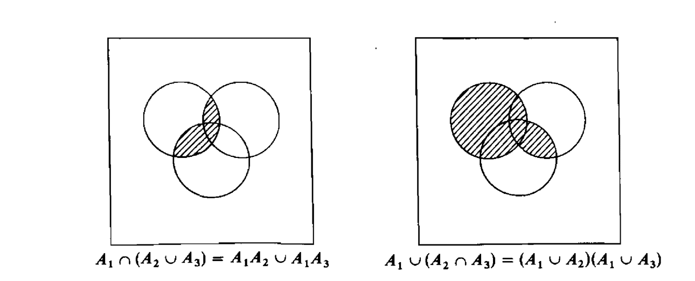

# Elements of Set Theory for Probability {#settheory}
 
## Definitions

In order to develop the Probability theory of this course we are going to need also some elements of set theory. 

To start our journey, let us introduce some definitions in Probability. 

```{definition, randomExperiment}

A **random experiment**  is a process that can result in two or more different outcomes with uncertainty as to which will be observed.
```

```{definition, event}

An **event** is an uncertain outcome of a random experiment. 

An event can be: 

- Elementary: it includes only one particular outcome of the experiment
- Composite: it includes more than one elementary outcome in the possible sets of outcomes.
```


```{definition, sampleSpace}
The **sample space** is the complete listing of the elementary events that can occur in a random experiment. We will denote the sample space by $S$.
```

```{example, cardGame, name = "A simple card game"}

When playing with a full deck of cards, we can characterise drawing a particular card as a random experiment, where we can identify a set of events and the sample space: 


```


```{example, flipCoins, name = "Flipping Coins"}
Flipping a set of two coins can be characterised as another random experiment. In this case, let us denote the outcomes for each coin are $H$ for Head and $T$ for Tail. Hence, the sample space of the experiment "flipping two coins" contains the following four points:

$$S = \{ (HH),(HT),(TH),(TT)  \}.$$
```


```{example, timePhone, name = "Time on your phone"}
Say you are interested in measuring the time of your life spent on your phone. The measure of the time (in hours) can be considered as the outcome of a random experiment, and every observation an event. 

Hence, the sample space consists of all nonnegative real  numbers:
$$ S = \{x: 0 \leq x < \infty \}$$
or, equivalently, $S\equiv \mathbb{R}^+$.
```


## Some definitions from set theory

The following definitions from set theory will be useful to deal with events.

```{definition, subsets}
If every element of a set $A$ is also an element of a set $B$, then **$A$ is a \textit{subset} of $B$**. We write this as : $$A \subset B$$ and we read it as **"$A$ is contained in $B$"**
```

```{definition, equality}
Two sets $A$ and $B$ are said to be **equal** if  $$A \subset B \text{ and } B \subset A;$$
```

```{definition, emptySet}
If a set $A$ contains no points, it will be called the **null set**, or **empty set**, and it is typically denoted by $\varnothing$.
```
 

## The Venn diagram

```{r, echo = FALSE, fig.align='center', fig.cap="source: [Tenso Graphics](https://cargocollective.com/tensographics)"}
knitr::include_graphics("img/fun/R9mJR.jpeg")
```


The Venn diagram is an elementary schematic representation of sets and helps displaying their properties. In this section we will use it to illustrate some of the elements of probability theory that we have previously mentioned and defined. 

- <mark>A generic Venn Diagram</mark>

### Sample Space and Events

For instance, an event, or a series of events, can be represented as an enclosed figure within the Sample space.


```{r, echo = FALSE, fig.align='center', fig.cap="source: [Tenso Graphics](https://cargocollective.com/tensographics)"}

```

### Exclusive and Non-Exclusive Events

Two events are mutually exclusive is they cannot occur jointly. This is represented by two separate enclosed surfaces within the sample space. 

```{r, echo = FALSE, fig.align='center', fig.cap="source: [Tenso Graphics](https://cargocollective.com/tensographics)"}

```

<mark>
  Events of King and Queen
</mark>

Events that are not mutually exclusive have a shared area, which in set theory constitutes an **intersection** and gets shown in a Venn diagram by two <mark>colliding</mark> figures. 


<mark>
  Example : Events of King and Heart.
</mark>

### Union and Intersection of Events

- The union of the events $A$ and $B$ is the event which occurs when either $A$ or $B$ occurs: $A \cup B$ 

\def\firstcircle{(0,0) circle (1.5cm)}
\def\secondcircle{(45:2cm) circle (1.5cm)}
\begin{tikzpicture}
    \begin{scope}[shift={(6cm,5cm)}, fill opacity=0.65]
        \fill[blue!20] \firstcircle;
        \fill[blue!20] \secondcircle;
        \draw \firstcircle node[below] {$A$};
        \draw \secondcircle node [above] {$B$};
<!-- %        \draw node [above] {$A \cup B$} -->
    \end{scope}
\end{tikzpicture}


- The intersection of the events $A$ and $B$ is the event which occurs when both $A$ and $B$ occur: $A \cap B$

\def\firstcircle{(0,0) circle (1.5cm)}
\def\secondcircle{(45:2cm) circle (1.5cm)}
\begin{tikzpicture}
    \begin{scope}[shift={(6cm,5cm)}, fill opacity=0.65]
    \draw \firstcircle node[below] {$A$};
    \draw \secondcircle node [above] {$B$};
 
      \clip \firstcircle;
      \fill[blue!20] \secondcircle;
    \end{scope}
\end{tikzpicture}

### Complement

The complement of an event $A$ is the event which occurs when $A$ does not occur: $A^{c}$ (or $\overline{A}$)

```{r, echo = FALSE, fig.align='center', fig.cap="source: [Tenso Graphics](https://cargocollective.com/tensographics)"}

```

Let $S$ be the complete set of all possible events. Then, $A^c$ is such that $A \cup A^c = S$, or equivalently $A^c = S \setminus A = S-A$.

### Some laws of 

Let $A$, $B$, and $D$ be sets. The following laws hold:

- **Commutative laws**: 
\begin{eqnarray*}
A \cup B = B \cup A \\
A \cap B = B \cap A
\end{eqnarray*}

<mark>
  insert animation 
</mark>

- **Associative laws**: 
\begin{eqnarray*}
A \cup (B \cup D) = (A \cup B) \cup D \\
A \cap (B \cap D) = (A \cap B) \cap D
\end{eqnarray*}

<mark>
  insert animation 
</mark>

- **Distributive laws**: 
\begin{eqnarray*}
A \cap (B \cup D) = (A \cap B) \cup (A\cap D)\\
A \cup (B \cap D) = (A\cup B) \cap (A \cup D)
\end{eqnarray*}

<mark>
  insert animation 
</mark>

We can use Venn Diagrams to illustrate these laws. Consider 

... for instance, let $A_1, A_2, A_3$ be in $S$ and let us introduce the shorthand notation: 
$$A_1 A_2 = A_1 \cap A_2  \quad \text{and} \quad A_1 A_3 = A_1 \cap A_3$$ 



```{exercise}
\def\firstcircle{(3,0) circle (1.5cm)}
\def\secondcircle{(0:5cm) circle (1.5cm)}

\colorlet{circle edge}{blue!50}
\colorlet{circle area}{blue!20}

\tikzset{filled/.style={fill=circle area, draw=circle edge, thick},
    outline/.style={draw=circle edge, thick}}

%Set A or B but not (A and B) also known a A xor B
\hspace{1cm} (i) 
\begin{tikzpicture}\centering  
    \draw[filled, even odd rule] \firstcircle node {$A$}
                                 \secondcircle node{$B$};
    \node[anchor=south] at (current bounding box.north) {$\overline{A \cap B}$};
\end{tikzpicture}

\hspace{5cm} (ii)
% Set B but not A
\begin{tikzpicture}
    \begin{scope}
        \clip \secondcircle;
        \draw[filled, even odd rule] \firstcircle
                                     \secondcircle node {$B$};
    \end{scope}
    \draw[outline] \firstcircle node {$A$}
                   \secondcircle;
    \node[anchor=south] at (current bounding box.north) {$B - A$};
\end{tikzpicture}
```

## Countable and Uncountable sets

Events can be represented by means of sets and sets can be either **countable** or **uncountable**. 

In mathematics, a **countable set** is a set with the same cardinality (number of elements) as some subset of the set of natural numbers ($\mathbb{N}$). 

- _A countable set is either a finite set or a countably infinite set._
- Whether finite or infinite, the elements of a countable set can always be counted one at a time and, although the counting may never finish, every element of the set is associated with a  natural number
    - roughly speaking one can count the elements of the set using $1,2,3,..$ 
    
- G. Cantor introduced the term countable set, contrasting sets that are countable with those that are **uncountable} (i.e., nonenumerable or nondenumerable).

 
```{example, countableSet, name = "An illustration of a Countable Set"} 


```

<!-- %Events can be represented by means of sets. -->


```{exercise, uncountableSet, name = "An illustration of an Uncountable Set"} 


and using the definition of $A$ and $B$ compute:


- $A^c$ 
- $B^c$
- $B^c \cup A$
- $B^c \cup A^c$
- $A \cup B$
- $A \cap B$
- $B \cup A^c$
- $A^c \cup A$
```


<!-- %\begin{figure}[h!] -->
<!-- %\centering                -->
<!-- %\includegraphics[width=0.6\textwidth,height=0.6\textheight]{Example3bis.pdf} -->
<!-- %\end{figure} -->


```{exercise, name = "flipping coins again"}

Let us consider the  experiment where we flip two coins. For each coin we have $H$ for Head and $T$ for Tail. Remember that the sample space contains the following four points  <mark> add reference here </mark>

$$ S = \{ (HH),(HT),(TH),(TT) \}.$$ 

Then, let us consider the events:

- $A= H$ is obtained at least once = $\Big\{ (HH),(HT),(TH) \Big\}$ 
-  $B=$ the second toss yields $T$ =  $\Big\{ (HT),(TT) \Big\}$ 

and using the definitions of $A$ and $B$ compute:

- $A^c$ 
- $B^c$
- $B^c \cup A$
- $A \cup B$
- $A \cap B$
- $B \cup A^c$
```

<!-- %\begin{figure}[h!] -->
<!-- %\centering                -->
<!-- %\includegraphics[width=0.9\textwidth,height=0.5\textheight]{Example4.pdf} -->
<!-- %\end{figure} -->

<!-- and using the definitions of $A$ and $B$ compute: -->
<!-- %\begin{figure}[h!] -->
<!-- %\centering                -->
<!-- %\includegraphics[width=0.8\textwidth,height=0.5\textheight]{Example4bis.pdf} -->
<!-- %\end{figure} -->

<!-- \begin{multicols}{2} -->
<!-- \item $A^c $  -->
<!-- \item $B^c$ -->
<!-- \item $B^c \cup A$ -->

<!-- \item $A \cup B$ -->
<!-- \item $A \cap B$ -->
<!-- \item $B \cup A^c$ -->
<!-- %\item $C^c$ -->
<!-- \end{multicols} -->

<!-- Solution  -->

<!-- and using the definitions of $A$ and $B$ compute: -->
<!-- %\begin{figure}[h!] -->
<!-- %\centering                -->
<!-- %\includegraphics[width=0.8\textwidth,height=0.5\textheight]{Example4bis.pdf} -->
<!-- %\end{figure} -->

<!-- \begin{multicols}{2} -->
<!-- \item $A^c = \{ (TT) \}$  -->
<!-- \item $B^c = \{ (HH), (TH) \}$ -->
<!-- \item $B^c \cup A$ -->

<!-- \item $A \cup B$ -->
<!-- \item $A \cap B$ -->
<!-- \item $B \cup A^c$ -->
<!-- %\item $C^c$ -->

```{proposition}
Let $A$ be a set in $S$ and let $\varnothing$ denote the empty set^[A set is called empty if it contains no elements.]. The following relations hold:


- $A \cap S = A$;
- $A \cup S = S$;
- $A \cap \varnothing = \varnothing$; 
- $A \cup \varnothing = A$;
- $A \cap A^c = \varnothing$;
- $A \cup A^c = S$;
- $A \cap A = A$;
- $A \cup A = A$;
```

```{exercise}
Use Venn Diagrams to illustarte these relationships
```

The above relations are helpful to define some other relations between sets/events. 

```{example}
Let $A$ and $B$ be two sets in $S$. Then we have:
$$B = (B \cap A) \cup (B \cap A^c).$$

  To check it, we can proceed as follows:

\begin{eqnarray*}
B & = & S \cap B \\
 & = & (A \cup A^c) \cap B  \\
 & = &  (B \cap A) \cup (B \cap A^c). 
\end{eqnarray*}

That concludes the argument.
```


## De Morgan's Laws: 

### First Law

Let $A$ and $B$ be two sets in $S$. Then:
\begin{eqnarray}
(A\cap B)^{c} =A^c \cup B^c,
\end{eqnarray}

where: 

- Left hand side: $(A\cap B)^{c}$ represents the **set of all elements that are not both $A$ and $B$**; 
- Right hand side: $A^c \cup B^c$ represents all elements that are not $A$ (namely they are $A^c$) and not $B$ either (namely they are $B^c$) $\Rightarrow$ **set of all elements that are not both $A$ and $B$**.

### Second Law 

Let $A$ and $B$ be two sets in $S$. Then:

\begin{eqnarray}
(A\cup B)^{c} =A^c \cap B^c,  \nn
\end{eqnarray}

where: 

- Left hand side: $(A\cup B)^{c}$ represents the **set of all elements that are neither $A$ nor $B$**; 
- Right hand side:$\color{blue}{A^c \cap B^c}$  represents the intersection of all elements that are not $A$ (namely they are $A^c$) and not $B$ either (namely they are $B^c$) $\Rightarrow$ **set of all elements that are neither $A$ nor $B$**.

## De Morgan's Theorem

More generally, we can consider unions and intersections of many (countable) sets. So, we state the general results:

```{theorem, deMorgan, name = "De Morgan's Theorem"} 
Let $\mathbb{N}$ be the set of natural number and $\{A_{i}\}$ a collection (indexed by $i \in \mathbb{N}$) of subsets of $S$. Then:

(i)
\begin{eqnarray}
\overline{\bigcup_{i \in \mathbb{N}} A_i} &=& \bigcap_{i \in \mathbb{N}} \overline{A}_i;
\end{eqnarray}

(ii) 
\begin{eqnarray}
\overline{\bigcap_{i \in \mathbb{N}} A_i} &=& \bigcup_{i \in \mathbb{N}} \overline{A}_i.
\end{eqnarray}
```


<!-- % -->
<!-- %\frametitle{Back to the events} -->
<!-- % -->
<!-- % -->
<!-- %The sample space of an experiment is denoted by $S$ and it is the complete listing of the elementary events (which are representable by means of  -->
<!-- %sets) associated to a random experiment.  -->
<!-- %```{example} [Countable] -->
<!-- %\begin{figure}[h!] -->
<!-- %\centering                -->
<!-- %\includegraphics[width=0.8\textwidth,height=0.6\textheight]{Example11.pdf} -->
<!-- %\end{figure} -->
<!-- %``` -->
<!-- %  -->
<!-- % -->
<!-- % -->

## Back to the events

**Our primary interest** will be not in events per se, but it will be in the _probability that an event does or does not happen_.


Intuitively,  the probability of an event is the number  associated to the event:
$$\text{event} \rightarrow \text{pr(event)}$$
such that:

1. the probability is positive or more generally non-negative (it can be zero);
1. the $\text{pr}(S)=1$ (remember, $S$ is the sample space) and $\text{pr}(\varnothing)=0$;
1. the probability of two (or more) mutually exclusive events is the sum of the probabilities of each event.

In many experiments, it is natural to assume that all outcomes in the sample space ($S$) are equally likely to occur. That is, consider an experiment whose sample space is a finite set, say, $S=\{1,2,3,...N\}$. Then, it is often natural to assume that
$$P(\{1\})=P(\{2\})=...=P(\{N\})$$
or equivalently $P(\{i\})= 1/N$, for $i=1,2,...,N$. 

Now, if we define a composite event $A$, there exist $N_A$ realizations having the same likelihood (namely, the have the same probability) in the event $A$, so  

$$\boxed{P(A)=\frac{N_A}{N}=\frac{\mbox{# of favorable outcomes}}{\mbox{total # of outcomes}}=\frac{\mbox{# of outcomes in $A$}}{\mbox{# of outcomes in $S$}}}$$

where the notation $# $ means "number".

```{example}

We roll a fair die and we define the event $$A=\text{the outcome is an even number}=\{2,4,6\}.$$ 
What is the probability of $A$?


First, we identify the sample space as 
$$S=\{1,2,3,4,5,6\}.$$ 
  
Then, we have that 

$$P(A)=\frac{N_A}{N} = \frac{\mbox{3 favorable outcomes}}{\mbox{6 total outcomes}} = \frac{1}{2}. $$
```

<!-- %= \text{pr}(\{1\})+\text{pr}(\{2\})+\text{pr}(\{3\}) -->

<!-- # since the die is fair, each outcome is equally -->
<!-- # %likely, so -->
<!-- # %\begin{eqnarray} -->
<!-- # %\text{pr}(\{1\})=\text{pr}(\{2\})=...=\text{pr}(\{6\})=\frac{1}{6}. \nonumber -->
<!-- # %\end{eqnarray} -->
<!-- # %Thus, we conclude that -->


Building on the intuition gained in the last example (see boxed formula), we state a first \color{blue} informal  definition 
of probability. Specifically, one way of defining the probability of an event is in terms of \textit{relative frequency}.

```{definition}
# [Informal]
Suppose that an experiment, whose sample space is $S$, is repeatedly performed under exactly the same conditions. For each event, say $A$, of the sample space, we define $n(A)$ to be the number of times in the first $n$ repetitions of the experiment that the event $A$ occurs. Then, $P(A)$, namely the probability of the event $A$, is defined as:
$$
P(A)=\lim_{n \to \infty} \frac{n(A)}{n},
$$

that is $P(A)$ is defined as the limiting proportion/frequency of time that $A$ occurs: it is the limit of relative frequency of $A$.
```


```{example}
# [Tossing a well-balanced coin]
In tossing a well-balanced coin, there are 2 mutually exclusive equiprobrable outcomes: H and T. Let $A$
be the event of head (H). Since the coin is fair, we have $P(A)=1/2$. To confirm this intuition/conjecture we can toss the coin a large number of times (each under identical conditions) and count the times we have H. Let $n$ be the \textbf{total \# of repetitions} while $n(A)$ is the \textbf{\# of times in which we observe $A$}. Then, the relative frequency:
$$
\lim_{n \to \infty} \frac{n(A)}{n},
$$ 
converges to $P(A)$. So,
$$
P(A) \sim \frac{n(A)}{n}, \quad \text{for large $n$}.
$$

\begin{figure}[h!]
\centering               
\includegraphics[width=0.7\textwidth,height=0.7\textheight]{roz.pdf}
\end{figure}
```

<!-- % -->
<!-- % -->
<!-- %\frametitle{Back to the events} -->
<!-- % -->
<!-- %Clearly,  -->
<!-- %$$0 \leq n(A) \leq n, \quad \text{so} \quad  0 \leq P(A) \leq 1.$$  -->
<!-- %Thus, we say that  \color{blue} the probability is a set function (it is defined on sets) and it associates to each set/event a number between zero and one.  -->
<!-- %  -->
<!-- % -->
<!-- %\vspace{0.5cm} -->
<!-- % -->
<!-- %Now, let us recall that a real-valued function is a mapping from $D_f$ to $\mathbb{R}$ and we write: -->
<!-- %$$ -->
<!-- %f \quad : \quad D_f \to \mathbb{R},   -->
<!-- %$$ -->
<!-- %where $D_f$ is the domain of $f$ and $\mathbb{R}$ is the range. \\ -->
<!-- % -->
<!-- %\vspace{0.5cm} -->
<!-- % -->
<!-- %\color{red} \textbf{Q.}  In the case of the (function) probability, we already know that the range is $[0,1]$, but what about $D_f$?  -->
<!-- % -->
<!-- % -->
<!-- % -->
<!-- % -->
<!-- % -->
<!-- % -->
<!-- %\frametitle{Back to the events} -->
<!-- % -->
<!-- %To define $D_f$ for -->
<!-- %the probability, we have to rely on the set theory --- indeed $D_f$ has to be related to sets/events. To this end, -->
<!-- %%\vspace{0.3cm} -->
<!-- %```{definition} [$\sigma$-algebra] -->
<!-- %The $\sigma$-algebra $\mathcal{B}$ generated by the sample space $S$ is defined as the collection of all subsets of $S$ satisfying: -->
<!-- %\begin{enumerate} -->
<!-- %\item[(i)] $S \in \mathcal{B}$; -->
<!-- %\item[(ii)] if $A \in \mathcal{B}$, then $A^c \in \mathcal{B}$; -->
<!-- %\item[(iii)] if $A_1 \in \mathcal{B}$ and $A_2 \in \mathcal{B}$, then $A_1 \cup A_2 \in \mathcal{B}$. More generally, for a collection of events $\{A_i\}$, with $i \in \mathbb{N}$, we have -->
<!-- %\begin{eqnarray} -->
<!-- %A = \bigcup_{i \in \mathbb{N}} A_i \text{ \ is such that \ }  A \in \mathcal{B}. \nn -->
<!-- %\end{eqnarray} -->
<!-- % -->
<!-- %\end{enumerate} -->
<!-- %``` -->
<!-- % -->
<!-- %Thus,  we will have that  -->
<!-- %$$ -->
<!-- %\boxed{P \quad : \quad \mathcal{B} \to [0,1]. }  -->
<!-- %$$ -->
<!-- % -->
<!-- % -->
<!-- % -->
<!-- % -->
<!-- % -->
<!-- %\frametitle{Back to the events} -->
<!-- % -->
<!-- %%In this way, we define the domain of the probability. Then,  -->
<!-- %To provide a formal definition of probability, we will make use of $\mathcal{B}$ and we will need to impose some additional conditions (that we are going to call \textit{axioms}). \\ -->
<!-- %\vspace{0.5cm} -->
<!-- %We here briefly state the ideas, then we will formalize them: \\  -->
<!-- %\vspace{0.3cm} -->
<!-- %(i) When we define the probability we would want the have a domain (namely $\mathcal{B}$) such that it includes the  -->
<!-- %sample space $S$, and $P(S)=1$. \\ \vspace{0.1cm} -->
<!-- %(ii)  Moreover, for the sake of completeness, if $A$ is an event and we can talk about the probability that $A$ happens, then it is  -->
<!-- %suitable for us that $A^c$ is also an event in $\mathcal{B}$, so that we can talk about the probability that $A$ does not happen. \\ \vspace{0.1cm}  -->
<!-- %(iii) Similarly, if  -->
<!-- %$A_1$ and $A_2$ are two events (so we can say something about their probability of happening), so we should be able to say something about the probability of the event $A_1 \cup A_2$.   -->
<!-- % -->
<!-- % -->
<!-- % -->

Clearly, 
$$0 \leq n(A) \leq n, \quad \text{so} \quad  0 \leq P(A) \leq 1.$$ 
Thus, we say that  \color{blue} the probability is a set function (it is defined on sets) and it associates to each set/event a number between zero and one. 
 


```{remark}
One can provide a more rigorous definition of probability, as a real-valued function which defines a mapping between sets/events and the interval $[0,1]$. To achieve this goal one needs the concept of sigma-algebra (which represents the domain of the probability), but we do not pursue with that---at the cost of losing the mathematical rigour of the next slide!!
```

<!-- %In this way, we define the domain of the probability. Then,  -->
To express the probability,  we need to impose some additional conditions, that we are going to call **axioms**.

We here briefly state the ideas, then we will formalize them:

(i) When we define the probability we would want the have a domain such that it includes the 
sample space $S$ and $P(S)=1$. 

(ii)  Moreover, for the sake of completeness, if $A$ is an event and we can talk about the probability that $A$ happens, then it is 
suitable for us that $A^c$ is also an event, so that we can talk about the probability that $A$ does not happen.
(iii) Similarly, if 
$A_1$ and $A_2$ are two events (so we can say something about their probability of happening), so we should be able to say something about the probability of the event $A_1 \cup A_2$.  


## Some references

The interested Student can find some additional info in the books by [@rozanov2013probability] and [@hogg2019introduction]. 

<!-- You can write citations, too. For example, we are using the **bookdown** package [@R-bookdown] in this sample book, which was built on top of R Markdown and **knitr** [@xie2015]. -->

<!-- % -->
<!-- % -->
<!-- % -->
<!-- %\frametitle{Back to the events} -->
<!-- % -->
<!-- %%Beyond the mathematical formalism, the interpretation of $\mathcal{B}$ goes like that: -->
<!-- %%\begin{interpretation} -->
<!-- %We said earlier that we are not interested in the events per se mainly because our focus is on the \textbf{probability} that an event happens.  -->
<!-- %As we said, the \textbf{probability is a function}. Now,  any function is a rule (law, formula, recipe) that associates each point in one set of points (the  -->
<!-- %domain) with one and only one point in another set of points (range). \\   -->
<!-- % -->
<!-- % -->
<!-- %(i) When we define the probability we would want the have a domain (namely $\mathcal{B}$) such that it includes the  -->
<!-- %sample space $S$. \\ \vspace{0.1cm} -->
<!-- %(ii)  Moreover, for the sake of completeness, if $A$ is an event and we can talk about the probability that $A$ happens, then it is  -->
<!-- %suitable for us that $A^c$ is also an event in $\mathcal{B}$ so that we can talk about the probability that $A$ does not happen. \\ \vspace{0.1cm}  -->
<!-- %(iii) Similarly, if  -->
<!-- %$A_1$ and $A_2$ are two events (so we can say something about their probability of happening), so should $A_1 \cup A_2$ be an event too.   -->
<!-- %%\end{interpretation} -->
<!-- % -->
<!-- % -->
<!-- % -->


