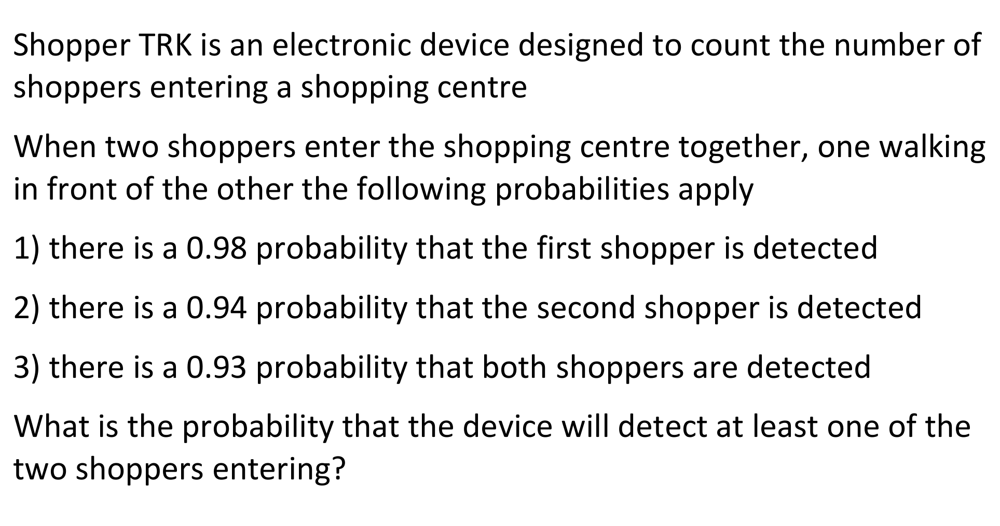
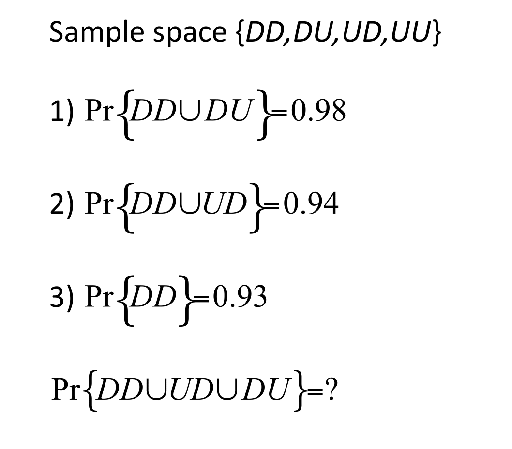
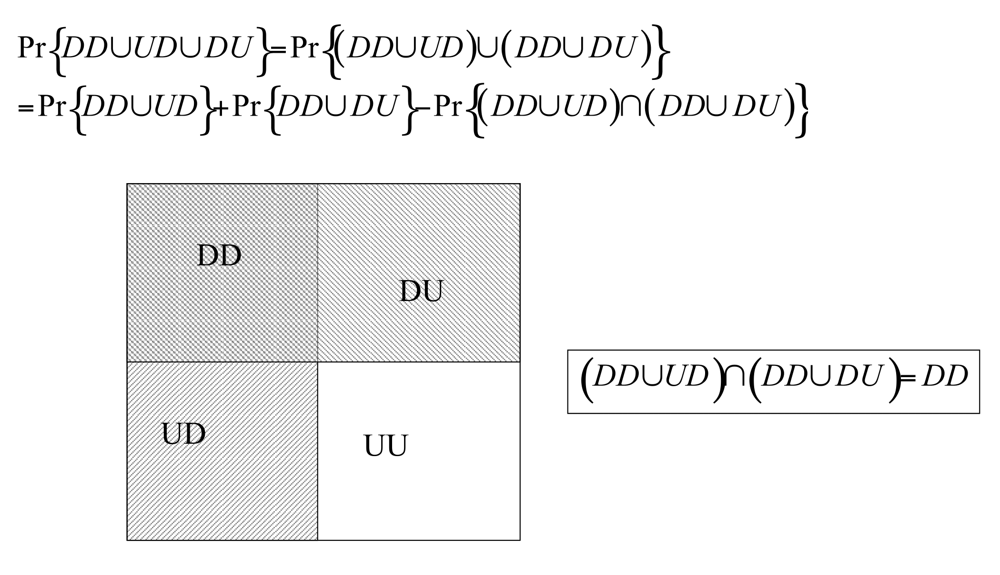
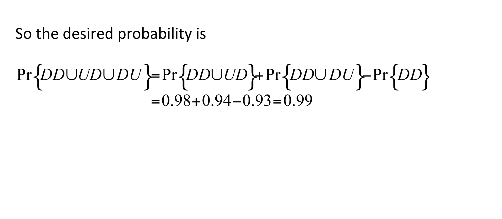
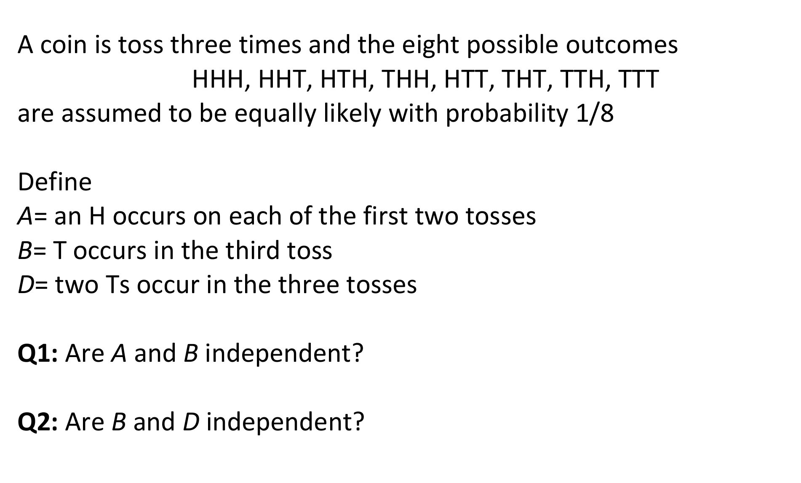
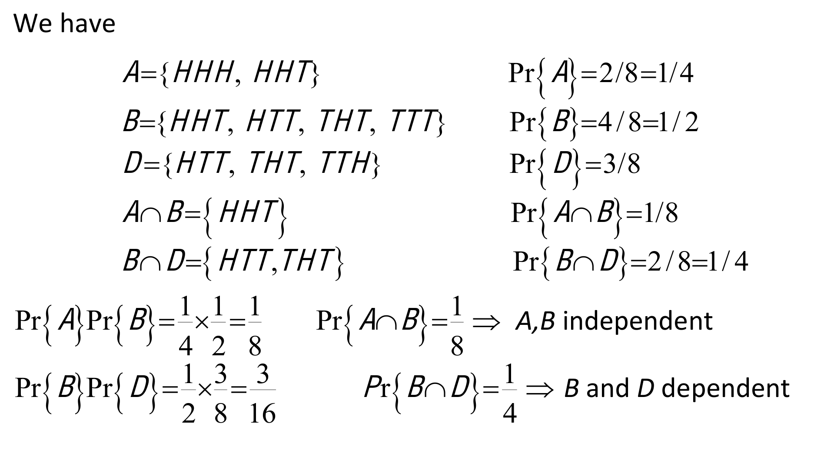
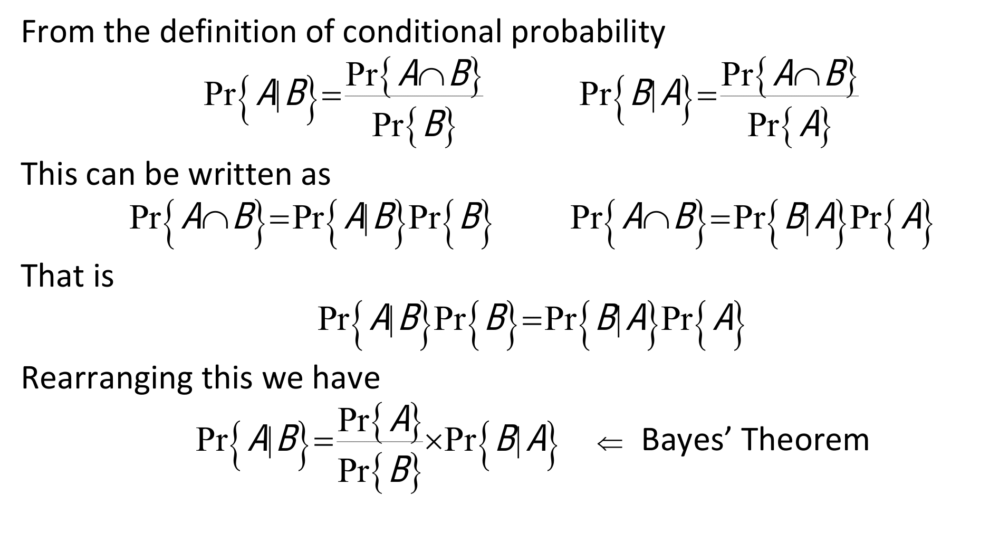
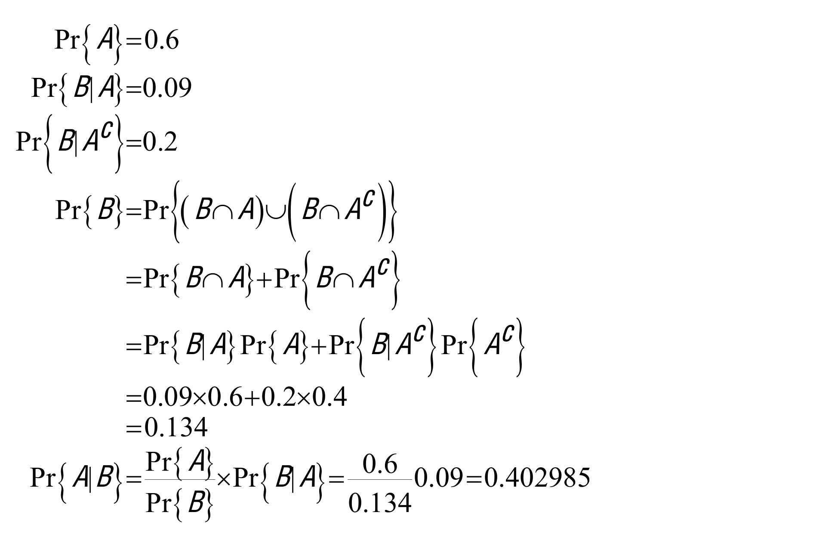

# 🔧 Probability Axioms {#axioms}

```{r ,echo = FALSE, fig.cap="'Is it clear to Everyone?' by Enrico Chavez", fig.align='center'}
  knitr::include_graphics("img/fun/EC_clear2everyone.png")
```

## An Axiomatic Definition of Probability

<!-- %Let $\mathcal{B}$ be the $\sigma$-algebra of subsets of a set $S$ representing the sample space. \\ -->
<!-- %\vspace{0.1cm} -->

In order to formalise probability as a branch of mathematics, Andrey Kolmogorov formulated a series of postulates. These _axioms_ are crucial elements of the foundations on which all the mathematical theory of probability is built.

```{definition, probability, name="Probability Axioms"}
We define _probability_ as a **set function** with values in $[0,1]$, which satisfies the following axioms:

(i) _The probability of an event $A$ in the Sample Space $S$ is a non-negative real number_ 
\begin{equation}
P(A) \geq 0, \text{ for every event } A \subset S 
(\#eq:nonnegative)
\end{equation}
(ii) _The probability of the Sample Space is 1_ 
\begin{equation}
P(S)=1
(\#eq:probss)
\end{equation}
(iii) If  $A_1,A_2,...$ is 
    - a sequence of **mutually exclusive events**, i.e.  
  $$A_{i}\cap A_{j}=\varnothing, \ \text{for} \ i\neq j,\ \text{and} \ i,j=1,2,...,$$ 
    - such that $A = \bigcup_{i=1}^{\infty} A_i$, then:

\begin{equation} 
P(A)=P\left(\bigcup_{i=1}^{\infty}A_{i}\right)=\sum_{i=1}^{\infty}P(A_i).
(\#eq:additivity)
\end{equation}
```

## Properties of $P(\cdot)$

These three axioms are the building block of other, more sophisticated statements. For instance:

```{theorem, probabilityEmptySet, name = "The Probability of the Empty Set"}
_The probability of the empty set is 0_ 
$$P(\varnothing)=0.$$
```

```{proof}
Consider the sequence of mutually exclusive empty sets. $A_1=A_2=A_3=....=\varnothing$. Then, by \@ref(eq:additivity) in Axiom (ii) we have

$$P(\varnothing)= P\left(  \bigcup_{i=1}^{\infty} A_i \right) = \sum_{i=1}^{\infty} P(A_i) =\sum_{i=1}^{\infty} P(\varnothing)$$
which is true **only if** the left hand side is an infinite sum of zeros. Thus:
$$P(\varnothing) =  0.$$
```

```{theorem, additionLaw, name = "The Addition Law of Probability"}
If $A_1, A_2,...$ are mutually exclusive events, then the probability of their union is the sum of their probabilities, i.e.
\begin{equation}
P\left(  \bigcup_{i=1}^{n} A_i \right) = \sum_{i=1}^{n} P(A_i).  
(\#eq:probuniondisj)
\end{equation}
``` 

```{proof}
Let $A_{n+1}=A_{n+2}=....=\varnothing$, then
$\bigcup_{i=1}^{n} A_i = \bigcup_{i=1}^{\infty} A_i,$
and, from \@ref(eq:additivity) (see Axiom (iii)) it follows that:

\begin{eqnarray}
P\left(  \bigcup_{i=1}^{n} A_i \right) &=& P\left(  \bigcup_{i=1}^{\infty} A_i \right)
= \sum_{i=1}^{\infty} P(A_i) = \sum_{i=1}^{n} P(A_i) + \underbrace{\sum_{i=n+1}^{\infty} P(A_i)}_{\equiv 0}.
\end{eqnarray}
```


```{theorem, complementRule, name = "The Complement Rule"}
If $A$ is an event, then $P(A^c) = 1- P(A).$
```

```{proof}
By definition, $A$ and its complement $A^c$ are such that: 
- $A \cup A^c = S$ and 
- $A \cap A^c = \varnothing$ 

Hence, from the addition law \@ref(thm:additionLaw): 
$$P( S ) = P\left(A \cup A^c \right) =P(A) + P\left(A^c \right).$$
  
Finally, by Axiom (ii), $P(S)=1$, and. 
$$1 = P(A) + P\left(A^c \right).$$
The result follows. 
```

<!-- %that $B \subset A$. -->

\def\firstcircle{(3,1) circle (2.95cm)}
\def\secondcircle{(1:3cm) circle (1.65cm)}

\colorlet{circle edge}{blue!50}
\colorlet{circle area}{blue!20}
\tikzset{filled/.style={fill=circle area, draw=circle edge, thick},
    outline/.style={draw=circle edge, thick}}
\hspace{3cm} \vspace{2cm}
\begin{tikzpicture}
    \draw[even odd rule] \firstcircle node at (1.95,1.9) {$A$}
                                 \secondcircle node at (2.5,0.5) {$B$};
    \node[anchor=south] at (current bounding box.north) at (6.5,2.2) {$B \subset A$};
\end{tikzpicture}


```{theorem, monotonicityRule, name = "The Monotonicity Rule"}
For any two events $A$ and $B$, such that $B \subset A$, we have:

$$P(A) \geq P(B).$$
```

<mark>
  Illustrate with an example. 
</mark>


<mark>
  Insert diagram here
</mark>

<!-- %where $A \in \mathcal{B}$ and $B \in \mathcal{B}$ -->


<!-- % -->
<!-- -->
<!-- %Assume we have two events $A \in \mathcal{B}$ and $B \in \mathcal{B}$, such that $B \subset A$. Graphically, -->
<!-- %we are in the following setting: -->
<!-- %\vspace{0.2cm} \hspace{0.3cm} -->
<!-- % -->
<!-- %\begin{tikzpicture} -->
<!-- %    \begin{scope}[shift={(1cm,-3cm)}, fill opacity=0.55] -->
<!-- %        \draw[fill=red, draw = black] (0,0) circle (3); -->
<!-- %        \draw[fill=green, draw = black] (-0.5,0) circle (2); -->
<!-- %    \node at (0,2.2) (A) {\large\textbf{A}}; -->
<!-- %    \node at (-0.15,-0.25) (B) {\large\textbf{B}}; -->
<!-- %    \end{scope} -->
<!-- % -->
<!-- %\end{tikzpicture} -->
<!-- % -->
<!-- % -->


```{proof}
Let us write
$$A = B \cup (B^c \cap A) $$
and notice that $B \cap (B^c \cap A) = \phi$, so that
\begin{eqnarray}
P(A) &=& P\left\{ B \cup (B^c \cap A)   \right\}  \\
&=& P(B) + P(B^c \cap A) 
\end{eqnarray}
which implies (since $P(B^c \cap A) \geq 0$) that
$$
P(A) \geq   P(B).
$$
```


```{theorem, boolsinequality, name = "Boole's inequality"} 
For the events $A_1,A_2,... A_n$,
$$
P(A_1 \cup A_2 \cup....\cup A_n) \leq \sum_{i=1}^{n}P(A_i).
$$
```


<!-- %```{proof} -->
To illustrate this property, consider for instance $n=2$. Then we have:
$$
P(A_1 \cup A_2 ) = P(A_1) + P(A_2) - P(A_1 \cap A_2) \leq P(A_1) + P(A_2)
$$
since $P(A_1 \cap A_2) \geq 0$ by definition.
<!-- %``` -->


```{remark}
It is worth noticing that if $A_j \cap A_i = \varnothing$, for every $i$ and $j$, with $i\neq j$, then
$P(A_1 \cup A_2 \cup....\cup A_n) = \sum_{i=1}^{n}P(A_i),$
as stated in \@ref(eq:probuniondisj).
```

```{theorem}
For any two events $A$ and $B$ then
$$
P(A \cup B) = P(A) + P(B) - P(A \cap B).
$$
```

```{proof}
Consider that $A\cup B = A \cup (A^c \cap B)$, and $A\cap(A^c \cap B) = \phi$. Now remember\footnote{See Lecture 1 for the meaning of set difference.} that $A^c \cap B = B -(A \cap B)$, so,
\begin{eqnarray}
P(A\cup B) &=& P(A) + P(A^c \cap B)  \\
&=& P(A) + P(B) - P(A\cap B). 
\end{eqnarray}

```

## Illustrations of use

### Flipping coins


```{example, rleI}


```

<mark>
  adapt example here
</mark>

### Detecting shoppers

```{example, name = "Real-life example II"} 
```

```{r ,echo = FALSE, fig.cap='', fig.align='center'}

```

```{r ,echo = FALSE, fig.cap='', fig.align='center'}

```

```{r ,echo = FALSE, fig.cap=' ', fig.align='center'}

```

```{r ,echo = FALSE, fig.cap='', fig.align='center'}

```

<mark>
  adapt example here
</mark>


### De Morgan's Law

```{example, demorganEx, name="Application of De Morgan's laws"}
Given  $P(A\cup B)=0.7$ and $P(A\cup {B}^c) = 0.9$, find $P(A)$.

By De Morgan's law,

$$P(A^c \cap B^c) = P((A\cup B )^c) = 1 - P(A\cup B) = 1 - 0.7 = 0.3$$

and similarly:

$$P(A^c \cap B) = 1 - P(A \cup B^c) = 1- 0.9 = 0.1.$$

Thus,
$$P(A^c)=P(A^c \cap B^c )+P(A^c \cap B)= 0.3+ 0.1= 0.4,$$

so
$$P(A)=1 - 0.4= 0.6.$$
```

### Probability, union, and complement

```{example}
John is taking two books along on his holiday vacation. With probability 0.5, he will like the first book; with probability 0.4, he will like the
second book; and with probability 0.3, he will like both books. What is the probability that he likes neither book? \\

Let $A_i$ be the event that John likes book $i$, for $i=1,2$. Then the probability that he likes at least one book is (remember the short hand notation $A_1 \cap A_2 = A_1 A_2$)
\begin{eqnarray}
P(\bigcup_{i=1}^2 A_i) &=& P(A_1 \cup A_2) = P(A_1) + P(A_2) - P(A_1A_2)  \\
&=& 0.5 + 0.4 -0.3 =0.6. 
\end{eqnarray}
Because the event the John likes neither books is the complement of the event that he likes at leas one of them (namely $A_1 \cup A_2$), we have
$$P(A^{c}_1 \cap A^{c}_2 ) = P((A_1 \cup A_2)^c) = 1- P (A_1 \cup A_2) = 0.4.$$
```


```{example}

# [Real-life example III]
Let $A$ denote the event that the midtown temperature in Los Angeles (LA) is 70 F, and let $B$ denote the event that the midtown temperature in
New York (NY) is 70 F. Also, let $C$ denote the event that the maximum of midtown temperatures in NY and LA is 70 F. If

$$P(A)=0.3, \quad P(B)=0.4 \quad \text{and} \quad P(C)=0.2,$$

find the probability that the minimum of the two midtown temperatures is 70 F.


Let $D$ denote the event that the minimum temperature is 70 F. Then
\begin{eqnarray}
P(A\cup B) &=& P(A) + P(B) - P(AB) = 0.7 -P(AB)  \\
P(C\cup D) &=& P(C) + P(D) - P(CD) = 0.2 -P(D) - P(DC). 
\end{eqnarray}
Since $$A\cup B = C \cup D \quad \text{and} \quad AB = CD,$$
subtracting one of the preceding equations from the other we get
\begin{eqnarray*}
P(A\cup B)-P(C\cup D)  & = &  0.7 -P(AB) - [0.2 -P(D) - P(DC)] \\
&  = & 0.5 -P(D) = 0 , \\
\end{eqnarray*}
thus $ P(D) =0.5.$
```


## Conditional probability

As a measure of uncertainty, the probability depends on the information available. 


```{example}
Suppose you have two dice and throw them; the possible outcomes are:
```


```{r}
knitr::include_graphics("img/03_axioms/c1.png")
```

Let us define $A$ = getting $5$, or equivalently $A=\{ 5\}$. What is $P(A)$, namely, the probability of getting $5$?

```{r}
knitr::include_graphics("img/03_axioms/c2.png")
```


The dice are fair so we can get 36 events with equal probability ${1}/{36}$. Namely:
$$Pr(i,j) = \frac{1}{36}, \quad \text{for} \quad i,j=1,..,6$$
Thus, we can make use of the blue guys as
\begin{eqnarray}
P(5) &=& Pr\left\{ (1,4) \cup (2,3) \cup (3,2) \cup  (4,1) \right\}  \\
&=& Pr\left\{ (1,4)  \right\} +  Pr\left\{ (2,3)  \right\} +  Pr\left\{(3,2)  \right\} + Pr\left\{  (4,1) \right\}  \\
&=& {1} /{36} + {1} /{36} + {1} /{36} + {1} /{36}  \\
&=& {4} /{36}  \\
&=& 1  /{9}. 
\end{eqnarray}


Now, suppose that we throw the die first and e we get 2.\\
\vspace{0.2cm}
\color{black}\textbf{Q.} \color{black} What is the probability of getting 5 given that we have observed 2 in the first throw?


```{r}
knitr::include_graphics("img/03_axioms/c4.png")
```


\color{blue}\textbf{A.} \color{black}

$\text{Pr}\{\text{getting 5 given 2 in the first throw}\}= \text{Pr}\{\text{getting 3 in the second throw}\}=1/6$

```{remark}
```
- Information changes the probability
- By knowing that we got 2 in the first throw, we have changed the sample space:


```{r ,echo = FALSE, fig.cap=''}
  
```

-  Probability can change drastically --- e.g., suppose that in our example we have 6 in the first throw $\Rightarrow$ the probability of observing 5 in two draws ... is zero !!!


```{definition}
Let $A$ and $B$ be two events. The conditional probability of event $A$
given event $B$, denoted by $P\left(A\vert B\right)$, is defined by:
$$
P\left(A\vert B\right) = \frac{P(A \cap B)}{P(B)}, \quad \text{if} \quad P(B) >0,
$$
and it is left undefined if $P(B)=0$.
```


### A check

```{r ,echo = FALSE}

```


```{example} 
Let us define the set $B$ as:

So we have

\begin{eqnarray}
P(B) &=& Pr\left\{ (2,1) \cup (2,2) \cup (2,3) \cup (2,4) \cup (2,5) \cup (2,6)     \right\}  \\
 &=&  Pr(2,1) + Pr(2,2) + Pr(2,3) + Pr(2,4) + Pr(2,5) + Pr(2,6)  \\
 &=& 6/36 =1/6 
\end{eqnarray}

and consider $A \cap B$
```

```{r ,echo = FALSE, fig.cap=''}
  knitr::include_graphics("img/03_axioms/c4.png")
```

So we have  $P(A \cap B) = Pr (2,3) = 1/36$ so,
$$
P(A\vert B) = \frac{P(A \cap B)}{P(B)}  =  \frac{1/36}{1/6} = \frac{1}{6}. 
$$


## Independence

```{definition}
Two events $A$ and $B$ are independent if the occurrence of one event has no effect on the probability of occurrence of the other event. Thus,
$$P(A\vert B) = P(A)$$
or equivalently
$$P(B\vert A) = P(B)$$
```

Clearly, if $P(A\vert B) \neq P(A)$, then $A$ and $B$ are \textit{dependent}.


### Independence -- another characterization

Two events $A$ and $B$ are independent if
$$P(A \vert B) = {P(A)},$$
now by definition of conditional probability we know that
$$P(A \vert B) = \frac{P(A \cap B)}{P(B)},$$
so we have
$$P(A) = \frac{P(A \cap B)}{P(B)},$$
and rearranging the terms, we find that two events are independent iif
$$P(A\cap B) = P(A) P(B).$$


```{example}
```


```{r ,echo = FALSE, fig.cap='things'}
  
```


```{r ,echo = FALSE, fig.cap=''}
  
```


## Theorem I

```{theorem, totalprob, name="Theorem of  total probabilities"}
Let  $B_1,B_2,...,B_k,...,B_n$ be mutually disjoint events, satisfying
$S=\cup_{i=1}^{n} B_i,$ and $P(B_i)>0$, for every $i=1,2,...,n$ then for every $A$ we have that:
\begin{equation}
P(A)=\sum_{i=1}^n P(A\vert B_i) P(B_i).
(\#eq:TP)
\end{equation}
```


```{proof}
Write $A=A\cap S = A\cap (\cup_{i=1}^{n} B_i) = \cup_{i=1}^{n} (A\cap B_i)$. Since the $\{B_i \cap A \}$ are mutually disjoint, we have
\begin{equation*}
P(A)=P\left(  \cup_{i=1}^{n} (A\cap B_i)  \right)=\sum_{i=1}^n P\left( A\cap B_i  \right ) =\sum_{i=1}^n P(A\vert B_i) P(B_i).
\end{equation*}
```


```{remark}
The theorem remains valid even if $n=\infty$ in Eq. \@ref(eq:TP). (Double check, and re-do the proof using $n=\infty$.)
```

```{corollary}
Let $B$ satisfy $0<P(B)<1$; then for every event $A$:

\begin{equation*}
P(A)=P(A\vert B)P(B)+P(A\vert B^c) P(B^c)
\end{equation*}
```

```{proof}
Exercise [Hint: $S=B \cup B^c$].
```

## Theorem II

Theorem I can be applied to derive the well-celebrated Bayes' Theorem.

```{theorem, bayes, name = "Bayes' Theorem"}
Let $B_1,B_2,...,B_k,...,B_n$ be mutually disjoint events, satisfying
$$S=\cup_{i=1}^{n} B_i,$$ and $P(B_i)>0,$
for every $i=1,2,...,n$. Then for every event $A$ for which $P(A)>0$, we have that
\begin{equation}
P(B_k\vert A)=\frac{P(A\vert B_k)P(B_k)}{\sum_{i=1}^n P(A\vert B_i) P(B_i)}.
(\#eq:Bayes)
\end{equation}
```

```{proof}
Let us write
\begin{eqnarray}
P(B_k\vert A)&=&\frac{P(A\cap B_k)}{P(A)}  \\
&=&\frac{P(A\cap B_k)}{\sum_{i=1}^n P(A\vert B_i) P(B_i)} \\
&=&\frac{P(A\vert B_k)P(B_k)}{\sum_{i=1}^n P(A\vert B_i) P(B_i)} 
\end{eqnarray}
That concludes the proof.
```

```{example}
Let us consider a special case, where we have only two events $A$ and $B$.
```

```{r ,echo = FALSE, fig.cap=''}
  
```

... so thanks to Bayes' Theorem we can reverse the role of $A\vert B$ and $B \vert A$.

### Guessing in a multiple choice exam

```{example, name = 'Example 3c in @ross2014first'}

_In answering a question on a multiple-choice test, a student either knows the answer
or guesses. Let p be the probability that the student knows the answer and 1 − p
be the probability that the student guesses. Assume that a student who guesses at
the answer will be correct with probability 1/m, where m is the number of multiple choice alternatives._

_What is the conditional probability that a student knew the
answer to a question given that he or she answered it correctly?_
  
**Solution** Let C and K denote, respectively, the events that the student answers the
question correctly and the event that he or she actually knows the answer. Now,

\begin{align*}
P(K|C ) & = \frac{P(KC)}{P(C)} \\ 
&= \frac{P(C|K)P(K)}{P(C|K )P(K) + P(C|Kc)P(Kc)} \\
&= \frac{p}{p + (1/m)(1 − p)} \\ 
&= \frac{mp}{1 + (m − 1)p}
\end{align*}

For example, if $m = 5$, $p = 12$ , then the probability that the student knew the answer to a question he or she answered correctly is 5/6
.
```


### Rent car maintenance

```{example}

- 60\% from AVIS
- 40\% from Mobility

Now consider that

- 9\% of the cars from AVIS need a tune-up
- 20\% of the cars from Mobility need a tune-up

If a car delivered to the consulting firm needs a tune-up, what is the probability that the care came
from AVIS?
```

Let us set: $A:=\{\text{car rented from AVIS}\}$ and $B:=\{\text{car needs a tune-up}\}$. We know $P(B\vert A)$ and we look for $P(A\vert B)$ $\Rightarrow$ Bayes' theorem!!

```{r ,echo = FALSE, fig.cap=''}
  
```


