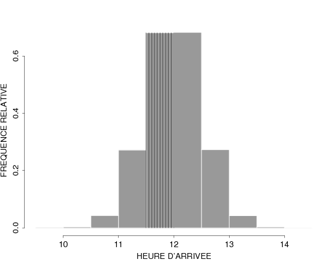
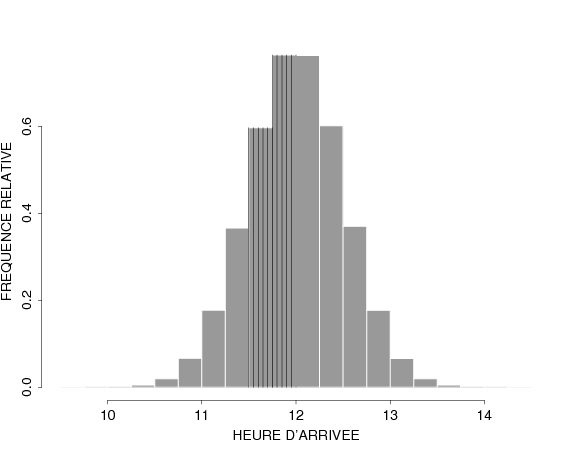
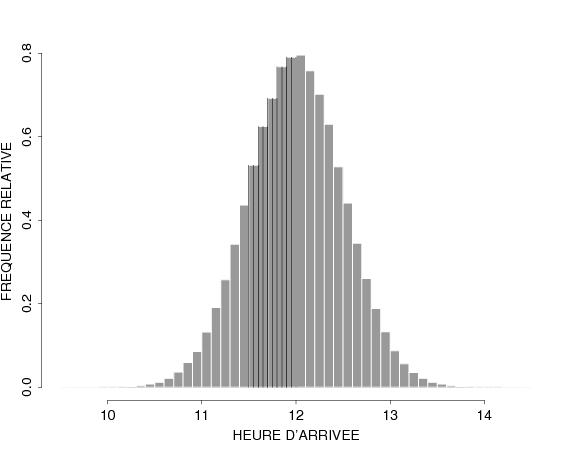

# 🔧 Continuous Random Variable {#continuousrv}
```{r, include = FALSE, message = FALSE, warning = FALSE}
library(tidyverse)
```


```{r ,echo = FALSE, fig.cap="'Statistical Cow' by Enrico Chavez", fig.align='center', out.width = "80%"}
  knitr::include_graphics("img/fun/EC_Stat_Cow.png")
```

## Two Motivating Examples

```{example, name = "Standard & Poors 500 returns"}

Let us consider the returns of the S\&P 500 index for all the trading days in 1990, 1991,...,1999.

Here below, the plot of the returns (in $\%$ on the y-axis)
series over time:
```

```{r ,echo = FALSE, fig.cap='', fig.align='center', out.width = "80%"}
sp_data <- MASS::SP500 %>%
  as_tibble() %>%
  mutate(day = row_number())

sp_data %>%
  ggplot() +
  geom_line(aes(x = day ,y =  value), color = "deeppink3", alpha = 0.75) +
  theme_minimal() +
  labs(title = "Daily Returns of the S&P 500 index between 1990 - 1999",
       y = "Returns", x = "Day")

```

Let's try to count the relative frequency of each of these returns, in an   attempt to  estimate the probability of each value of the return.

```{r ,echo = FALSE, fig.cap='', fig.align='center', out.width = "80%"}
sp_data %>%
  count(value) %>%
  mutate(relative_frequency = n/sum(n)) %>%
  ggplot() +
  geom_col(aes(x =  value, y =relative_frequency), color = "deeppink3", alpha = 0.75) +
  theme_minimal() +
  labs(title = "Relative frequency of returns of the S&P 500 index", 
       y = "Relative frequency", x = "Returns")
```

We notice that there are too many different values for the returns. This yields 
a low value and "uniform" relative frequency which does not help us gain any insight on the probability distribution of the values. Moreover, we could be almost sure that a future return would not have any of the values already obtained. 

However, we notice that there's some _concentration_, i.e. there are more returns in the 
neighborhood of zero, as there are in the extreme corners of the possible values. To quantify this concentration, we can create a _histogram_ by splitting the space of possible values into a given number of intervals, or "bins", and counting the number of observations within a bin. 

If we consider 30 bins, we obtain the following plot: 

```{r ,echo = FALSE, fig.cap='', fig.align='center', out.width = "80%"}

sp_data %>%
  ggplot() +
  geom_histogram(aes(x =  value), bins = 30, fill = "deeppink3", alpha = 0.75) +
  theme_minimal() +
  labs(title = "Histogram returns of the S&P 500 index",
       subtitle="30 bins",
       y = "Frequency", x = "Returns")

```

If we consider separating the space of returns into 300 `bins`, we obtain the 
following plot: 

```{r ,echo = FALSE, fig.cap='', fig.align='center', out.width = "80%"}
  sp_data %>%
  ggplot() +
  geom_histogram(aes(x =  value), bins = 300, fill = "deeppink3", alpha = 0.75) +
  theme_minimal() +
  labs(title = "Histogram returns of the S&P 500 index",
       subtitle="300 bins",
       y = "Frequency", x = "Returns")
```

We could go further and affine the number of bins and the method of counting. 
One of the options is to estimate a so-called _Density Curve_, which among other
considerations, chooses to split the space into an infinite amount of bins.


```{r ,echo = FALSE, fig.cap='', fig.align='center', out.width = "80%"}
sp_data %>%
  ggplot() +
  geom_density(aes(x =  value), fill = "deeppink3", alpha = 0.75) +
  theme_minimal() +
  labs(title = "Density Plot: returns of the S&P 500 index",
       y = "Frequency", x = "Returns")
```

This plot is much more interesting, as it clearly shows that the returns are 
quite concentrated around 0. 

```{example, name = "Arrivals to the Cafeteria"}
Let us consider a serious/significant issue: the arrivals to the cafeteria UniMail, from 10AM to 2PM
\begin{eqnarray*}
\mbox{relative freq}&=& \frac{\mbox{# customers incoming }}{\mbox{# total of customers}}
\end{eqnarray*}


We want to study the distribution of this object over the considered time interval. 
E.g. we would like to know when the relative frequency has a peak and when that peak happens.

Once again, we can display this phenomenon as a histogram: 

```
```{r ,echo = FALSE, fig.cap='', fig.align='center', out.width = "80%"}
  
```

And we can affine our analysis by increasing the number of bins.  

```{r ,echo = FALSE, fig.cap='', fig.align='center', out.width = "80%"}
  
```

In the last one, we see that there is clearly a peak around 12h. If we would like 
to allocate resources (e.g. hire more service workers to adapt to the demand),
we'd like to call the workers to provide service around those hours. 

```{r ,echo = FALSE, fig.cap='', fig.align='center', out.width = "80%"}
  
```

These examples are illustrations of a class of random variables which are 
different from what we have seen so far. Specifically, the examples emphasise 
that, unlike discrete random variables, the considered variables are 
**continuous random variables** i.e. they can take any value in an interval.

This means we cannot simply _list_ all possible values of the random variable, 
because there are (infinitely many) an uncountable number of possible outcomes 
that might occur. 

However, what we can do is to construct a probability distribution by assigning 
a positive **probability to each and every possible interval** of values that 
can occur. This is done by defining the **Cumulative Distribution Function (CDF)**,
which is sometimes called  **Probability Distribution Function**. 

So, graphically, we have that the **Discrete Random Variables** have a distribution that allocates the **probability** to the **values**, represented by *bars*, whereas **Continuous Random Variables** have a distribution that allocates probability to **intervals**, represented by the **area below the density curve** enclosed by the interval. 

```{r ,echo = FALSE, fig.cap='', fig.align='center', out.width = "80%"}
  knitr::include_graphics("img/05_continuous_rv/discr_vs_cont-1.png")
```

## Cumulative Distribution Function (CDF)

```{definition, label="CDF"}
 Let $X$ be a continuous random variable and let $x\in \mathbb{R}$, here $x$ denotes any number somewhere on the real line $\mathbb{R}=(-\infty,\infty)$. The "Probability Distribution Function" synonymously, the **Cumulative Distribution Function (CDF) of $X$ at the point $x$** is a continuous function $\color{red}{F_{X}\left( x\right)}$ defined such that:
 
-  $\lim_{x\rightarrow -\infty}\color{red}{F_{X}\left( x\right)}=0$ and $\lim_{x\rightarrow +\infty}\color{red}{F_{X}\left( x\right)}=1$,
-  $0\leq \color{red}{F_{X}\left( x\right)} \leq 1$ for all $x\in \mathbb{R}$ and
- the function is monotonically non-decreasing in $x$, i.e. 
  $$\color{red}{F_{X}\left( x\right)}\geq \color{red}{F_{X}\left( x'\right)}\quad\mbox{for all}\quad x>x'$$
  and the value $\color{red}{F_{X}\left( x\right)}$ yields the probability that $X$ lies in the interval $(-\infty,x]$, i.e
$$\color{red}{F_{X}\left( x\right)}=P\left( X\leq x\right)$$
```

```{r ,echo = FALSE, fig.cap='', fig.align='center', out.width = "80%"}
seq(-5, 5, by=0.05) %>%
  as_tibble() %>%
  rename(x = value) %>%
  mutate(p_x = pnorm(x)) %>%
  ggplot(aes(x = x, y = p_x)) +
  geom_line(color = "red", lwd = 1.5) +
  theme_minimal() +
  labs(title= "Cumulative Distribution Function (CDF)",
       x = "x",
       y = expression(F[X](x)==P(X<=x))) +
  theme_minimal()
```

```{definition, label="PDF"}
Let $X$ be a random variable taking values in the interval $(a,b]$ since:

-  $\color{red}{F_{X}\left( x\right)}$ is zero for all $x<a$ 
-  $0<\color{red}{F_{X}\left( x\right)}<1$ for all $x$ in $(a,b)$ and 
-  $\color{red}{F_{X}\left( x\right)}=1$ for all $x\geq b$.

Then, the Probability Density Function (PDF) of $X$ at the point $x$ is defined as

$$\color{blue}{f_{X}\left( x\right)} =\frac{d\color{red}{F_{X}(x)}}{dx}.$$
```

Graphically, if we represent the values of the PDF with a curve, the CDF will be the area beneath it in the interval considered. 

```{r ,echo = FALSE, fig.cap='', fig.align='center', out.width = "80%"}
 knitr::include_graphics("img/05_continuous_rv/generic_CDF2-1.png")
```
 
<!-- % -->
<!-- %-  Let $X$ be a continuous random variable with continuous CDF $F_{X}\left( x\right)$. -->
<!-- % -->
<!-- %-  Then the Probability Density Function (% -->
<!-- %%TCIMACRO{\TeXButton{blue}{\color{blue}}}% -->
<!-- % -->
<!-- %\color{blue}% -->
<!-- % -->
<!-- %PDF% -->
<!-- %%TCIMACRO{\TeXButton{black}{}}% -->
<!-- % -->
<!-- %% -->
<!-- % -->
<!-- %) of $X$ at the point $x$ is defined as -->
<!-- %\begin{equation*} -->
<!-- %\color{blue}{f_{X}\left( x\right) =\frac{dF_{X}(x)}{dx}}\,. -->
<!-- %\end{equation*}% -->
<!-- %%for all $x\in \mathbb{R}$. -->
<!-- %-  For the illustrated CDF we have: -->
<!-- % -->
<!-- %%TCIMACRO{% -->
<!-- %%\FRAME{ftbpF}{4.67in}{2.5624in}{0pt}{}{}{generic_pdf.bmp}{% -->
<!-- %%\special{language "Scientific Word";type "GRAPHIC";maintain-aspect-ratio TRUE;display "USEDEF";valid_file "F";width 4.67in;height 2.5624in;depth 0pt;original-width 13.4859in;original-height 7.389in;cropleft "0";croptop "1";cropright "1";cropbottom "0";filename 'generic_pdf.bmp';file-properties "XNPEU";}}}% -->
<!-- % -->
<!-- %\begin{figure}[ptb]\centering -->
<!-- %\includegraphics[width=0.95\textwidth]{generic_pdf__1.pdf}% -->
<!-- %\end{figure}% -->

Another way of seeing this relationship is with the following plot, where the value of the area undereneath the density is mapped into a new curve that will represent the CDF.

```{r ,echo = FALSE, fig.cap='', fig.align='center', out.width = "80%"}
knitr::include_graphics("img/05_continuous_rv/Diego_F-1.png")
```

From a formal mathematical standpoint, the relationship between PDF and CDF is given by the **_fundamental theorem of integral calculus_**. In the illustration, $X$ is a random variable taking values in the interval $(a,b]$, and the PDF $f_{X}\left(x\right)$ is non-zero only in $(a,b)$. More generally we have, for a variable taking values on the whole real line ($\mathbb{R}$): 

-  the **_fundamental theorem of integral calculus_** yields
$$\color{red}{F_{X}\left( x\right)} =P\left( X\leq x\right) =\int_{-\infty}^{x}\color{blue}{f_{X}\left(
t\right)}dt,$$
the area under the CDF between $-\infty$ and $x$ 

-  or in terms of derivative
$$\color{blue}{f_{X}\left( x\right)} = \frac{d\color{red}{F_{X}(x)}}{dx}$$ 

Most of the PDF's that we are going to consider are bell-shaped. So, typically, we will have a density that looks like a bell:
```{r ,echo = FALSE, fig.cap='A typical bell-shaped Density Function', fig.align='center', out.width = "50%"}
knitr::include_graphics("img/05_continuous_rv/R_bell_pdf-1.png")
```
and a CDF that has the shape of an S.
```{r ,echo = FALSE, fig.cap='A typical S-shaped Cumulative Distribution Function', fig.align='center', out.width = "50%"}
knitr::include_graphics("img/05_continuous_rv/R_bell_CDF-1.png")
```

## Distributional Summaries


### The Expectation

Recall that for **Discrete** random variables, the Expectation results from **summing the product of $x_{i}$ and $p_{i}=P(X=x_{i})$**, for all **possible values $x_{i}$**

\begin{equation*}
  E\left[ X\right] =\sum_{i}x_{i}p_{i}
\end{equation*}

```{definition, name = "Expectation of a Continuous Random Variable"}
The Expectation of $X$ results from **integrating the product of $x$ and its PDF $f_{X}\left(x\right)$** over the **range of possible values of $x$**. In other words, we obtain the Expectation via integration:
\begin{equation*}
  E\left[ X\right] =\int_{a}^{b}x\,f_{X}\left( x\right)dx
\end{equation*}
```

### The Variance

Recall that, for **discrete** random variables, we defined the variance as: 

\begin{equation*}
Var\left( X\right) =\sum_{i}\left( x_{i}-E\left[ X\right] \right) ^{2}P
\left( X=x_{i}\right)
\end{equation*}

```{definition, name="Variance of a Continuous Random Variable"}
Similarly, for continuous random variables, we use integration to obtain the variance. 

\begin{equation*}
Var\left( X\right) =\int_{a}^{b}\left( x-E\left[ X\right] \right)^{2}\,f_{X}\left( x\right) dx
\end{equation*}

```

Very roughly speaking, we could say that we are replacing the sum ($\sum$) by its continuous counterpart, namely the integral ($\int$).

<!-- %\frametitle{The expected value of a function of a random variable} -->
<!-- % -->
<!-- %Building on this intuition, we generalise to finding the expected value of $h(X)$.  -->
<!-- % -->
<!-- % -->
<!-- %For **discrete** random variables:% -->
<!-- %\begin{equation*} -->
<!-- %E\left[ h\left( X\right) \right] =\sum_{i}h\left( x_{i}\right) P \left( -->
<!-- %X=x_{i}\right) -->
<!-- %\end{equation*} -->
<!-- % -->
<!-- %  -->
<!-- % -->
<!-- %For **continuous** random variables:% -->
<!-- %\begin{equation*} -->
<!-- %Var\left( X\right) =\int_{a}^{b}h\left( x\right) \,f_{X}\left( x\right) dx -->
<!-- %\end{equation*} -->

### Important properties of expectations

As with discrete random variables, the following properties hold when $X$ is a continuous random variable and $c$ is any real number (namely, $c \in \mathbb{R}$):

- $E\left[ cX\right] =cE\left[ X\right]$
- $E\left[ c+X\right] =c+E\left[ X\right]$
- $Var\left( cX\right) =c^{2}Var\left( X\right)$
- $Var\left( c+X\right) =Var\left( X\right)$

Let us consider, for instance, the following proofs for first two properties. 
To compute $E\left[ cX\right]$ we take advantage of the _linearity_ of the
integral with respect to multiplication by a constant. 
\begin{eqnarray*}
E\left[ cX\right] &=&\int \left( cx\right) f_{X}\left( x\right) dx \\
&=&c\int xf_{X}\left( x\right) dx \\
&=&cE\left[ X\right].
\end{eqnarray*}

In the same way,  to evaluate $E\left[ c+X\right]$, we take advantage of the 
linearity of integration and of the fact that $f(x)$ is a density and integrates to 1 over the 
whole domain of integration.
\begin{eqnarray*}
E\left[ c+X\right] &=&\int \left( c+x\right) f_{X}\left( x\right) dx \\
&=&\int cf_{X}\left( x\right) dx+\int xf_{X}\left( x\right) dx \\
&=&c\times 1+E\left[ X\right] \\
&=&c+E\left[ X\right].
\end{eqnarray*}

### Mode and Median

There are two other important distributional summaries that also characterise a sort of center for the distribution: the Mode and the Median.

The **Mode** of a continuous random variable having density $f_{X}(x)$ is the **value of $x$ for which the PDF $f_X(x)$ attains its maximum**, i.e.$$\text{Mode}(X) = \text{argmax}_{x}\{f_X(x)\}.$$ Very roughly speaking, it is the **point with the highest _concentration_ of probability**.

On the other hand, the **Median** of a continuous random variable having CDF $F_{X}(x)$ is the **value $m$ such that $F(m) = 1/2$**
  $$\text{Median}(X) = \text{arg}_{m}\left\{P(X\leq m) = F_X(m) = \frac{1}{2}\right\}.$$
Again, very roughly speaking, the median is the value that **splits the sample space in two intervals with equal cumulative probability**. 

Let's illustrate these two location values in the PDF. We have purposefully chosen an asymmetric (right)_skewed_ distribution to display the differences between these two values. 

```{r ,echo = FALSE, fig.cap='Mode and Median of an asymmetric distribution', fig.align='center', out.width = "80%"}
library(patchwork)
k <- 7
med <- k*(1-2/(9*k))^3
mod <- k-2

sim_data <- seq(0, 30, by=0.05) %>%
  as_tibble() %>%
  rename(x = value) %>%
  mutate(p_x = dchisq(x,df = k)) 

chisq_density <- 
  sim_data %>%
  ggplot(aes(x = x, y = p_x)) +
  geom_line(color = "blue", lwd = 1.5)+
  theme_minimal()


mode_illustration <- 
  chisq_density + 
  geom_vline(aes(xintercept = mod), linetype =2)+
  labs(title = "Mode",
       x = "x",
       y = expression(f[X](x)))
  
median_illustration <- 
  chisq_density + 
  geom_vline(aes(xintercept = med), linetype =2, color = "red")+
  geom_area(data = sim_data %>% filter(x<=med), aes(x = x, y = p_x), fill="red", alpha =0.5)+
  labs(title = "Median",
       x = "x",
       y = expression(f[X](x)))

mode_illustration / median_illustration
```

## Some Important Continuous Distributions 

There is a wide variety of Probability Distributions. In this section, we will explore the properties of some of them, namely: 

-  Continuous Uniform
-  Gaussian a.k.a. "Normal"
-  Chi-squared
-  Student's $t$
-  Fisher's $F$
-  Log-Normal
-  Exponential

### Continuous Uniform Distribution

```{definition, label = "unif", name = "Continuous Uniform Distribution"}
We say $X$ has a continuous **uniform** distribution over the
interval $[a,b]$, denoted as $X\sim \mathcal{U}(a,b)$, when the CDF and PDF are respectively given by:
$$
{F_X\left( x\right)}=\left\{
                           \begin{array}{ll}
                             0, & \hbox{$x\leq a$;} \\
                             \frac{(x-a)}{(b-a)}, & \hbox{$a<x\leq b$;} \\
                             1, & \hbox{$x>b$.}
                           \end{array}
                         \right.\mbox{and}~{f_{X}\left( x\right)} =\left\{
\begin{array}{l}
\frac{1}{b-a}\text{, for }a<x<b \\
0\text{, otherwise}
\end{array}
\right. ,
$$

```
<!-- %-  The PDF is given by% -->
<!-- %\begin{equation*} -->
<!-- %f_{X}\left( x\right) =\left\{ -->
<!-- %\begin{array}{l} -->
<!-- %\frac{1}{b-a}\text{, for }a<x<b \\ -->
<!-- %0\text{, \quad otherwise}% -->
<!-- %\end{array}% -->
<!-- %\right. -->
<!-- %\end{equation*} -->
<!-- % -->


<!-- %% -->
<!-- % -->
<!-- % -->
<!-- %\frametitle{Continuous uniform distribution} -->
<!-- % -->
<!-- %```{definition} -->
<!-- %We say $X$ has a continuous **uniform** distribution over the -->
<!-- %interval $(a,b]$, denoted as $X\sim Unif(a,b)$, when the CDF and PDF are given by -->
<!-- %$$ -->
<!-- %\color{red}{F_X\left( x\right)}=\left\{ -->
<!-- %                           \begin{array}{ll} -->
<!-- %                             0, & \hbox{$x\leq a$;} \\ -->
<!-- %                             \frac{(x-a)}{(b-a)}, & \hbox{$a<x\leq b$;} \\ -->
<!-- %                             1, & \hbox{$x>b$.} -->
<!-- %                           \end{array} -->
<!-- %                         \right.\mbox{and}~\color{blue}{f_{X}\left( x\right)} =\left\{ -->
<!-- %\begin{array}{l} -->
<!-- %\frac{1}{b-a}\text{, for }a<x<b \\ -->
<!-- %0\text{, \quad otherwise}% -->
<!-- %\end{array}% -->
<!-- %\right. , -->
<!-- %$$ -->
<!-- %respectively. -->
<!-- %``` -->
<!-- %%-  The PDF is given by% -->
<!-- %%\begin{equation*} -->
<!-- %%f_{X}\left( x\right) =\left\{ -->
<!-- %%\begin{array}{l} -->
<!-- %%\frac{1}{b-a}\text{, for }a<x<b \\ -->
<!-- %%0\text{, \quad otherwise}% -->
<!-- %%\end{array}% -->
<!-- %%\right. -->
<!-- %%\end{equation*} -->
<!-- %% -->


As a graphical illustration, let us consider the case when $a=0$ and $b=1$. So, we have that the density is 1 on the interval $(0,1)$ and 0 everywhere else:
```{r ,echo = FALSE, fig.cap='Density of a Continuous Uniform Random Variable', fig.align='center', out.width = "80%"}
  sim_data <- seq(-1, 2, by=0.0005) %>%
  as_tibble() %>%
  rename(x = value) %>%
  mutate(f_x = dunif(x,min=0, max=1)) 

sim_data %>%
  mutate(f_x = case_when(
    x==0~0,
    x==1~0,
    TRUE ~ f_x
  )
  ) %>% 
  ggplot(aes(x = x, y = f_x)) +
  geom_point(color = "blue", lwd = 1)+
  theme_minimal() +
   labs(title = "Density of U(0,1)",
       x = "x",
       y = expression(f[X](x))) + 
  ylim(c(0,1.5))+
  geom_point(data=as_tibble(data.frame(x = c(0,1), f_x= c(0,0))), aes(x=x, y = f_x),
             color = "blue", lwd = 3) + 
  geom_point(data=as_tibble(data.frame(x = c(0,1), f_x= c(1,1))), aes(x=x, y = f_x),
             color = "blue", lwd = 3, shape = 1)
```


#### Expectation

The expected value of $X$ can be computed via integration: 
\begin{eqnarray*}
E\left[ X\right] &=&\int_{a}^{b}\frac{x}{\left( b-a\right) }dx \\
&=&\frac{1}{\left( b-a\right)} \int_{a}^{b} x dx \\
&=& \frac{1}{\left( b-a\right)} \left[\frac{x^{2}}{2}\right] _{a}^{b} \\
&=&\frac{1}{\left(b-a\right)}\left[\frac{b^{2}}{2}-\frac{a^{2}}{2}\right]\\
&=&\frac{1}{2\left(b-a\right)}\left[(b-a)(b+a)\right]\\
&=&\frac{a+b}{2}
\end{eqnarray*}

```{example} 
When $a=0$ and $b=1$, then $E\left[ X\right] =\frac{1}{2}$.
``` 

#### Variance

By definition, the variance of $X$ is given by: 
\begin{eqnarray*}
Var\left( X\right) 
&=&\int_{a}^{b}\left[] x-\left( \frac{a+b}{2}\right)
\right]^{2}\frac{1}{b-a}dx \\
&=&E\left[ X^{2}\right] -E\left[ X\right] ^{2}
\end{eqnarray*}

Since we know the values of the second term:
\begin{equation*}
E\left[ X\right] ^{2}=\left( \frac{a+b}{2}\right) ^{2},
\end{equation*}
we only need to work out the first term, i.e. 
\begin{eqnarray*}
E\left[ X^{2}\right] &=&\int_{a}^{b}\frac{x^{2}}{b-a}dx =\left. \frac{x^{3}}{3\left( b-a\right) }\right\vert _{a}^{b} \\
&=&\frac{b^{3}-a^{3}}{3\left( b-a\right) } = \frac{(b-a)\left( ab+a^{2}+b^{2}\right)}{3\left( b-a\right) } \\
&=&\frac{\left( ab+a^{2}+b^{2}\right) }{3}.
\end{eqnarray*}

Putting both terms together, we get that the variance of $X$ is given by:
\begin{eqnarray*}
Var\left( X\right) &=&\frac{\left( ab+a^{2}+b^{2}\right) }{3}-\left( \frac{%
a+b}{2}\right) ^{2} \\
&=&\frac{1}{12}\left( a-b\right) ^{2}
\end{eqnarray*}

```{example} 
For instance, when $a=0$ and $b=1$, then $Var\left( X\right) =\frac{1}{12}$.
``` 

```{example} 
Let $X \sim \mathcal{U}(0,10)$. Then its PDF is $f_X(x) = 1/10=0.1$ for $x\in(0,10)$ and zero otherwise. The PDF plot is:
```
```{r ,echo = FALSE, fig.cap='Density of $X \\sim \\mathcal{U}(0,10)$', fig.align='center', out.width = "80%"}
  sim_data <- seq(-1, 11, by=0.0005) %>%
  as_tibble() %>%
  rename(x = value) %>%
  mutate(f_x = dunif(x,min=0, max=10)) 

sim_data %>%
  mutate(f_x = case_when(
    x==0~0,
    x==10~0,
    TRUE ~ f_x
  )
  ) %>% 
  ggplot(aes(x = x, y = f_x)) +
  geom_point(color = "blue", lwd = 1)+
  theme_minimal() +
   labs(title = "Density of U(0,10)",
       x = "x",
       y = expression(f[X](x))) + ylim(c(0,0.2))+
  geom_point(data=as_tibble(data.frame(x = c(0,10), f_x= c(0,0))), aes(x=x, y = f_x),
             color = "blue", lwd = 3) + 
  geom_point(data=as_tibble(data.frame(x = c(0,10), f_x= c(0.1,0.1))), aes(x=x, y = f_x),
             color = "blue", lwd = 3, shape = 1)+ 
  scale_x_continuous(breaks = seq(-1,11, by = 1))
```

We can compute the probabilities of different intervals:
\begin{align}
P(0\leq x \leq 1) &= \int_{0}^{1} 0.1x dx &= &0.1 x \left.\right\vert_{x=0}^{x=1}  \\
                  &= 0.1\cdot(1-0)        &= &0.1  \\
P(0\leq x \leq 2) &=  0.1\cdot (2-0)      &= &0.2  \\ 
P(2\leq x \leq 4) &=  P(2\leq x \leq 4)   &= &0.2  \\ 
P(x \geq 2)       &=  P(2 < x \leq 10)    &= &0.1(10-2) = 0.8
\end{align}

Let's represent graphically the $P(X\geq 2)$. Indeed, we see that it is represented by the pink rectangle. If we compute the area, it is apparent that its value is $0.8$, as we have obtained with the formula.

```{r ,echo = FALSE, fig.cap='Cumulated Probability between 2 and 10', fig.align='center', out.width = "80%"}
sim_data <- seq(-1, 11, by=0.0005) %>%
  as_tibble() %>%
  rename(x = value) %>%
  mutate(f_x = dunif(x,min=0, max=10),
         f_x = case_when(
           x==0~0,
           x==10~0,
           TRUE ~ f_x
           )
         )

sim_data %>%
  ggplot(aes(x = x, y = f_x)) +
  geom_area(data = sim_data %>% filter(x>=2) , aes(x = x, y = f_x), fill="pink", alpha =0.5) + 
  geom_point(color = "blue", lwd = 1)+
  theme_minimal() +
   labs(title = "Density of U(0,1)",
       x = "x",
       y = expression(f[X](x))) + 
  ylim(c(0,0.2))+
  geom_point(data=as_tibble(data.frame(x = c(0,10), f_x= c(0,0))), aes(x=x, y = f_x),
             color = "blue", lwd = 3) + 
  geom_point(data=as_tibble(data.frame(x = c(0,10), f_x= c(0.1,0.1))), aes(x=x, y = f_x),
             color = "blue", lwd = 3, shape = 1) + 
  scale_x_continuous(breaks = seq(-1,11, by = 1))
  
```

### Normal (Gaussian) distribution

The Normal distribution was "discovered" in the eighteenth
century when scientists observed an astonishing degree of
regularity in the behavior of measurement errors. 

They found that the patterns (distributions) that they observed, and which they
attributed to chance, could be **closely approximated by continuous
curves** which they christened the "normal curve of errors".
 
The mathematical properties of these curves were first studied by:

-  Abraham de Moivre (1667-1745),
-  Pierre Laplace (1749-1827), and then
-  Karl Gauss (1777-1855), who also lent his name to the distribution.

```{definition, label = "gaussian", name = "The Gaussian Distribution"}
A variable $X$ is said to have a **Gaussian** or **Normal**
distribution, with mean $\mu$ and variance $\sigma ^{2}$, if its PDF is given by
\begin{equation*}
\phi_{(\mu,\sigma)}(x) =\frac{1}{\sqrt{2\pi \sigma ^{2}}}\exp{ \left\{ -\frac{1%
}{2\sigma ^{2}}\left( x-\mu \right) ^{2}\right\}}~~-\infty<x<\infty\,.
\end{equation*}
The short-hand notation is $X\sim \mathcal{N}\left( \mu ,\sigma ^{2}\right)$. 
```

There are couple of important **properties** worth mentioning:  

- A Normal random variable **$X$ can take any value $x\in\mathbb{R}$**.
- A Normal distribution is **completely defined by its mean $\mu$ and its variance $\sigma ^{2}$**. This means that infinitely many different normal distributions are obtained by varying the _parameters_ $\mu$ and $\sigma ^{2}$. 

To illustrate this last property, we plot a series of densities that result from replacing different values of $\mu$ and $\sigma^2$ in the following figure: 

```{r normalDensities,echo = FALSE, fig.cap='Densities for $\\color{blue}{X_{1}\\sim\\mathcal{N}(0,1)}$, $\\color{red}{X_{2}\\sim\\mathcal{N}(0,1.5^2)}$, $\\color{forestgreen}{X_{3}\\sim\\mathcal{N}(1,2.5^2)}$', fig.align='center', out.width = "80%"}
  knitr::include_graphics("img/05_continuous_rv/normals4-1.png")
```

- As we can assess in the previous Figure \@ref(normalDensities), the PDF of the Normal Distribution is "Bell-shaped", meaning that looks a little bit like a bell. Moreover, it is:
  - **Symmetric**, i.e. it is not skewed either to the right or to the left. This also implies that the values of the density are the same for $x$ and $-x$, i.e  $\phi_{(\mu,\sigma)}(x) = \phi_{(\mu,\sigma)}(-x)$
  - **Unimodal**, meaning that it has only one mode and 
  - The **Mean**, **Median** and **Mode** are all **equal**, owing to the **symmetry** of the distribution.

```{r ,echo = FALSE, fig.cap='The symmetry of the Gaussian Distribution', fig.align='center', out.width = "80%"}
sim_data <- seq(-5, 5, by=0.005) %>%
  as_tibble() %>%
  rename(x = value) %>%
  mutate(f_x = dnorm(x,mean = 0, sd = 1.5))

sim_data_redux <- 
  sim_data %>% 
  filter(x %in% c(1.5, -1.5))

sim_data %>%
  ggplot(aes(x = x, y = f_x)) +
  geom_line(color = "red", lwd = 1)+
  theme_minimal() +
  geom_segment(
    data =sim_data_redux ,
    mapping = aes(x = x,  y=0 , xend = x, yend = f_x), 
    linetype = 2
  ) + 
  geom_segment(
    data = sim_data_redux,
    mapping = aes(x = x[1],y = f_x , xend = x[2], yend = f_x), 
    linetype = 2
  ) + 
  geom_text(
    data = sim_data_redux,
    aes(x = x, y =0-0.01 , label = c("-x", "x"))
  ) + 
  geom_text(
    data = sim_data_redux,
    aes(x = 0, y =f_x[1]+0.01 , label="phi(x)"), parse = TRUE
    )+ 
   labs(title = "Density of N(0,2.25)",
       x = "x",
       y = expression(f[X](x)))
```


#### The Standard Normal distribution

First let us establish that $\phi_{(\mu,\sigma)}(x)$ can serve as a
**density function**. To show that, we need to demonstrate that it integrates to 1 in all the domain $\mathbb{R}$

Integrating with respect to $x$ using _integration by substitution_ we obtain
\begin{eqnarray*}
\int_{-\infty}^{\infty}\phi_{(\mu,\sigma)}(x)dx&=&
\int_{-\infty}^{\infty}\frac{1}{\sqrt{2\pi\sigma^2}}\exp{\left\{-\frac{(x-\mu)^2}{2\sigma^2}\right\}}dx
\\
 &=&\int_{-\infty}^{\infty}\frac{1}{\sqrt{2\pi}}\exp{\left\{-\frac{z^2}{2}\right\}}dz \quad \text{where: } z=\frac{x-\mu}{\sigma} \Leftrightarrow dz = \frac{dx}{\sigma}.
\end{eqnarray*}
But the second integral on the right hand side equals to:
$$
\int_{-\infty}^{\infty}\exp{\left\{-\frac{z^2}{2}\right\}}dz =  2\underbrace{\int_0^{\infty}\exp{\left\{-\frac{z^2}{2}\right\}}dz}_{={\sqrt{2\pi}} \big/ {2}} =
\sqrt{2\pi}
$$
which is **a known result**, known as the **Gaussian Integral** that cancels out with $1/\sqrt{2\pi}$ yielding the integration to 1. Hence, the function  $\phi_{(\mu,\sigma)}(x)$ does 
indeed define the PDF of a  random variable with a mean $\mu$ and a variance of $\sigma^2$

```{remark}
Notice that to prove that $\phi_{(\mu,\sigma)}(x)$, we had to **transform** $X$ to $Z$ via the substitution $Z=(X-\mu)/\sigma$. The new variable $Z$ is said to be **standardised**.

Notice also that the integrand that results from this substitution:
$$\frac{1}{\sqrt{2\pi}}\exp{\left\{-\frac{z^2}{2}\right\}}=\phi_{(0,1)}(z),$$
is the PDF of a random variable $Z\sim \mathcal{N}(0,1)$, which is called a 
**standard normal random variable** since $E[Z]=0$ and $Var(Z)=1$. 

Because of the special role that the standard normal distribution has in 
calculations involving the normal distribution its PDF is given the special 
notation:
$$\phi(z)=\phi_{(0,1)}(z).$$
```

In shorthand notation, we can characterise this transformation in the following way. 
$$X\sim \mathcal{N}\left( \mu ,\sigma ^{2}\right)\Leftrightarrow Z=\frac{\left( X-\mu \right) }{\sigma }\sim \mathcal{N}\left( 0,1\right)$$
This process of _standardisation_ has very important implications when dealing with the Normal Distribution, one of them being the that one can **compute all quantities related with a random variable $X$ by evaluating the related quantities over $Z$**. This is an example of what is called called a **variable transformation**

In particular, we can transform from $X$ to $Z$ by "shifting" and "re-scaling":
\begin{equation*}
Z=\frac{X-\mu }{\sigma } \ (\text{for the random variable}) \quad\mbox{and}\quad z=\frac{x-\mu }{\sigma }\,  \ (\text{for its values}) ,
\end{equation*}
and return back to $X$ by a "re-scaling" and "shifting":
\begin{equation*}
X=\sigma Z+\mu  \ (\text{for the random variable}) \quad\mbox{and}\quad x=\sigma z+\mu\, \ (\text{for its values}) .
\end{equation*}

Thus, **statements about any Normal random variable** can always be translated into **equivalent statements about a standard Normal random variable**, and viceversa.

#### The Normal CDF

For instance, we can concentrate on the consequences of this property on the computation of the CDF. 

Analytically the CDF of a Normal Random Variable $X\sim \mathcal{N}\left( \mu ,\sigma ^{2}\right)$ is given by:  
$$\Phi_{(\mu,\sigma)}\left( x\right) =\int_{-\infty }^{x}\frac{1}{\sqrt{2\pi \sigma ^{2}}}\exp{ \left\{ -\frac{1}{2\sigma ^{2}}\left( t-\mu \right) ^{2}\right\}} dt$$
To calculate $\Phi_{(\mu,\sigma)}\left( x\right)=P(\{X\leq x\})$ we use integration with the substitution
$s=(t-\mu)/\sigma$, which implies: $z=(x-\mu)/\sigma$ (for the domain of integration) and $ds=dt/\sigma$ (for the "differential"), yielding: 
\begin{eqnarray*}
P(\{ X\leq x\} )&=&\int_{-\infty}^x\frac{1}{\sqrt{2\pi\sigma^2}}\exp{\left\{-\frac{(t-\mu)^2}{2\sigma^2}\right\}}dt\\
 &=&\int_{-\infty}^z\phi(s)ds\\
P(\{ X\leq x\} )  &=&P(\{Z\leq z\})
\end{eqnarray*}

Hence, the **probability of the interval $X\leq x$** has been **mapped into a corresponding probability** for a **standard Normal random variable**. In other words:

$$P(\{ X\leq x\}) = P\left(\left\{\underbrace{\frac{X-\mu}{\sigma}}_Z\leq \underbrace{\frac{x-\mu}{\sigma}}_{z}\right\}\right) = P(\{ Z\leq z\})$$ 

The integral that defines the CDF of a Standard Normal random variable: 
$$P(\{Z\leq z\})=\Phi(z)=\int_{-\infty}^z\phi(s)ds$$
**does not have a closed-form expression**. Yet, it is possible to provide very precise 
**numerical approximations** using computers. Some of these values can be found in so-called **Standard Normal Tables**, which contain values of the integral $\Phi(z)$ for various values of $z\geq 0$.

To compute the cumulative probability for $z\leq 0$ we take advantage of the symmetry property of $\phi(z)$ i.e. $\phi(z)=\phi(-z)$, which also implies that: 
$$\Phi(-z)=1-\Phi(z)\,$$

We can see this in the following plot.
```{r ,echo = FALSE, fig.cap='The Symmetry of the Standard Normal PDF and its consequences for the CDF', fig.align='center', out.width = "80%", fig.height = 8,fig.width=8}
sim_data <- seq(-3, 3, by=0.005) %>%
  as_tibble() %>%
  rename(x = value) %>%
  mutate(f_x = dnorm(x,mean = 0, sd = 1))

sim_data_redux <- 
  sim_data %>% 
  filter(x %in% c(1, -1))

standard_normal <- 
  sim_data %>%
  ggplot(aes(x = x, y = f_x)) +
  geom_line(color = "red", lwd = 1)+
  theme_minimal() +
  labs(title = "",
       x = "Z",
       y = expression(f[Z](z))) 

standard_normal_symmetric <- 
  standard_normal +
  geom_segment(
    data =sim_data_redux ,
    mapping = aes(x = x,  y=0 , xend = x, yend = f_x), 
    linetype = 2
  ) + 
  geom_segment(
    data = sim_data_redux,
    mapping = aes(x = x[1],y = f_x , xend = x[2], yend = f_x), 
    linetype = 2
  ) + 
  geom_text(
    data = sim_data_redux,
    aes(x = x, y =0-0.05 , label = c("-z", "z"))
  ) + 
  geom_text(
    data = sim_data_redux,
    aes(x = 0, y =f_x[1]+0.05 , label="phi(z)"), parse = TRUE
    )
  

phi_min_z <- standard_normal_symmetric +
  geom_area(data = sim_data %>% filter(x<= -1),
    aes(x = x, y =f_x), fill= "red", alpha =0.5) + 
  annotate("text", x = -2.5, y = 0.05, label = "Phi(-z)", parse =TRUE, color = "red")
  
phi_z_one_min_z <- standard_normal_symmetric +
  geom_area(data = sim_data %>% filter(x<= 1),
    aes(x = x, y =f_x), fill= "blue", alpha =0.5) +
  geom_area(data = sim_data %>% filter(x>= 1),
    aes(x = x, y =f_x), fill= "red", alpha =0.5)+
  annotate("text", x = 2.5, y = 0.05, label = "1-Phi(z)", parse =TRUE, color = "red")+
  annotate("text", x = -1.5, y = 0.2, label = "Phi(z)", parse =TRUE, color = "blue")

phi_min_z_z <- standard_normal_symmetric +
  geom_area(data = sim_data %>% filter(x<= -1),
    aes(x = x, y =f_x), fill= "red", alpha =0.5)+ 
  geom_area(data = sim_data %>% filter(x>= 1),
    aes(x = x, y =f_x), fill= "red", alpha =0.5) +
  annotate("text", x = -2.5, y = 0.05, label = "Phi(-z)", parse =TRUE, color = "red")+
  annotate("text", x = 2.5, y = 0.05, label = "1-Phi(z)", parse =TRUE, color = "red")

phi_min_z / phi_z_one_min_z / phi_min_z_z
```

To compute the probability in a closed interval, if $X\sim \mathcal{N}\left( \mu ,\sigma ^{2}\right)$ we can proceed by substraction: 
\begin{eqnarray*}
P(\{x_1<X\leq x_2\})&=&P(\{z_1<Z\leq z_2\})\\
&=&P(\{Z\leq z_2\}) - P(\{Z\leq z_1\})\\ 
&=&\Phi(z_2)-\Phi(z_1)
\end{eqnarray*}
where, again, the values $z_1$ and $z_2$ result from _standardisation_ 
$z_1=(x_1-\mu)/\sigma$ and $z_2=(x_2-\mu)/\sigma$. As we can see from the plot below, there's a clear
geometric interpretation to this relation. 

```{r ,echo = FALSE, fig.cap='Computing the Probability of an interval', fig.align='center', out.width = "80%", fig.height = 8,fig.width=8}
x_low <- -1.5
x_high <- 0.75

sim_data_assym <- 
  sim_data %>% 
  filter(x %in% c(x_low, x_high))

phi_x_low <- 
  standard_normal+
  geom_area(data = sim_data %>% filter(x<= x_low),
    aes(x = x, y =f_x), fill= "red", alpha =0.25)+
  annotate("text", x = -2, y = 0.025, label = "Phi(z[1])", parse =TRUE, color = "red") + 
  annotate("text", x = x_low, y = -.05, label = "z[1]", parse =TRUE)  


phi_x_high <- 
  standard_normal+
  geom_area(data = sim_data %>% filter(x<= x_high),
    aes(x = x, y =f_x), fill= "red", alpha =0.25) +
  annotate("text", x = 0, y = 0.2, label = "Phi(z[2])", parse =TRUE, color = "red")+
  annotate("text", x = x_high, y = -.05, label = "z[2]", parse =TRUE)  

phi_x_low_high <- standard_normal +
  geom_area(data = sim_data %>% filter(x>= x_low, x<=x_high),
    aes(x = x, y =f_x), fill= "red", alpha =0.25) + 
  annotate("text", x = 0, y = 0.2, label = "Phi(z[2]) - Phi(z[1])", parse =TRUE, color = "red")+
  annotate("text", x = x_low, y = -.05, label = "z[1]", parse =TRUE)  +
  annotate("text", x = x_high, y = -.05, label = "z[2]", parse =TRUE)  


phi_x_low  / phi_x_high / phi_x_low_high
```

<!-- Graphical Explanation that I find a bit underwhelming -->

<!-- We can proceed graphically. Let's start with a variable $X \sim \mathcal{N}(5,3)$. The procedure of shifting and rescaling consists in defining a new variable $Y=X-5$, which is a recentered/shifted $X$ (it's centered at 0 and has the same variance as $X$) and finally defining $Z= Y/\sqrt{3}$, which is a recentered/shifted and rescaled $X$ (it's centered at 0 and has unit variance).  -->


```{r ,echo = FALSE, fig.cap='', fig.align='center', out.width = "80%", eval = FALSE}
  mu <- 5
sigma <- sqrt(3)
sim_data <- seq(-5, 10, by=0.005) %>%
  as_tibble() %>%
  rename(t = value) %>%
  mutate(f_X = dnorm(t,mean = mu, sd = sigma)) %>% 
  mutate(f_Y = dnorm(t-mu, sd = sigma)) %>% 
  mutate(f_Z = dnorm((t-mu)/sigma))


sim_data %>% 
  ggplot(aes(x = t, y=f_X))+
  geom_line() +
  geom_line(aes(x = t-mu, y=f_Y))+
  geom_line(aes(x = (t-mu)/sigma, y=f_Z))+
  theme_minimal()

```


```{r ,echo = FALSE, fig.cap='', fig.align='center', out.width = "80%", eval = FALSE}
  knitr::include_graphics("img/05_continuous_rv/Std_Diego-1.png")
```


#### Standard Normal Tables

Standard Normal Tables give values of the standard normal integral $\Phi(z)$ for  $z\geq 0$. This is done to , to save space, since values for negative $z$ are obtained via symmetry, as we mentioned in the previous section.
<!-- %-  Other Normal tables give either $1-\Phi(z)$ (tail area) or $\Phi(z)-0.5$! -->

Most of the tables are explicit in this choice and graphically show that they 
contain the probabilities of the interval $0\leq Z \leq z$, e.g. 
```{r ,echo = FALSE, fig.cap='Description of the contents of a Standard Normal Table', fig.align='center', out.width = "80%"}
  knitr::include_graphics("img/05_continuous_rv/bell_curve__5-1.png")
```

Typically, the dimension of the rows is nearest tenth to $z$, while
the columns indicate the nearest hundreth. 

Say we would like to find the value of $\Phi(0.46)$. We'd have to find the
row for $0.4$ and the column for `0.06`.  
```{r ,echo = FALSE, fig.cap='Probabilities for some values in the Standard Normal Table', fig.align='center', out.width = "80%"}
  knitr::include_graphics("img/05_continuous_rv/myTableGauss-1.png")
```

You can use these tables to compute integrals/probabilities of intervals $Z<=z$ or 
$Z \in [z_1, z_2]$ using the rules mentioned above. 
```{r ,echo = FALSE, fig.cap='', fig.align='center', out.width = "100%"}
  knitr::include_graphics("img/05_continuous_rv/CDF_pr-1.png")
```

```{example, name = 'Probability of several intervals'}

Let us use the table Compute the probabilities for some open intervals:

\begin{align*}
P(\{Z\leq 1\})    &\approx 0.8413 \\
P(\{Z\leq 1.96\}) &\approx 0.9750 \\
P(\{Z\geq 1.96\}) &=       1-P(\{Z\leq 1.96\}) \approx 1-0.9750=0.0250 \\
P(\{Z\geq -1\})   &=       P(\{Z\leq 1\})\approx 0.8413 \\
P(\{Z\leq -1.5\}) &=      P(\{Z\geq 1.5\}) =1-P(\{Z\leq 1.5\}) \approx 1-0.9332=0.0668
\end{align*}

And some closed intervals: 
\begin{align*}
P(\{0.64\leq Z\leq 1.96\}) &=P(\{Z\leq 1.96\})-P(\{Z\leq 0.64\}) \approx 0.9750-0.7389=0.2361 \\
P(\{-0.64\leq Z\leq 1.96\}) &= P(\{Z\leq 1.96\})-P(\{Z\leq -0.64\}) =P(\{Z\leq 1.96\})-(1-P(\{Z\leq 0.64\})) \approx0.9750-(1-0.7389)=0.7139 \\
P(\{-1.96\leq Z\leq -0.64\}) &=P(\{0.64\leq Z\leq 1.96\}) \approx 0.2361
\end{align*}

```

#### Further properties of the Normal distribution

##### The Rule '68 -- 95 -- 99.7' {-}

In the following plot, the shaded areas under the PDFs are (approximately)
equivalent to $0.683$, $0.954$ and $0.997$, respectively.
```{r ,echo = FALSE, fig.cap='', fig.align='center', out.width = "100%"}
  knitr::include_graphics("img/05_continuous_rv/Areas_Normal-1.png")
```

This leads to the rule: **.'68 -- 95 -- 99.7'** i.e. that if $X$ is a 
Normal random variable, $X \sim \mathcal{N}(\mu, \sigma^2)$, its realization 
has approximately a probability of:

| Probability    | Interval |
|:--------------:|:----------------------------------------------------------:|
| $68 \, \%$     | $\lbrack \mu - \sigma, \, \mu + \sigma \rbrack$            |
| $95 \, \%$     | $\lbrack \mu - 2 \, \sigma, \, \mu + 2 \, \sigma \rbrack$  |
| $99.7 \, \%$   | $\lbrack \mu - 3 \, \sigma, \, \mu + 3 \, \sigma\rbrack$   |

-  For $X\sim \mathcal{N}\left( \mu ,\sigma ^{2}\right)$ 
\begin{equation*}
E\left[ X\right] =\mu \text{ and }Var\left( X\right) =\sigma ^{2}.
\end{equation*}

-  If $a$ is a number, then 
\begin{eqnarray*}
X+a &\sim &\mathcal{N}\left( \mu +a,\sigma ^{2}\right) \\
aX &\sim &\mathcal{N}\left( a\mu ,a^{2}\sigma ^{2}\right).
\end{eqnarray*}

-  If $X\sim \mathcal{N}\left( \mu ,\sigma ^{2}\right)$ and $Y\sim \mathcal{N}\left( \alpha,\delta ^{2}\right)$, and $X$ and $Y$ are **independent** then
\begin{equation*}
X+Y\sim \mathcal{N}\left( \mu +\alpha ,\sigma ^{2}+\delta ^{2}\right).
\end{equation*}

To illustrate the last point, let's use simulated
values for two independent normally-distributed random variables 
$X\sim \mathcal{N}(5,1)$ and $Y\sim \mathcal{N}(7,1)$, alongside their sum. 

We can see that if we plot the densities of these RV's independently, we have the
expected normal density (two bell-shaped curves centered around 5 and 7 that are
similar in shape since they sport the same variance). Moreover the density of the 
sum of the simulated values is also bell-shaped and appears to be centered around
12 and sports a wider variance, confirming visually what we expected, i.e. that 
$X + Y \sim \mathcal{N}(5+7,1+1)$, $X+Y \sim \mathcal{N}(12,2)$.
```{r ,echo = FALSE, fig.cap='Locations of $n=30$ sampled values of $X,$ $Y$, and $X+Y$ shown as tick marks under each respective density', fig.align='center', out.width = "80%"}
  knitr::include_graphics("img/05_continuous_rv/sum_of_two_independent_normals_with_rug__1-1.png")
```

#### An example

```{example}

_On the highway A2 (in the Luzern area), the speed is limited to $80$ $km/h$. A radar measures the speeds of all the cars. 
Assuming that the registered speeds are distributed according to a Normal law with mean $72$ $km/h$ and standard error $8$ $km/h$: 

  -  _what is the proportion of the drivers who will have to pay a penalty for high speed?_ 
  -  _knowing that in addition to the penalty, a speed higher than $30$ $km/h$ (over the max allowed speed) implies a withdrawal of the driving license, what is the proportion of the drivers who  will lose their driving license among those who will have a to pay a fine?_

**Response**

Let $X$ be the random variable expressing the registered speed: $X \sim \mathcal{N}(72,64)$.

  -  Since a driver has to pay if its speed is above  $80$ $km/h$, the proportion of drivers paying a penalty is expressed  through $P(X>80)$:
\begin{equation*}
P(X>80)= P\left(Z>\frac{80-72}{8} \right)=1-\Phi(1) \simeq 16 \%
\end{equation*}
where $Z \sim \mathcal{N}(0,1)$.
  -  We are looking for the conditional probability of a recorded speed greater than 110 \underline{given that} the driver has had already to pay a fine:
  \begin{eqnarray*}
  P(X>110 \vert X>80) &=&  \frac{P(\{X>110\} \bigcap \{X>80\})}{P(X>80)} \\
   &=& \frac{P(X>110)}{P(X>80)} = \frac{1- \Phi((110-72)/8)}{1-\Phi(1)}\approx \frac{0}{16\%}\simeq 0.
  \end{eqnarray*}


```


<!-- %\frametitle{... it's all about normality...} -->
<!-- % -->
<!-- % -->
<!-- %\begin{figure}[ptb]\centering -->
<!-- %\includegraphics[natheight=7.389in, natwidth=13.4859in, height=2.4031in, width=4.7426in]{RU_Normal.PDF}% -->
<!-- %\end{figure} -->
<!-- % -->
<!-- % -->
<!-- %% -->
<!-- % -->

### The Chi-squared distribution

```{definition}
If $Z_{1},Z_{2},\ldots ,Z_{n}$ are independent standard Normal random
variables, then:
\begin{equation*}
X=Z_{1}^{2}+Z_{2}^{2}+\cdots +Z_{n}^{2}
\end{equation*}%
has a **Chi-squared distribution with $n$ degrees of freedom**. Write as $X\sim \chi ^{2}(n)$.
```

A Chi-Squared-distributed Random Variable has the following properties:

- $X\sim \chi ^{2}(n)$ can take only **positive** values. 
- The expectation and variance for $X\sim \chi ^{2}(n)$, are given by:
\begin{eqnarray*}
E\left[ X\right] &=&n \\
Var\left( X\right) &=&2n
\end{eqnarray*}
- Finally, if $X\sim \chi ^{2}(n)$ and $Y\sim \chi ^{2}(m)$ are **independent** then $X+Y\sim \chi ^{2}(n+m)$.

The Chi-Squared distribution has a parameter that defines its shape, namely the 
$n$ degrees of freedom. To illustrate their effect, let's plot some densities 
in the following plot.

```{r ,echo = FALSE, fig.cap='Chi-Squared densities for various values of $n$', fig.align='center', out.width = "80%"}
  knitr::include_graphics("img/05_continuous_rv/chisquared_pdfs__2-1.png")
```

#### Chi-squared tables 

As you can imagine, cumulated probabilities for Chi-squared distributions are not straightforward to compute. To do it, we require computational methods. 

Given that the shape depends on the parameter $n$ there would be an infinite number of tables (as many as $n$) should we want to carry along the values of the CDF. Instead, tables contain the values for the Upper-tail or Lower-tail _Quantiles_ for some given probabilities. For instance, in the following plot, we have a typical table, containing the values of the quantiles for different upper-tail probabilities displayed according to the degrees of freedom (denoted as $V$). 

```{r ,echo = FALSE, fig.cap='A typical Chi-square Table', fig.align='center', out.width = "80%"}
  knitr::include_graphics("img/05_continuous_rv/chisq_table__3-1.png")
```

<!-- To be included in the future: definition of upper-tail and lower-tail quantiles -->

```{example}
Let $X$ be a chi-squared random variable with 10 degrees-of-freedom. What is the value of its **upper fifth percentile**? 

By definition, the upper fifth percentile is the chi-squared value $x$ (lower case!!!) such that the probability to the right of $x$ is $0.05$ (so the upper tail area is $5\%$).  To find such an $x$ we use the chi-squared table: 
  
-  setting $\mathcal{V} = 10$ in the first column on the left and getting the corresponding row 
-  finding the column headed by $P(X \geq x) = 0.05$. 
 
Now, all we need to do is read the corresponding cell. What do we get? Well, the table tells us that the upper fifth percentile of a chi-squared random variable with 10 degrees of freedom is **18.30703**.
```


### The Student-t distribution

```{definition}
If $Z\sim \mathcal{N}(0,1)$ and $Y\sim \chi ^{2}(v)$ are **independent**
then%
\begin{equation*}
T=\frac{Z}{\sqrt{Y/v}}
\end{equation*}
has a **Student-t** distribution with $v$ degrees of freedom. Write as $T\sim t_{v}$.
```

- $T\sim t_{v}\,$\ can take any value in $\mathbb{R}$. 
- Expected value and variance for $T\sim t_{v}$ are 
\begin{eqnarray*}
E\left[ T\right] &=&0\text{, for }v>1 \\
Var\left( T\right) &=&\frac{v}{v-2}\text{, for }v>2.
\end{eqnarray*}

```{remark}
The PDF of $T\sim t_{v}$ is similar to a Normal (with mean zero) but with fatter tails. When $v$ is large (typically, $v \geq 120$) $t_{v}$ approaches $\mathcal{N}(0,1)$.
```
```{r ,echo = FALSE, fig.cap='Densities for various Student-t densities alongside the Normal Density', fig.align='center', out.width = "80%"}
  knitr::include_graphics("img/05_continuous_rv/student_t__4-1.png")
```


Again, since the distribution depends on the degrees of freedom $v$, in the absence of 
computers, we rely on tables for some values of upper-tail probabilities. 

```{r ,echo = FALSE, fig.cap="A typical Student's-t Table", fig.align='center', out.width = "80%"}
  knitr::include_graphics("img/05_continuous_rv/Student_t_table__5-1.png")
```

### The F distribution

```{definition}

If $X\sim \chi ^{2}(v_{1})$ and $Y\sim \chi ^{2}(v_{2})$ are **
independent**, then
\begin{equation*}
F=\frac{\frac{X}{v_{1}}}{\frac{Y}{v_{2}}},
\end{equation*}%
has an **F** distribution with $v_{1}$ `numerator' and $v_{2}$
`denominator' degrees of freedom. Write as $F\sim F_{v_{1},v_{2}}$.
```

- $F\sim F_{v_{1},v_{2}}\,$\ can take only **positive** values. 
- Expected value and variance for $F\sim F_{v_{1},v_{2}}$ (note that **the order of the degrees of freedom is important!**) is given by: 
\begin{eqnarray*}
E\left[ F\right] &=&\frac{v_{2}}{v_{2}-2}\text{, for }v_{2}>2 \\
Var\left( F\right) &=&\frac{2v_{2}^{2}\left( v_{1}+v_{2}-2\right) }{%
v_{1}\left( v_{2}-2\right) ^{2}\left( v_{2}-4\right) }\text{, for }v_{2}>4.
\end{eqnarray*}

As we can assess from the following plot, there is no uniform way in which the densities change
according to the degrees of freedom. However all of them seem to be concentrated towards the lower side of the $\mathbb{R}^{+}$ line. 
```{r ,echo = FALSE, fig.cap='', fig.align='center', out.width = "80%"}
  knitr::include_graphics("img/05_continuous_rv/F-dist_pds__6-1.png")
```

Again, when distributed in tables, we can only obtain information on the quantiles
for some upper-tail probabilites. However, since the distributions are defined by 
two sets of degrees of freedom, a table can only pertain one value of the upper tail 
probability. 
```{r ,echo = FALSE, fig.cap='Critical Values for $F$ distribution and $\\alpha = 0.05$', fig.align='center', out.width = "80%"}
  knitr::include_graphics("img/05_continuous_rv/Fdist_table__7-1.png")
```

### The lognormal distribution

```{definition}
 $Y$ has a **lognormal distribution** when 
 $$\ln \left( Y\right) =X$$
has a Normal distribution. We write $Y\sim$ \emph{lognormal}$\left( \mu ,\sigma ^{2}\right) $. 
```

- If $Y\sim$ \emph{lognormal}$\left( \mu ,\sigma ^{2}\right)$ then
\begin{eqnarray*}
E\left[ Y\right] &=&\exp^{ \left( \mu +\frac{1}{2}\sigma ^{2}\right)} \\
Var(Y) &=&\exp^{ \left( 2\mu +\sigma ^{2}\right)} \left( \exp^{ \left( \sigma
^{2}\right)} -1\right).
\end{eqnarray*}

In the next plot, we display an estimation of the density of the realization of a Normal Random Variable, as well as the density of $y = exp(x)$. Notice how the distribution is assymetric, positive and right-skewed. 
```{r ,echo = FALSE, fig.cap='', fig.align='center', out.width = "80%"}
  knitr::include_graphics("img/05_continuous_rv/lognormal_with_rug__8-1.png")
```

### Exponential distribution

```{definition}
Let $X$ be a  continuous random variable, having the following  characteristics:

- $X$ is defined on the positive real numbers $\left( 0;\infty \right)$ --- namely $\mathbb{R}^+$;  
- The PDF and CDF are given by:
\begin{eqnarray*}
f_X(x)&=\lambda \exp\{-\lambda x\},\lambda >0; \\
F_X(x)=1-\exp (-\lambda x); \nn 
\end{eqnarray*} 
then we say that $X$ has an **exponential distribution** and we write $X\sim \text{Exp}(\lambda)$.
```

- The Expectation and Variance of $X\sim \text{Exp}(\lambda)$ are as follows:

\begin{eqnarray*}
E[X]=\int_{0}^{\infty }xf_X(x )dx= 1/\lambda & \text{and} &   Var(X)=\int_{0}^{\infty }x^{2}f_X(x )dx-E^{2}(X)=1/\lambda ^{2}. \nn
\end{eqnarray*}


```{remark}
$X$ is typically applied to model the **waiting time until an event occurs**, when events are always occurring at a rate $\lambda >0$. 

Moreover, the sum of independent exponential random variables has a Gamma distribution (see the exercises).
```

```{example}
Let $X\sim$ \text{Exp}$(\lambda)$, with $\lambda =0.5$. Thus 
$$f_X(x) = \left\{ \begin{array}{ll}
0.5 \exp (-0.5x) & x>0\\
0 & \text{otherwise}
\end{array} \right.$$
Then, find the CDF.

For $x>0$, we have
\begin{eqnarray*}
F_{X}(x) & = & \int_{0}^{x}f_{X}(u)du\\
& = & 0.5\Big( -2\exp (-0.5u)\Big) \bigl|_{u=0}^{u=x}\\
& = & 0.5(-2\exp (-0.5x)+2\exp (0))\\
& = & 1-\exp (-0.5x)
\end{eqnarray*}

so, finally, 

$$F_X(x) = \left\{ \begin{array}{ll}
0 & x \leq 0 \\
1-\exp (-0.5x)& x>0
\end{array} \right.$$
```

```{r ,echo = FALSE, fig.cap='Graphical Illustration of Exponential distributions with varying $\\lambda$', fig.align='center', out.width = "80%"}
  exp_data <- seq(0, 18, by=0.05) %>%
  as_tibble() %>%
  rename(x = value) %>%
  mutate(f_x_1 = dexp(x,rate = 0.5),
         f_x_2 = dexp(x,rate = 2)) %>%
  pivot_longer(cols = -c(x),
               names_to = "distribution",
               values_to = "f_x"
               ) %>%
  mutate(distribution =
           if_else(distribution=="f_x_1", "Exp(0.5)", "Exp(2)"))

exp_data %>%
  ggplot(aes(x = x, f_x, color = distribution)) +
  geom_line(lwd = 1) +
  theme_minimal()+
  labs(title = "Exponential densities",
       x = "x",
       y = expression(f[X](x)))
```


## Transformation of variables


- Consider a random variable $X$
- Suppose we are interested in $Y=\psi(X)$, where $\psi$ is a **one to one function**
- A **function** $\psi \left( x\right)$ **is one to one** (1-to-1) if there are no two numbers, $x_{1},x_{2}$ in the domain of $\psi$ such that $\psi \left( x_{1}\right) =\psi \left( x_{2}\right)$ but $x_{1}\neq x_{2}$.
-  A sufficient condition for $\psi \left( x\right)$ to be 1-to-1 is that it be monotonically increasing (or decreasing) in $x$. 
-  Note that the **inverse** of a 1-to-1 function $y=\psi \left(x\right)$ is a 1-to-1 function $\psi^{-1}\left( y\right)$ such that:

\begin{equation*}
\psi ^{-1}\left( \psi \left( x\right) \right) =x\text{ and }\psi \left( \psi
^{-1}\left( y\right) \right) =y.
\end{equation*}

- To transform $X$ to $Y$, we need to consider all the values $x$ that $%
X$ can take
- We first transform $x$ into values $y=\psi (x)$

### Transformation of discrete random variables


- To transform a discrete random variable $X$, into the random variable $Y=\psi (X)$, we transfer the probabilities for **each** $x$ to the values $y=\psi \left( x\right) $: 


<!-- \multicolumn{2}{l}{_Probability function for_$X$} |  |  -->
<!-- \multicolumn{2}{l}{_Probability function for_$X$} \\  -->
| $X$ | $P \left(\{ X=x_{i} \}\right) =p_{i}$ |       | $Y$   | $P \left(\{X=x_{i}  \}\right) =p_{i}$   |  
|:---:|:-------------------------------------:|:-----:|:-----:|:---------------------------------------:|
| $x_{1}$ | $p_{1}$ | $\qquad \Rightarrow \qquad$ | $\psi (x_{1})$ | $p_{1}$ | 
| $x_{2}$ | $p_{2}$ |  | $\psi (x_{2})$ | $p_{2}$ | 
| $x_{3}$ | $p_{3}$ |  | $\psi (x_{3})$ | $p_{3}$ | 
| $\vdots$ | $\vdots$ |  | $\vdots$ | $\vdots$  | 
| $x_{n}$ | $p_{n}$ |  | $\psi (x_{n})$ | $p_{n}$| 

Notice that this is equivalent to applying the function $\psi \left(\cdot \right)$ inside the probability statements:

\begin{eqnarray*}
P \left( \{ X=x_{i}  \}\right) &=&P \left(  \{\psi \left( X\right) =\psi \left(
x_{i}\right)  \} \right) \\
&=&P \left( \{ Y=y_{i} \} \right) \\
&=&p_{i}
\end{eqnarray*}

```{example} 
[option pricing]

Let us imagine that we are tossing a balanced coin ($p=1/2$), and when we get a "Head" ($H$) the stock price moves up of a factor $u$, but when we get a "Tail" ($T$) the price moves down of a factor $d$. We denote the price at time $t_1$  by $S_1(H)=u S_0$ if the toss results in head ($H$), and by $S_1(T)=d S_0$  if it results in tail ($T$). After the second toss, the price will be one of:
```

```{r ,echo = FALSE, fig.cap='', fig.align='center', out.width = "80%"}
  knitr::include_graphics("img/05_continuous_rv/Shreve_Bin-1.png")
```
Indeed, after two tosses, there are four possible coin sequences, 
$$
\{HH,HT,TH,TT\}
$$
although not all of them result in different stock prices at time  $t_2$.
<!-- % -->
<!-- %% Define styles for bags and leafs -->
<!-- %\tikzstyle{bag} = [text width=2em, text centered] -->
<!-- %\tikzstyle{end} = [] -->
<!-- %\begin{tikzpicture}[sloped] -->
<!-- %   \node (a) at ( 0,0) [bag] {$\$ A$}; -->
<!-- %   \node (b) at ( 4,-1.5) [bag] {B}; -->
<!-- %   \node (c) at ( 4,1.5) [bag] {C}; -->
<!-- %   \node (d) at ( 8,-3) [bag] {D}; -->
<!-- %   \node (e) at ( 8,0) [bag] {E}; -->
<!-- %   \node (f) at ( 8,3) [bag] {F}; -->
<!-- %   \draw [->] (a) to node [below] {$(1-p)$} (b); -->
<!-- %   \draw [->] (a) to node [above] {$P$} (c); -->
<!-- %   \draw [->] (c) to node [below] {$P^2$} (f); -->
<!-- %   \draw [->] (c) to node [above] {$(1-p)p$} (e); -->
<!-- %   \draw [->] (b) to node [below] {$(1-p)p$} (e); -->
<!-- %   \draw [->] (b) to node [above] {$(1-p)^2$} (d); -->
<!-- %\end{tikzpicture} -->


Let us set $S_0=1$, $u=2$ and $d=1/2$: we represent the price evolution by a tree:

```{r, engine = 'tikz',echo = FALSE, fig.cap='', fig.align='center', out.width = "80%"} 
%% Define styles for bags and leafs
\tikzstyle{bag} = [text width=8em, text centered]
\tikzstyle{end} = []
\begin{tikzpicture}[sloped]
   \node (a) at ( 0,0) [bag] {$\$ 1$};
   \node (b) at ( 4,-1.5) [bag] {$\$ d =\$ 0.5$};
   \node (c) at ( 4,1.5) [bag] {$\$ u= \$ 2$};
   \node (d) at ( 8,-3) [bag] {$\$ d^2= \$ 0.25$};
   \node (e) at ( 8,0) [bag] {$\$ ud= \$ du = \$ 1$};
   \node (f) at ( 8,3) [bag] {$\$ u^2=\$ 4$};
   \draw [->] (a) to node [below] {$(1-p)$} (b);
   \draw [->] (a) to node [above] {$p$} (c);
   \draw [->] (c) to node [below] {$p^2$} (f);
   \draw [->] (c) to node [above] {$(1-p)p$} (e);
   \draw [->] (b) to node [below] {$(1-p)p$} (e);
   \draw [->] (b) to node [above] {$(1-p)^2$} (d);
\end{tikzpicture}
```


Now consider an European option call with maturity $t_2$ and strike price $K=0.5$, whose random pay-off at $t_2$ is $C=\max(0;S_2-0.5)$. Thus, 
\begin{eqnarray*}
C(HH)=\max(0;4-0.5)=\$ 3.5 & C(HT)=\max(0;1-0.5)=\$ 0.5 \\
C(TH)=\max(0;1-0.5)=\$ 0.5 & C(TT)=\max(0;0.25-0.5)=\$ 0.
\end{eqnarray*}
Thus at maturity $t_2$ we have

| $S_2$  | $P \left(\{ X=x_{i} \}\right) =p_{i}$ |        | $C$    | $P \left(\{C=c_{i}  \}\right) =p_{i}$ | 
|:------:|:-------------------------------------:|:------:|:------:|:------:| 
| $\$ u^2$ | $p^2$ | $\qquad \Rightarrow \qquad$ | $\$ 3.5$ | $p^2$|
| $\$ ud$ | $2p(1-p)$ |  | $\$ 0.5$ | $2p(1-p)$ | 
| $\$ d^2$ | $(1-p)^2$  |  | $\$ 0$ | $(1-p)^2$|

Since $ud=du$ the corresponding values of $S_2$ and $C$ can be aggregated, without loss of info.

### Transformation of variables using the CDF

We can use the same logic for CDF probabilities, whether the random variables are **discrete or continuous**.

For instance, Let $Y=\psi \left( X\right)$ with $\psi \left( x\right)$ 1-to-1 and **monotone increasing**. Then: 

\begin{eqnarray*}
F_{Y}\left( y\right) &=&P \left( \{ Y\leq y \}\right) \\
&=&P \left( \{ \psi \left( X\right) \leq y \} \right) =P \left( \{ X\leq \psi
^{-1}\left( y\right) \} \right) \\
&=&F_{X}\left( \psi ^{-1}\left( y\right) \right)
\end{eqnarray*}

```{example}
Let $Y=\psi \left( X\right) =\exp^{ X}$ where $X\sim F_X$ on all values $x\in\mathbb{R}$
\begin{eqnarray*}
F_{Y}\left( y\right) &=&P \left( \{ Y\leq y \} \right) \\
&=&P \left( \{ \exp^{  X} \leq y \} \right) =P \left( \{ X\leq \ln
\left( y\right) \} \right) \\
&=&F_{X}\left( \ln \left( y\right) \right) \text{ only for }y>0\text{.}
\end{eqnarray*}
```


You can notice that Monotone decreasing functions work in a similar way, but require
changing of the sense of the inequality, e.g. let $Y=\psi \left( X\right)$ with $\psi \left( x\right)$ 1-to-1 and 
**monotone decreasing**. Then:

\begin{eqnarray*}
F_{Y}\left( y\right) &=&P \left( \{ Y\leq y \} \right) \\
&=&P \left( \{ \psi \left( X\right) \leq y \} \right) =P \left( \{ X\geq \psi
^{-1}\left( y\right) \} \right) \\
&=&1-F_{X}\left( \psi ^{-1}\left( y\right) \right)
\end{eqnarray*}

```{example}
Example: let $Y=\psi \left( X\right) =-\exp(X)$ where $X\sim F_X$ on all values $x\in\mathbb{R}$
\begin{eqnarray*}
F_{Y}\left( y\right) &=&P \left( \{ Y\leq y \}\right) =P \left( \{ -\exp(X) \leq y \} \right) \\
&=&P \left( \{ \exp(X) \geq -y \} \right) =P \left( \{ X\geq \ln \left( -y\right) \} \right) \\
&=&1-F_{X}\left( \ln \left( -y\right) \right) \text{ only for }y<0.
\end{eqnarray*}
```

### Transformation of continuous RV through PDF

For continuous random variables, if $\psi \left( x\right)$ 1-to-1 and
monotone **increasing**, we have:
\begin{equation*}
F_{Y}\left( y\right) =F_{X}\left( \psi ^{-1}\left( y\right) \right)
\end{equation*}
Notice this implies that the PDF of $Y=\psi \left( X\right)$ must
satisfy%
\begin{eqnarray*}
f_{Y}\left( y\right) &=&\frac{dF_{Y}\left( y\right) }{dy}=\frac{dF_{X}\left(
\psi ^{-1}\left( y\right) \right) }{dy} \\
&=&\frac{dF_{X}\left( x\right) }{dx}\times \frac{d\psi ^{-1}\left( y\right) 
}{dy}\qquad \text{{\small (chain rule)}} \\
&=&f_{X}\left( x\right) \times \frac{d\psi ^{-1}\left( y\right) }{dy}\qquad 
\text{{\small (derivative of CDF (of }}X\text{){\small \ is PDF)}} \\
&=&f_{X}\left( \psi ^{-1}\left( y\right) \right) \times \frac{d\psi
^{-1}\left( y\right) }{dy}\qquad \text{{\small (substitute }}x=\psi
^{-1}\left( y\right) \text{{\small )}}
\end{eqnarray*}


What happens when $\psi \left( x\right)$ 1-to-1 and monotone **decreasing**? We have:
\begin{equation*}
F_{Y}\left( y\right) =1-F_{X}\left( \psi ^{-1}\left( y\right) \right)
\end{equation*}
So now the PDF of $Y=\phi \left( X\right)$ must satisfy:
\begin{eqnarray*}
f_{Y}\left( y\right) &=&\frac{dF_{Y}\left( y\right) }{dy}=-\frac{%
dF_{X}\left( \psi ^{-1}\left( y\right) \right) }{dy} \\
&=&-f_{X}\left( \psi ^{-1}\left( y\right) \right) \times \frac{d\psi
^{-1}\left( y\right) }{dy}\qquad \text{{\small (same reasons as before)}}
\end{eqnarray*}

but $\frac{d\psi ^{-1}\left( y\right) }{dy}<0$ since here $\psi \left(\cdot \right)$ is monotone decreasing, hence we can write:
\begin{equation*}
f_{Y}\left( y\right) =f_{X}\left( \psi ^{-1}\left( y\right) \right) \times
\left\vert \frac{d\psi ^{-1}\left( y\right) }{dy}\right\vert
\end{equation*}

This expression (called **Jacobian-formula**) is valid for $\psi \left( x\right)$ 1-to-1 and
monotone (whether increasing or decreasing)

```{example}

What is the PDF for the lognormal distribution?

-  Recall that $Y$ has a **lognormal distribution** when $\ln \left(Y\right) =X$ has a Normal distribution

-  $\Rightarrow$ if $X\sim \mathcal{N}\left( \mu ,\sigma ^{2}\right) ,$ then $Y=\exp(X)\sim\text{lognormal}\left(\mu ,\sigma ^{2}\right)$

-  Corresponding to $\psi \left( x\right) =\exp(x)$ and $\psi^{-1}\left( y\right) =\ln (y)$

-  The _PDF_ of $X$ is 
\begin{equation*}
f_{X}\left( x\right) =\frac{1}{\sqrt{2\pi \sigma ^{2}}}\exp^{ \left\{ -\frac{1%
}{2\sigma ^{2}}\left( x-\mu \right) ^{2}\right\}}
\end{equation*}
for any $-\infty <x<\infty $

-  Using $\psi \left( x\right) =\exp^x$ we know we will ll have possible values 
for $Y$ only on $0<y<\infty $

-  We know that:
\begin{equation*}
f_{Y}\left( y\right) =f_{X}\left( \psi ^{-1}\left( y\right) \right) \times
\left\vert \frac{d\psi ^{-1}\left( y\right) }{dy}\right\vert
\end{equation*}

- And since $\psi ^{-1}\left( y\right) =\ln (y)$ then 
\begin{equation*}
\left\vert \frac{d\psi ^{-1}\left( y\right) }{dy}\right\vert =\left\vert 
\frac{1}{y}\right\vert
\end{equation*}

- $\Rightarrow$ the _PDF_ of $Y$ is 
\begin{equation*}
f_{Y}\left( y\right) =\frac{1}{y\sqrt{2\pi \sigma ^{2}}}\exp^{ \left\{ -\frac{1%
}{2\sigma ^{2}}\left( \ln (y)-\mu \right) ^{2}\right\}}
\end{equation*} for any $0<y<\infty $

- Both the Normal and the lognormal are characterized by
only two parameters ($\mu$ and $\sigma$). The _median_ of the lognormal distribution is $\exp^{
\mu }$, since 
$$P \left( \{ X\leq \mu \} \right) = 0.5,$$
and hence
\begin{eqnarray*}
0.5 &=&P \left(\{ X\leq \mu \}\right) \\
&=&P \left( \{\exp^{X} \leq \exp^{ \mu }\} \right) \\
&=&P \left( \{Y\leq \exp^{ \mu }\} \right).
\end{eqnarray*}
```

More generally, for $\alpha\in[0,1]$, the $\alpha$-th quantile of a r.v. $X$ is the value $x_\alpha$ such that $P(\{X \leq x_\alpha\})\geq\alpha$. If $X$ si a continuous r.v.  we can set $P(\{X \leq x_\alpha\})=\alpha$ (as we did, e.g., for the lognormal).


### A caveat

When $X$ and $Y$ are two random variables, we should pay attention to their transformations. For instance, let us consider
$$
X\sim \mathcal{N}(\mu,\sigma^2) \quad \text{and}  \quad Y\sim Exp(\lambda).
$$ 
Then, let's transform $X$ and $Y$


-   in a linear way: $Z=X+Y$. We know that 
$$
E[Z] = E[X+Y] = E[X] + E[Y] 
$$
%so we can rely on the linearity of the expected value.
-  in a nonlinear way $W = X/Y$. One can show that

$$\color{red} E[W] = E\left[\frac{X}{Y}\right] \neq \frac{E[X]}{E[Y]}.$$

<!-- %so, we cannot rely on the linearity of the expected value. -->
 


## The big picture

Despite exotic names, the common distributions relate to each other in intuitive and interesting ways. Several follow naturally from the Bernoulli distribution, for example. 

```{r ,echo = FALSE, fig.cap='', fig.align='center', out.width = "80%"}
  knitr::include_graphics("img/05_continuous_rv/RelRVs_Diego-1.png")
```


