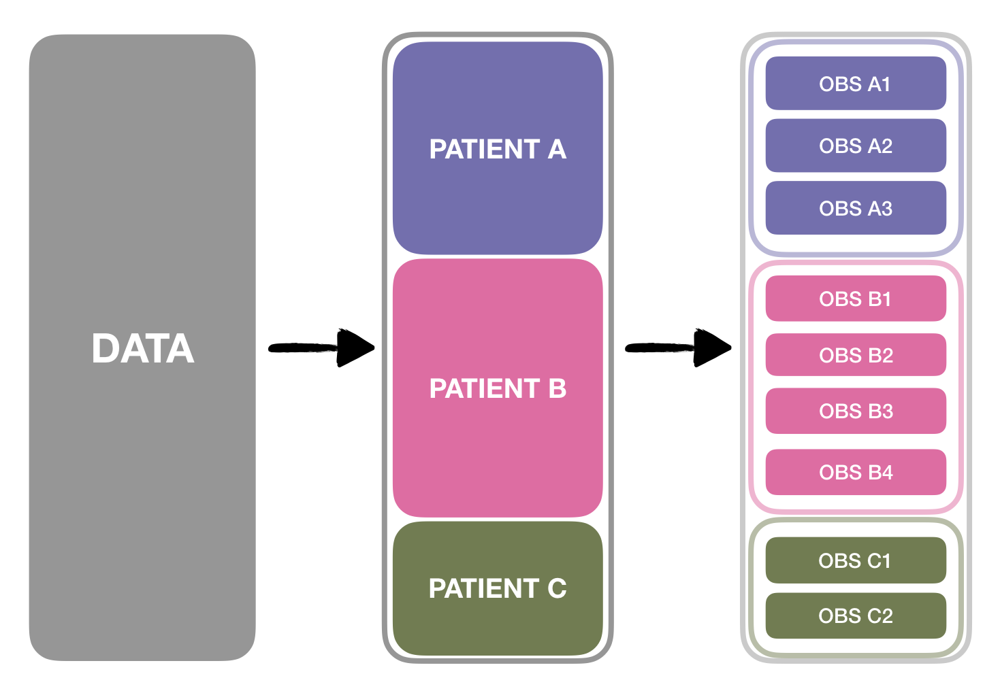
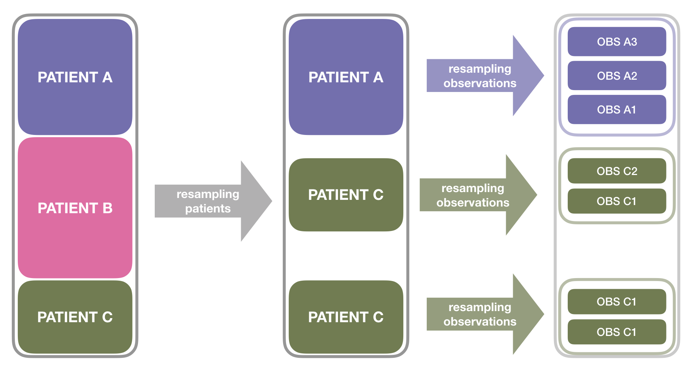
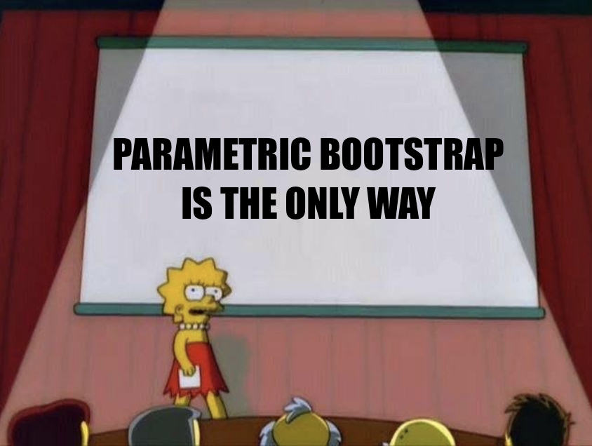

class: center, middle

# Joint Work

???

My comments when I present

---
class: center, middle

# _(Co)-Starring:_

---
class: center

# _(Co)-Starring:_
.column[

### Eva Cantoni


]

.column[

### Stephane Heritier


]

.column[

### Rory Wolfe


]

---


# Outline

1. **Clustered Data**

2. **Bootstrapping** Clustered Data

3. Bootstrapping Clustered Data via a **Weighted Laplace Approximation**

4. (Some) Properties

5. Discussion and Current Work

---
class: inverse, center, middle

```{r , include = FALSE}
knitr::opts_chunk$set(
  # fig.width=5,
  # fig.height=5,
  # out.width = '0.95\\linewidth',
  fig.dim = c(5,5),
  fig.align="center",
  echo =FALSE, 
  cache = TRUE, 
  message = FALSE,
  # results = 'hide', 
  warning = FALSE,
  global.par = TRUE, 
  # dpi=200,
  cache.lazy = FALSE, eval = FALSE)

# Primary Color Palette
pal_monashblue  <- "#006DAE"
pal_black       <- "#000000"
pal_white       <- "#FFFFFF"
pal_darkgrey    <- "#5A5A5A"
pal_grey        <- "#969696"
pal_lightGrey   <- "#E6E6E6"

# Secondary Color Palette

pal_blue        <- "#027EB6"
pal_burple      <- "#746FB2"
pal_fuchsia     <- "#9651A0"
pal_ruby        <- "#C8008F"
pal_pink        <- "#EE64A4"
pal_red         <- "#EE0220"
pal_orange      <- "#D93F00"
pal_umber       <- "#795549"
pal_olive       <- "#6F7C4D"
pal_green       <- "#008A25"
```

```{r}
library(plyr)
library(reshape)
library(lme4)
library(ggplot2)
library(dplyr)
library(xtable)
```

<!-- Tell a story  -->
<!-- This is the journey : Elevator pitch 30 seconds -->
<!-- Signpost along the way, i.e. 
<!-- Say where are we going and where are we up to in the story -->

# Clustered Data

---
class: center

### Data that can be **grouped**, according to a **hierarchical** structure. 



### _Highest_ level in the hierarchy: Independent **Clusters** ( $i$ )

???


A natural clustering factor in medical applications and longitudinal studies is the patient level. from which the different observations come. 


In this case, the patient, but in general it can be other things, such as hospitals in centre-patient studies. More levels of clustering can be considered.
---
class: center

### Modelling $\Rightarrow$ **Mixed Models** (MM)

.content-box-lightgrey[
$$\text{Mixed Effects} = \textbf{Fixed Effects} + \color{blue}{\textbf{Random Effects}}$$
]

---
class: center

### Modelling $\Rightarrow$ **Mixed Models** (MM)

.content-box-lightgrey[
$$\text{Mixed Effects} = \underbrace{\textbf{Fixed Effects}}_{\mathbf{X}_{i}\mathbf{\beta}} + \underbrace{\color{blue}{\textbf{Random Effects}}}_{\color{blue}{\mathbf{Z}_{i}\mathbf{D}_{\sigma}\mathbf{u}_{i}}}$$
]

--
.pull-left[
Generalized Linear Mixed Models (**GLMM**)

.content-box-lightgrey[
$${\scriptsize \underbrace{\text{link function}}_{g}\underbrace{\left[\mathbb{E}\text{xpected}\left(\textbf{Outcomes}\right)\right]}_{\left[\mathbb{E}\left( \mathbf{Y}_{i} \ \vert \ \mathbf{X}_{i} , \mathbf{u}_{i} \right)\right]} = \mathbf{X}_{i}\mathbf{\beta} + \color{blue}{\mathbf{Z}_{i}\mathbf{D}_{\sigma}\mathbf{u}_{i}}}$$
]

.black[Example] Longitudinal **Mixed Logit**: 

.content-box-lightgrey[

$$\log \frac{p_{ij}}{1-p_{ij}} = \mathbf{x}_{ij}^{T}\mathbf{\beta} + \color{blue}{\sigma_{1} u_{i}}$$
]
]

--
.pull-right[

Accelerated Failure Time Models (**AFT**)

.content-box-lightgrey[

$${\scriptsize \text{log}\underbrace{\left(\textbf{Duration}\right)}_{ \mathbf{T}_{i} } = \mathbf{X}_{i}\mathbf{\beta}+\color{blue}{\mathbf{Z}_{i}\mathbf{D}_{\sigma}\mathbf{u}_{i}}+\color{purple}{\phi\mathbf{\varepsilon}_i}}$$
]

.black[Example]: **AFT** with **Random Intercept** and **Right-Censoring**

.content-box-lightgrey[
\begin{align}
\log t_{ij}&= \mathbf{x}_{it}^T\mathbf{\beta} + \color{blue}{\sigma_1 u_i} + \phi\varepsilon_{it}\\
Y_{ij} &= (1-\delta_{ij}) t_{ij}+\delta_{ij} C_{ij}
\end{align}
$\delta_{ij}$, $C_{ij}$: censoring **indicators** and **times**
]
]

???

For parsimony, the effects of the different levels in this hierarchy are considered as random, this has the added advantage of modelling within-cluster correlations.

Mixed models _link_ the expected outcome with a combination of Fixed Effects and Random effects. 

This combination can be _linear_ yielding the class of generalized Linear Mixed Models. 

---
class: center, middle

### Likelihood Inference $\Rightarrow$ **(Numerical) Integration** (of $\color{\blue}{\mathbf{u}_{i}}$ )

.content-box-lightgrey[
$$\color{red}{\mathcal{L}_i\left(\mathbf{\theta}\right)} = \color{red}{f\left(\mathbf{y}_{i}\right)}$$
]

---
class: center, middle

### Likelihood Inference $\Rightarrow$ **(Numerical) Integration** (of $\color{\blue}{\mathbf{u}_{i}}$ )

.content-box-lightgrey[
$$\color{red}{\mathcal{L}_i\left(\mathbf{\theta}\right)} = \color{blue}{\int_{\mathbb{R}^q}} f\left(\mathbf{y}_i, \color{blue}{\mathbf{u}_i}\right) \mathrm{d} \color{blue}{\mathbf{u}_{i}}$$
]

???

As with many problems with unobserved random effects, these need to be partialed out by integration from the joint pdf of responses and random effects in order to construct the likelihood. 

---
class: center, middle

### Likelihood Inference $\Rightarrow$ **(Numerical) Integration** (of $\color{\blue}{\mathbf{u}_{i}}$ )

.content-box-lightgrey[
$$\color{red}{\mathcal{L}_i\left(\mathbf{\theta}\right)} = \int_{\mathbb{R}^q} \color{blue}{f\left(\mathbf{y}_i \vert \color{blue}{\mathbf{u}_i}\right)f\left(\color{blue}{\mathbf{u}_i}\right)} \mathrm{d} \mathbf{u}_{i}$$
]


???

which is the product between the conditional pdf or pmf and random effect density
---
class: center, middle

### Likelihood Inference $\Rightarrow$ **(Numerical) Integration** (of $\color{\blue}{\mathbf{u}_{i}}$ )

.content-box-lightgrey[
$$\color{red}{\mathcal{L}_i\left(\mathbf{\theta}\right)} =\int_{\mathbb{R}^q} \color{red}{\exp} \left[ \color{blue}{\log f\left(\mathbf{y}_i \vert \color{blue}{\mathbf{u}_i}\right)  + \log  f\left(\color{blue}{\mathbf{u}_i}\right)} \right] \ \mathrm{d}\mathbf{u}_{i}$$
]

???

which can be written for convenience as the exponents in the log 

--

### e.g. via the **Laplace Approximation** $\rightarrow \color{red}{\tilde{\mathcal{L}}\left(\mathbf{\theta}\right)}$.
---
class: inverse, center, middle

# Bootstrapping Clustered Data

---
class: center, middle

### _Classical_ Bootstrap **does not respect the clustering structure**


---
class: center, middle

### _Cluster_ Bootstrap  **might be limited** by the **number of elements** at each level



---
class: center, middle

### _Residual_ Bootstrap **struggles** with **random effects** and **link function**

--

.pull-left[
Easy(-ish) in **Gaussian LMM**

.content-box-lightgrey[
$$\mathbf{x}_{ij}^T\widehat{\mathbf{\beta}} + \widehat{\sigma}_1\color{red}{\widehat{u}_{i}^{{\star}}} + \widehat{\phi}\color{red}{\widehat{\varepsilon}_{i}^{{\star}}} \longrightarrow  y_{ij}^{\color{red}{\star}}$$
]

<!--  -->


]

--
.pull-right[

Not that clear **in other cases**

.content-box-lightgrey[
$$\mathbf{x}_{ij}^T \widehat{\mathbf{\beta}} + \widehat{\sigma}_1\color{red}{\widehat{u}_{i}^{{\star}}}  \overset{\mathbf{???}}{\rightarrow}
g(\mathbb{E}[y_{ij}^{\color{red}{\star}}]) 
\overset{\mathbf{???}}{\rightarrow}
y_{ij}^{\color{red}{\star}}$$
]

<!--  -->


]

---
class: center, middle

<!--  -->

### _Parametric_ Bootstrap is the only **feasible** and **convenient** alternative 

???

At this point in the talk it appears that Parametric Bootstrap (approach based on simulations) is the only feasible and convenient alternative 

---
class: inverse, center, middle

# Bootstrapping Clustered Data via a Weighted Laplace Approximation* 

???

That said, it also help us segue into the title of the talk

--

(*yup! Our proposal!)

???

What is it that we propose?

---
class: dark, center, middle


## Random Weighted Laplace Bootstrap (RWLB)

--

### **General** scheme relying on **externally generated _Random Weights_**

---

# RWLB Algorithm

### 1. **Generate _Random Weights_**  ${\color{red}{w_{i}^{*}}}$
--

### 2. **Apply** to $\color{blue}{f(\mathbf{y}_i,\mathbf{u}_i)}$ 
--

### 3. **Evaluate via the _Laplace Approximation_** ${\color{red}{\tilde{\mathcal{L}}_{i}^{*}}}$  
--

### 4. Optimize
--
...
--

### 5. Profit! 
---

# (Some) Details

### 1. **Generate _Random Weights_**  ${\color{red}{w_{i}^{*}}}$

.content-box-lightgrey[
$$\mathbb{E}\left[{\color{red}{w^{*}_{i}}}\right] = \mathbb{V}ar\left[{\color{red}{w^{*}_{i}}}\right]=1 \qquad \text{e.g. } \mathcal{E}(1)$$
]

--

### 2. **Apply** to $\color{blue}{f(\mathbf{y}_i,\mathbf{u}_i)}$ 

.content-box-lightgrey[
$$\mathcal{L}_i^{*} \left(\mathbf{\theta}\right) = 
\int_{\mathbb{R}^q} 
\exp \left\{- \left[ - {\color{red}{w_{i}^{*}}} 
\color{blue}{\log f\left(\mathbf{y}_i \vert \mathbf{u}_i\right)}  - 
{\color{red}{w_{i}^{*}}} \log f\left(\color{blue}{\mathbf{u}_i}\right)\right] \right\}   \mathrm{d}\mathbf{u}_{i}$$
]

--

### 3.(4. and 5.)  **Evaluate** : Package `TMB` (`C++` Templates and `R`)

---
class: inverse, center, middle

# (Some) Properties

---
class: dark, center, middle

# The Good `r icon::fontawesome("thumbs-up")`


---
class: middle

# `r icon::fontawesome("thumbs-up")` Flexible

--

## Can be applied to **a wide variety of Mixed Models**

--

### `r icon::fontawesome("arrow-circle-right")` Can deal with **Non-Gaussian Responses** and **Censored Data**
  
### `r icon::fontawesome("arrow-circle-right")` Software **implementation is straightforward**

---
### `r icon::fontawesome("thumbs-up")` Flexible

.content-box-lightgrey[
$$\mathcal{L}_i^{*} \left(\mathbf{\theta}\right) = 
\int_{\mathbb{R}^q} 
\exp \left\{- \left[ - {\color{red}{w_{i}^{*}}} 
\color{blue}{\log f\left(\mathbf{y}_i \vert \mathbf{u}_i\right)}  - 
{\color{red}{w_{i}^{*}}} \log f\left(\color{blue}{\mathbf{u}_i}\right)\right] \right\}   \mathrm{d}\mathbf{u}_{i}$$
]

--

.black[Example:] **Mixed Logit**

.tothe-left[
`template.cpp`: application of $\color{red}{w_i^{*}}$

```c
...
for(int j=0;j<ngroups;j++){
* res-= w[j]*dnorm(u[j], Type(0) ,sigma,1); 
}

for(int i=0;i<nobs;i++){
  j=group[i];
* res-= w[j]*dbinom(y[i],Type(1),Type(1/(1+exp(-mu[i]-u[j]))),1);
}
...
```
]
--
.tothe-right[

`estimation.R`: Approximation and $\mathcal{L}(\mathbf{\theta})$
```r
...
# Compilation
* compile("template.cpp")

# Loading to the Environment
dyn.load(dynlib("template")) 

# AD Object creation
obj <- MakeADFun(data=data,
                 parameters=parameters,
                 random="u",
                 DLL="template"
                 )
# Optimisation                  
opt <-nlminb(obj$par, obj$fn, obj$gr)
...
```
]

---
class: middle

# `r icon::fontawesome("thumbs-up")` Correct

--

## **Good approximation** of the **Asymptotic Distribution**

--

### `r icon::fontawesome("arrow-circle-right")` $\sqrt{n} \left(\widehat{\mathbf{\beta}}^{*} - \widehat{\beta}\right)$ is `r icon::fontawesome("check")`

--

### `r icon::fontawesome("arrow-circle-right")`  $\sqrt{n} \left(\widehat{\mathbf{\sigma}}^{*} - \widehat{\sigma}\right)$ is `r icon::fontawesome("check-circle")` 

---
class: dark, middle, center 

# Simulations
--

# 1. **Mixed Logit** 
---

### Simulation: **Mixed Logit**

- **Parameters** :  .black[4 Fixed Effects] ( $\beta_k$ ) and .black[1 Random intercept] ( $\sigma_1$ )

- **Number of Simulations**: 1000 with $B=1000$ **Bootstrap Replicates** 
- **Studied methods**: .green[RWLB] vs .red[Parametric Bootstrap (PB)]

- **Cluster size** ( $n_i$ ): **7** and **21**

- **Number of clusters** ( $n$ ): **300** and **600**

--

#### .black[Q-Q plots]: _Average_ **Bootstrap** replicates vs. **Empirical** Distributions 

.content-box-lightgrey[
$$\sqrt{n}\left(\widehat{\beta}_{k}^{*}-\widehat{\beta}_{k}\right) \ \  \text{vs.} \ \ \sqrt{n}\left(\widehat{\beta}_{k} - \beta_{k}\right)
\qquad \sqrt{n} \left(\widehat{\sigma}_1^{*} - \widehat{\sigma}_{1}\right) \ \ \text{vs.} \ \ \sqrt{n} \left(\widehat{\sigma}_{1} - \sigma_1\right)$$
]

???

To illustrate these points, let me show you a comparison of the Mean Bootstrap distribution vs. the empirical by means of qq-plots

---
class: center

```{r load_data, include=FALSE}
estimates.df <- read.table(
  "~/Dropbox/Paper/Reports/GSEMThesis/Ch2/Review/Simulations/simulated_datasets/estimates_full.txt", 
  header = TRUE)

estimates.df %>% mutate(
  real_value=
    case_when(Parameter== "b_1" ~1,
              Parameter== "b_2" ~1,
              Parameter== "b_3" ~-0.5,
              Parameter== "b_4" ~1,
              Parameter== "log_sigma"~log(1),
              Parameter== "sigma"~1,
              Parameter== "sigma2"~1
    ),
  scaled_value = sqrt(n_g)*(value-real_value)
) -> estimates.df

```

```{r load_replicates_rwlb, include = FALSE}
replicates_rwlb.df <- read.table(
  "~/Dropbox/Paper/Reports/GSEMThesis/Ch2/Review/Simulations/simulated_datasets/replicates_rwlb_full.txt", 
  header = TRUE)

replicates_rwlb.df %>%
  select(-Method) %>% 
  inner_join(
    filter(estimates.df, Method == "laml"),
    by = c("Sample","Parameter","n_i", "n_g"), 
    suffix=c("_rwlb", "_laml")
  ) %>%
  select(-Method) %>% 
  inner_join(
    filter(estimates.df, Method == "agqd"),
    by = c("Sample","Parameter","n_i", "n_g", "real_value"), 
    suffix=c("_laml", "_agqd")
  ) %>% 
  rename(value_agqd = value) %>% 
  arrange(Sample) %>%
  mutate(
    scaled_value_rwlb_laml = sqrt(n_g)*(value_rwlb - value_laml),  
    scaled_value_rwlb_agqd = sqrt(n_g)*(value_rwlb - value_agqd)
  ) -> replicates_rwlb.df
```

```{r load_replicates_parb, include = FALSE}
replicates_parb.df <- read.table(
  "~/Dropbox/Paper/Reports/GSEMThesis/Ch2/Review/Simulations/simulated_datasets/replicates_parb_full.txt", 
  header = TRUE)

replicates_parb.df %>%
  select(-Method) %>% 
  inner_join(
    filter(estimates.df, Method == "laml"),
    by = c("Sample","Parameter","n_i", "n_g"), 
    suffix=c("_parb", "_laml")
  ) %>%
  select(-Method) %>% 
  inner_join(
    filter(estimates.df, Method == "agqd"),
    by = c("Sample","Parameter","n_i", "n_g", "real_value"), 
    suffix=c("_laml", "_agqd")
  ) %>% 
  rename(value_agqd = value) %>% 
  arrange(Sample) %>%
  mutate(
    scaled_value_parb_laml = sqrt(n_g)*(value_parb - value_laml),  
    scaled_value_parb_agqd = sqrt(n_g)*(value_parb - value_agqd)
  ) -> replicates_parb.df
```

```{r qqplot_functions , include = FALSE}
compare_boots_vs_emp <- function(
  parameter, ni, ng,
  estimates=estimates.df,
  replicates_rwlb = replicates_rwlb.df, 
  replicates_parb = replicates_parb.df,
  est_method = c("laml", "agqd")
){
  est_method <- match.arg(est_method)
  x <- estimates %>% 
    filter(
      Parameter == parameter, 
      n_i == ni,n_g == ng, 
      Method == est_method
    ) %>% 
    select(scaled_value)
  
  if(est_method == "laml"){
    y_rwlb <- replicates_rwlb %>% 
      filter(
        Parameter == parameter, 
        n_i == ni, n_g == ng 
      ) %>% 
      select(scaled_value_rwlb_laml) %>% as.vector()
    
    y_parb <- replicates_parb %>% 
      filter(
        Parameter == parameter, 
        n_i == ni,n_g == ng
      ) %>% 
      select(scaled_value_parb_laml) %>% as.vector()
    
  } else {
    
    y_rwlb <- replicates_rwlb %>% 
      filter(
        Parameter == parameter, 
        n_i == ni, n_g == ng 
      ) %>% 
      select(scaled_value_rwlb_agqd) %>% as.vector()
    
    y_parb <- replicates_parb %>% 
      filter(
        Parameter == parameter, 
        n_i == ni,n_g == ng
      ) %>% 
      select(scaled_value_parb_agqd) %>% as.vector()
  }

  qq_rwlb <- qqplot(x = x[,1] , y = y_parb[,1], plot.it = FALSE)
  qq_parb <- qqplot(x = x[,1] , y = y_rwlb[,1], plot.it = FALSE)
  
  points_df = rbind(
    data.frame(bootstrap="PARB", x = qq_parb$x , y= qq_parb$y),
    data.frame(bootstrap="RWLB", x = qq_rwlb$x , y= qq_rwlb$y)
  )
  library(ggplot2)
  points_df%>% 
    ggplot()+
    geom_point(aes(x, y, col = bootstrap))+
    xlab("Empirical") + ylab("(Pooled) Bootstrap")+
    scale_color_manual(values = c(pal_fuchsia, pal_green),
                      name  ="Method",
                      breaks=c("PARB", "RWLB"),
                      labels=c("Parametric", "RWLB"))+
    geom_abline(intercept = 0, slope =1, lty = 2, alpha = 0.5) + 
    theme_classic()
}

compare_boots_vs_emp_all_betas <- function(
  parameters, 
  ni, ng,
  estimates=estimates.df,
  replicates_rwlb = replicates_rwlb.df, 
  replicates_parb = replicates_parb.df,
  est_method = c("laml", "agqd")
){
  est_method <- match.arg(est_method)
  dfs <- list()
  for(parameter in parameters){
    x <- estimates %>% 
      filter(
        Parameter == parameter, 
        n_i == ni,n_g == ng, 
        Method == est_method
      ) %>% 
      select(scaled_value)
    
    if(est_method == "laml"){
      y_rwlb <- replicates_rwlb %>% 
        filter(
          Parameter == parameter, 
          n_i == ni, n_g == ng 
        ) %>% 
        select(scaled_value_rwlb_laml) %>% as.vector()
      
      y_parb <- replicates_parb %>% 
        filter(
          Parameter == parameter, 
          n_i == ni,n_g == ng
        ) %>% 
        select(scaled_value_parb_laml) %>% as.vector()
      
    } else {
      
      y_rwlb <- replicates_rwlb %>% 
        filter(
          Parameter == parameter, 
          n_i == ni, n_g == ng 
        ) %>% 
        select(scaled_value_rwlb_agqd) %>% as.vector()
      
      y_parb <- replicates_parb %>% 
        filter(
          Parameter == parameter, 
          n_i == ni,n_g == ng
        ) %>% 
        select(scaled_value_parb_agqd) %>% as.vector()
    }
    
    qq_rwlb <- qqplot(x = x[,1] , y = y_parb[,1], plot.it = FALSE)
    qq_parb <- qqplot(x = x[,1] , y = y_rwlb[,1], plot.it = FALSE)
    
    dfs[[parameter]] = rbind(
      data.frame(parm = parameter, bootstrap="PARB", x = qq_parb$x , y= qq_parb$y),
      data.frame(parm = parameter, bootstrap="RWLB", x = qq_rwlb$x , y= qq_rwlb$y)
    )
  }
  
  points_df <- bind_rows(dfs) %>% 
    mutate(
      parameter_fac =
        case_when(parm== "b_1" ~"beta[0]",
                  parm== "b_2" ~"beta[1]",
                  parm== "b_3" ~"beta[2]",
                  parm== "b_4" ~"beta[3]"
      )
    )
  
  library(ggplot2)
  points_df%>% 
    ggplot()+
    geom_point(aes(x, y, col = bootstrap))+
    xlab("Empirical") + ylab("(Pooled) Bootstrap")+
    scale_color_manual(values = c(pal_fuchsia, pal_green),
                       name  ="Method",
                       breaks=c("PARB", "RWLB"),
                       labels=c("Parametric", "RWLB"))+
    geom_abline(intercept = 0, slope =1, lty = 2, alpha = 0.5) + 
    facet_wrap(.~ parameter_fac, labeller = "label_parsed")+
    theme_classic()
}
```


###  Fixed Effect Parameters $\beta_k$
**Number of clusters** $n = 300$
.pull-left[
**Cluster size** $n_i= 7$
```{r, fig.align="center"}
compare_boots_vs_emp_all_betas(
  parameters = c("b_1", "b_2", "b_3", "b_4"), 
    ni=7, ng=300, est_method = "laml")

```
]

???

As we have said at the introduction of this section, the approximation of the bootstrap to the asymptotic distribution is very correct as shown by the alignment of the green lines over the identiy line.

This is valid accross 

--

.pull-right[
**Cluster size** $n_i = 21$
```{r, fig.align="center"}
compare_boots_vs_emp_all_betas(
  parameters = c("b_1", "b_2", "b_3", "b_4"), 
    ni=21, ng=300, est_method = "laml")

```
]

---
class: center

### Random Effect Variance $\sigma_1^{2}$

**Cluster size** $n_{i} = 7$
.pull-left[
**Number of Clusters:** $n = 300$
```{r, fig.align="center"}
 compare_boots_vs_emp(
  parameter="sigma2", ni=7, ng=300, est_method = "laml")

```
]

.pull-right[
**Number of Clusters:** $n = 600$
```{r, fig.align="center"}
 compare_boots_vs_emp(
  parameter="sigma2", ni=7, ng=600, est_method = "laml")
```
]

---
class: center

### Random Effect Variance $\sigma_{1}^{2}$
**Cluster size** $n_{i} = 14$
.pull-left[
**Number of Clusters:** $n = 300$
```{r, fig.align="center"}
 compare_boots_vs_emp(
  parameter="sigma2", ni=14, ng=300, est_method = "laml")

```
]

.pull-right[
**Number of Clusters:** $n = 600$
```{r, fig.align="center"}
compare_boots_vs_emp(
  parameter="sigma2", ni=14, ng=600, est_method = "laml")

```
]

---
class: center

### Random Effect Variance $\sigma_{1}^{2}$
**Cluster size** $n_{i} = 21$


.pull-left[
**Number of Clusters:** $n = 300$
```{r, fig.align="center"}
compare_boots_vs_emp(
  parameter="sigma2", ni=21, ng=300, est_method = "laml")

```
]

.pull-right[
**Number of Clusters:** $n = 600$
```{r, fig.align="center"}
compare_boots_vs_emp(
  parameter="sigma2", ni=21, ng=600, est_method = "laml")

```
]
---
class: center

### Coverage Ratios 


```{r , include = FALSE}
coverage_ratios.df <- read.table(
  "~/Dropbox/Paper/Reports/GSEMThesis/Ch2/Review/Simulations/simulated_datasets/coverage_ratios_full.txt", 
  header = TRUE)
alpha = 0.05
coverage_ratios.df %>% 
  mutate(
    parameter_fac = case_when(
      Parameter=="b_1"~"beta[0]",
      Parameter=="b_2"~"beta[1]",
      Parameter=="b_3"~"beta[2]",
      Parameter=="b_4"~"beta[3]",
      Parameter=="log(sigma)"~"log~sigma",
      Parameter=="sigma"~"sigma",
      Parameter=="sigma2"~"sigma^2",
      ),
    n_g_fac = case_when(
      n_g==300~"n[g]==300",
      n_g==600~"n[g]==600"
      ),
    n_i_fac = case_when(
      n_i==7~"n[i]==7",
      n_i==14~"n[i]==14",
      n_i==21~"n[g]==21"
      )
    ) -> coverage_ratios.df
```


```{r, fig.dim=c(10,6)}
coverage_ratios.df%>%
  filter(
    Parameter %in% c(paste("b", 1:4, sep="_") , "sigma2"),
    Method %in% c("laml", "rwlb_P", "rwlb_S"))%>%
  ggplot() +
  geom_col(aes(factor(n_i), value, fill = Method), position="dodge")+
  scale_fill_manual(values = c(pal_pink, pal_green,pal_olive),
                    name  ="Method",
                    breaks=c("laml", "rwlb_P", "rwlb_S"),
                    labels=c("Asymptotic", "Percentile RWLB", "Studentized RWLB"))+
  coord_cartesian(ylim=range(coverage_ratios.df$value))+
  facet_grid(n_g_fac~parameter_fac, labeller = "label_parsed", switch="y")+ 
  xlab(expression(n[i]))+
  geom_hline(aes(yintercept = 1-alpha), lty= 2, col="blue")+
  ggtitle("Asymptotic vs RWLB (Percentile and Studentized)")+
  theme_classic() 
```
---
class: center

### Coverage Ratios 

```{r, fig.dim=c(10,6)}
coverage_ratios.df%>%
  filter(
    Parameter %in% c(paste("b", 1:4, sep="_") , "sigma2"),
    Method %in% c("rwlb_P","parb_P"))%>%
  ggplot() +
  geom_col(aes(factor(n_i), value, fill = Method), position="dodge")+
  scale_fill_manual(values = c(pal_green,pal_fuchsia),
                    name  ="Method",
                    breaks=c("rwlb_P","parb_P"),
                    labels=c("Percentile RWLB", "Percentile Parametric"))+
  coord_cartesian(ylim=range(coverage_ratios.df$value))+
  facet_grid(n_g_fac~parameter_fac, labeller = "label_parsed", switch="y")+ 
  xlab(expression(n[i]))+
  geom_hline(aes(yintercept = 1-alpha), lty= 2, col="blue")+
  ggtitle("Parametric vs RWLB (Percentile)")+
  theme_classic() 
```
---
class: center

### Coverage Ratios 

```{r, fig.dim=c(10,6)}
coverage_ratios.df%>%
  filter(
    Parameter %in% c(paste("b", 1:4, sep="_") , "sigma2"),
    Method %in% c("rwlb_S","parb_S"))%>%
  ggplot() +
  geom_col(aes(factor(n_i), value, fill = Method), position="dodge")+
  scale_fill_manual(values = c(pal_olive,pal_ruby),
                    name  ="Method",
                    breaks=c("rwlb_S","parb_S"),
                    labels=c("Studentized RWLB", "Studentized Parametric"))+
  coord_cartesian(ylim=range(coverage_ratios.df$value))+
  facet_grid(n_g_fac~parameter_fac, labeller = "label_parsed", switch="y")+ 
  xlab(expression(n[i]))+
  geom_hline(aes(yintercept = 1-alpha), lty= 2, col="blue")+
  ggtitle("Parametric vs RWLB (Studentized)")+
  theme_classic() 
```
---
class: dark, middle, center 

# Simulations
--

# 2. **Log-Normal AFT** 
---
### Simulated **Log-Normal AFT**

- **Parameters**: 4 Fixed Effects ( $\beta_k$ ), 1 Random intercept ( $\sigma_1$ ) and a Scale ( $\phi$ ) 
- Number of Simulations: 1000 with $B=1000$ Bootstrap Replicates

- **Studied methods**: .green[RWLB] vs .pink[Asymptotic based on the Laplace-Approximated Likelihood] 

- **Cluster sizes ( $n_i$ )**: 4, 10, 20, 50

- **Number of clusters ( $n$ )**: 20, 50, 100, 200 

- **Degree of censoring**:  0% and 23%

- **Signal-to-noise Ratio** $\displaystyle \frac{\sigma_{1}}{\phi} = 1/0.5 = 2$
--

####  .black[Box-Plots]: Small-sample Bias Correction of $\widehat{\sigma_1}$

.content-box-lightgrey[
$$\widehat{\sigma}_1^{\text{BC}} = \widehat{\sigma}_1^{\text{ML}} - \frac{1}{B}\sum_{b=1}^B\left[ \color{forestgreen}{\widehat{\sigma}^{*}_{1}} -  \widehat{\sigma}_1^{\text{ML}}\right]$$
]


---
class: center

### Boxplots of $\widehat{\sigma}_1$

```{r , include = FALSE}
rm(list=ls())

knitr::opts_chunk$set(
    # fig.width=5,
    # fig.height=5,
    # out.width = '0.95\\linewidth',
  fig.dim=c(12,6),
    echo =FALSE, 
    cache = TRUE, 
    message = FALSE,
    # results = 'hide', 
    warning = FALSE,
    # dpi=200,
    global.par = TRUE, 
    cache.lazy = FALSE)

# Primary Color Palette
pal_monashblue  <- "#006DAE"
pal_black       <- "#000000"
pal_white       <- "#FFFFFF"
pal_darkgrey    <- "#5A5A5A"
pal_grey        <- "#969696"
pal_lightGrey   <- "#E6E6E6"

# Secondary Color Palette

pal_blue        <- "#027EB6"
pal_burple      <- "#746FB2"
pal_fuchsia     <- "#9651A0"
pal_ruby        <- "#C8008F"
pal_pink        <- "#EE64A4"
pal_red         <- "#EE0220"
pal_orange      <- "#D93F00"
pal_umber       <- "#795549"
pal_olive       <- "#6F7C4D"
pal_green       <- "#008A25"
```

```{r, include =  FALSE}

library(tidyr)
library(dplyr)

bs  <- c(1, 1, -0.5, 1)

## Sigma #
s1  <- c(0.2, 0.5, 1)
s0  <- 0.5

## ni ##
ni  <- c(4, 10, 20, 50)

## ng ##
ng  <- c(20, 50, 100)

bs.rlrbc <- read.table(
  "~/Dropbox/[Uni] MONASH/[Codes]/LP-RE-ML-Bootstrap/b_lp-re-ml_bc.txt"
  )
ss.rlrbc <- read.table(
  "~/Dropbox/[Uni] MONASH/[Codes]/LP-RE-ML-Bootstrap/s_lp-re-ml_bc.txt"
  )

bs_dta <- bs.rlrbc %>% pivot_longer(
  cols = paste("b",1:4,sep="."),
  names_to= "parameter") 

ss_dta <- ss.rlrbc %>% pivot_longer(
  cols = paste("s",c(1,0),sep="."),
  names_to = "parameter") 

th_dta <- full_join(bs_dta, ss_dta)

th_dta %>% 
  mutate(s_1_fac = factor(s_1 , 
                          labels = c("sigma[1]==0.2","sigma[1]==0.5","sigma[1]==1")),
         n_i_fac = factor(n_i , 
                          labels = c("n[i]==2","n[i]==4","n[i]==10","n[i]==20", "n[i]==50")),
         n_g_fac = factor(n_g,
                           labels = c("n==20", "n==50","n==100","n==200")),
         cns_fac = factor(cns, labels = c("cens==0", "cens==23")), 
         mth_fac = case_when(
           mth == "lpml"~"Approx.~Asymptotic",
           mth == "rb-lpml"~"RWLB~Corrected", 
           mth == "rb-reml"~"RWLB~Corrected (REML)",
           mth == "reml"~"Approx.~Asymptotic REML"
         )
         ) -> th_dta
```

```{r, fig.align="center",  fig.dim=c(6,6)}
th_dta %>% 
  filter(parameter == "s.1", n_i>2, s_1==1 , mth %in% c("lpml"), cns==0) %>%
  ggplot() +
  geom_boxplot(mapping = aes(x = factor(n_i), y = value, fill = mth))+
  scale_fill_manual(values = c(pal_pink),
                      name  ="Method",
                      breaks=c("lpml"),
                      labels=c("Laplace-Approx. Asymptotic"))+
  facet_grid(~mth_fac+n_g_fac, scales = "free_y", labeller = label_parsed)+
  xlab(label = expression(n[i])) +
  ylab(label = expression(sigma[1]))+
  geom_hline(aes(yintercept = bs[1]), lty= 2, col="blue")+
  theme_classic()
```

---
class: center

### Boxplots of $\widehat{\sigma}_1$

```{r, fig.align="center", fig.dim=c(12,6)}
th_dta %>% 
  filter(parameter == "s.1", n_i>2, s_1==1 , mth %in% c("lpml", "rb-lpml"), cns==3) %>%
  ggplot() +
  geom_boxplot(mapping = aes(x = factor(n_i), y = value, fill = mth))+
  scale_fill_manual(values = c(pal_pink, pal_green),
                      name  ="Method",
                      breaks=c("lpml", "rb-lpml"),
                      labels=c("Laplace-Approx. Asymptotic", "RWLB-Corrected"))+
  facet_grid(~mth_fac+n_g_fac, scales = "free_y", labeller = label_parsed)+
  xlab(label = expression(n[i])) +
  ylab(label = expression(sigma[1]))+
  geom_hline(aes(yintercept = bs[1]), lty= 2, col="blue")+
  theme_classic()

```


---
class: center

### Boxplots of $\widehat{\phi}$

```{r, fig.align="center", fig.dim=c(6,6)}
th_dta %>% 
  filter(parameter == "s.0", n_i>2, s_1==1 , mth %in% c("lpml"), cns==0) %>%
  ggplot() +
  geom_boxplot(mapping = aes(x = factor(n_i), y = value, fill = mth))+
  scale_fill_manual(values = c(pal_pink),
                      name  ="Method",
                      breaks=c("lpml"),
                      labels=c("Laplace-Approx. Asymptotic"))+
  facet_grid(~mth_fac+n_g_fac, scales = "free_y", labeller = label_parsed)+
  xlab(label = expression(n[i])) +
  ylab(label = expression(phi))+
  geom_hline(aes(yintercept = 0.5), lty= 2, col="blue")+
  theme_classic()

```

---
class: center

### Boxplots of $\widehat{\phi}$

```{r, fig.align="center",  fig.dim=c(12,6)}
th_dta %>% 
  filter(parameter == "s.0", n_i>2, s_1==1 , mth %in% c("lpml", "rb-lpml"), cns==3) %>%
  ggplot() +
  geom_boxplot(mapping = aes(x = factor(n_i), y = value, fill = mth))+
  scale_fill_manual(values = c(pal_pink, pal_green),
                      name  ="Method",
                      breaks=c("lpml", "rb-lpml"),
                      labels=c("Laplace-Approx. Asymptotic", "RWLB-Corrected"))+
  facet_grid(~mth_fac+n_g_fac, scales = "free_y", labeller = label_parsed)+
  xlab(label = expression(n[i])) +
  ylab(label = expression(phi))+
  geom_hline(aes(yintercept = 0.5), lty= 2, col="blue")+
  theme_classic()

```
---
class: dark, center, middle

# The 'meh' `r icon::fontawesome("thumbs-down")`


---
# Some Caveats

### `r icon::fontawesome("thumbs-down")` Can be **unstable** in **extreme Cases**

--

- RWLB is tributary to the quality of the estimation method.

    - **Cluster Size** is **too small** and/or

    - **Signal-to-noise** ratio is **weak** 

---
class: center

### Simulated AFT - $\widehat{\sigma}_1$ : Same as before

```{r, fig.align="center", fig.dim=c(12,6)}
th_dta %>% 
  filter(parameter == "s.1", n_i>2, s_1==1 , mth %in% c("lpml", "rb-lpml"), cns==0) %>%
  ggplot() +
  geom_boxplot(mapping = aes(x = factor(n_i), y = value, fill = mth))+
  facet_grid(~mth_fac+n_g_fac, scales = "free_y", labeller = label_parsed)+
  scale_fill_manual(values = c(pal_pink, pal_green),
                      name  ="Method",
                      breaks=c("lpml", "rb-lpml"),
                      labels=c("Laplace-Approx. Asymptotic", "RWLB-Corrected"))+
  xlab(label = expression(n[i])) +
  ylab(label = expression(sigma[1]))+
  geom_hline(aes(yintercept = 1), lty= 2, col="blue")+
  geom_hline(aes(yintercept = 0), lwd= 2)+
  theme_classic()
```

---
class: center

### Simulated AFT - $\widehat{\sigma}_1$ : **s-t-n = 1**

```{r, fig.align="center", fig.dim=c(12,6)}
th_dta %>% 
  filter(parameter == "s.1", n_i>2, s_1==0.5 , mth %in% c("lpml", "rb-lpml"), cns==0) %>%
  ggplot() +
  geom_boxplot(mapping = aes(x = factor(n_i), y = value, fill = mth))+
  scale_fill_manual(values = c(pal_pink, pal_green),
                      name  ="Method",
                      breaks=c("lpml", "rb-lpml"),
                      labels=c("Laplace-Approx. Asymptotic", "RWLB-Corrected"))+
  facet_grid(~mth_fac+n_g_fac, scales = "free_y", labeller = label_parsed)+
  xlab(label = expression(n[i])) +
  ylab(label = expression(sigma[1]))+
  geom_hline(aes(yintercept = 0.5), lty= 2, col="blue")+
  geom_hline(aes(yintercept = 0), lwd= 2)+
  theme_classic()
```
---
class: center

### Simulated AFT - $\widehat{\sigma}_1$ : **s-t-n = 0.4**

```{r, fig.align="center", fig.dim=c(12,6)}
th_dta %>% 
  filter(parameter == "s.1", n_i>2, s_1==0.2 , mth %in% c("lpml", "rb-lpml"), cns==0) %>%
  ggplot() +
  geom_boxplot(mapping = aes(x = factor(n_i), y = value, fill = mth))+
  scale_fill_manual(values = c(pal_pink, pal_green),
                      name  ="Method",
                      breaks=c("lpml", "rb-lpml"),
                      labels=c("Laplace-Approx. Asymptotic", "RWLB-Corrected"))+
  facet_grid(~mth_fac+n_g_fac, scales = "free_y", labeller = label_parsed)+
  xlab(label = expression(n[i])) +
  ylab(label = expression(sigma[1]))+
  geom_hline(aes(yintercept = 0.2), lty= 2, col="blue")+
  geom_hline(aes(yintercept = 0), lwd= 2)+
  theme_classic()
```


---
class: center

### Simulated AFT - $\widehat{\sigma}_1$ : **s-t-n = 0.4, $n_{i}=2$**

```{r, fig.align="center", fig.dim=c(12,6)}
th_dta %>% 
  filter(parameter == "s.1", s_1==0.2 , mth %in% c("lpml", "rb-lpml"), cns==0) %>%
  ggplot() +
  geom_boxplot(mapping = aes(x = factor(n_i), y = value, fill = mth))+
  scale_fill_manual(values = c(pal_pink, pal_green),
                      name  ="Method",
                      breaks=c("lpml", "rb-lpml"),
                      labels=c("Laplace-Approx. Asymptotic", "RWLB-Corrected"))+
  facet_grid(~mth_fac+n_g_fac, scales = "free_y", labeller = label_parsed)+
  xlab(label = expression(n[i])) +
  ylab(label = expression(sigma[1]))+
  geom_hline(aes(yintercept = 0.2), lty= 2, col="blue")+
  geom_hline(aes(yintercept = 0), lwd= 3)+
  theme_classic()
```

---
# Some Caveats

### `r icon::fontawesome("thumbs-down")` **Variance** of some $\widehat{\mathbf{\sigma}}^{*}$  **differs slightly** from the asymptotic.

- Divergence **Depends on the relationship between**:  
    
    - **Marginal Variance** of the Observations  $\mathbb{V}ar(\mathbf{Y}_i) = \mathbf{\Sigma}_{i}$: and 
    
    - **Contrasts of the Random Effects**:  $\mathbf{Z}_{i}$ 

--

- **In LMM**, this is _easy-ish_ to figure out.
  
    - Relationship **governed by** $\text{tr}(\mathbf{\Sigma}_{i}^{-1}\mathbf{Z}_{i}\mathbf{Z}_{i}^{T})$

    - **"Fuller" designs**, e.g. *Random Intercept*  $\mathbf{Z}_{ir} = \mathbb{1}_{n_{i}}$ and *Slope*  $\mathbf{Z}_{ir} = \mathbf{x}^{(k)}_{i}$ seem less affected. 
    
    - **"Sparser"" designs** e.g. the *Random Error* $\varepsilon$ with $\mathbf{Z}_{i0} = \mathbf{I}_{n_{i}}$ seem to be **most divergent**.
    
    - Possible **fix**: increases in $n_i$. 
    
---
class: inverse, center, middle

# Discussion and Current Work

---

# Discussion

### RWLB has good properties as a bootstrapping method.

--

- `r icon::fontawesome("thumbs-up")` **Flexible** to be applied in many fields.

- `r icon::fontawesome("thumbs-up")` **Correct** to provide good inference.

--

### RWLB has a few drawbacks.

- `r icon::fontawesome("thumbs-down")` **settings** where it appears to fail

- `r icon::fontawesome("thumbs-down")` **improvements** to its estimation of variability. 

---

# Current Work

#### 1. Data applications 

- Time-to-failure studies on patients submitting to dialysis under two different treatments.

--

#### 2. Further software implementation of estimation methods in AFT


- Software tool allowing for flexible estimation of AFT models for Clustered Data (different distributions for durations and Random effects)

- Bootstrapping via RWLB is intended as a feature. 

--

#### 3. Improvements

- REML-like-based estimation method and its effects on variance and bias. 

---

# References (and Associated Publications) 

F-A, Cantoni (2020),  **Bootstrapping generalized linear mixed models via a weighted Laplace approximation**, 

- _Under Review_

F-A, Cantoni (2019), **Bootstrap estimation of uncertainty in prediction for generalized linear mixed models**, 

- _Computational Statistics & Data Analysis_, Volume 130, 2019, Pages 1-17 `r icon::academicons("doi")` [10.1016/j.csda.2018.08.006](10.1016/j.csda.2018.08.006)
    
F-A, Wolfe, Cantoni, Heritier (2020), **A flexible tool for inference of Accelerated Failure Time models with clustered data**, 

- Working Paper

---
class: center, middle

# Questions?

---
class: center, middle

# Remarks?
 
---
class: center, middle

# I'll stick around!

---
class: center, middle

# Thanks!

Slides created via the `R` package [**xaringan**](https://github.com/yihui/xaringan).

Research funded by the
National Health and Medical Research Council (NHMRC) of Australia (APP 1128222)

Travel Grant accorded by ViCBiostat and Monash University, Melbourne. 

---

class: inverse, center, middle

# Appendix

---
class: dark , center, middle

# (Some) Theory

---
# Comparison with GCB*
 
**Generalised Cluster Bootstrap** for Gaussian LMM (Field, Pang, Welsh 2014)  

$$\widehat{\mathbf{\theta}}^{*} = \underset{\theta}{\mathrm{arg}} \left\{ \frac{1}{\sqrt{n}}\sum_{i=1}^{n} \color{red}{w_{i}^{*}} \Psi_{i}\left(\mathbf{\theta}\right) = \mathbf{0} \right\}$$

--
.tothe-left[
.content-box-lightgrey[
.black[Theorem:] Under regularity conditions on $\Psi_i\left(\mathbf{\theta}\right)$, ensuring Asymptotic Normality i.e.

$$\sqrt{n}\left(\widehat{\mathbf{\theta}}-\mathbf{\theta}\right)
\overset{\mathcal{D}}{\underset{n\rightarrow \infty}{\longrightarrow}}
\mathcal{N}\left\{ \mathbf{0},\mathbf{M}^{-1}\mathbf{Q}\mathbf{M}^{-1}\right)$$

for fixed $n_i$, then:
.content-box-fuchsia[
.white[
$$\sqrt{n}\left(\widehat{\mathbf{\theta}}^{*}- \widehat{\mathbf{\theta}}\right)\overset{\mathcal{D}}{\underset{n\rightarrow\infty}{\longrightarrow}}\mathcal{N}\left(\mathbf{0},\widehat{\mathbf{M}}^{-1}\widehat{\mathbf{Q}}\widehat{\mathbf{M}}^{-1}\right)$$]
]
]
]
--
.tothe-right[

$$\widehat{\mathbf{M}}^{-1}\widehat{\mathbf{Q}}\widehat{\mathbf{M}}^{-1}$$

Is the _Empirical_ **Sandwich Variance**

<!--  -->

]

---

### Elements of the **bread** ( $\mathbf{M}$ ) and  **patty** ( $\mathbf{Q}$ ) matrices **depend on  $\Psi_i\left(\mathbf{\theta}_0\right)$** or its **derivatives**:

$Let  k, l \in \{1, \dots d\}$, where $d = p + s$, $\mathbf{M} = \left( M_{kl}\right)_{k=1, l=1}^{p,s}$, $\mathbf{Q} = \left( Q_{kl}\right)_{k=1, l=1}^{p,s}$

**Asymptotic Variance**
.content-box-lightgrey[
\begin{align}
-\frac{1}{n}
\sum_{i=1}^n 
\mathbb{E} 
\left\{ 
{\color{blue}{\partial_{\theta_{l}}\Psi^{(k)}_i\left(\mathbf{\theta}_0\right)}}
\right\}
&\underset{n\rightarrow \infty}{\longrightarrow}
M_{kl}\\
\frac{1}{\sqrt{n}}\sum_{i=1}^n 
\mathbb{E} 
\left\{ 
{\color{blue}{\Psi^{(k)}_i\left(\mathbf{\theta}_0\right)
\Psi^{(l)}_i\left(\mathbf{\theta}_0\right)}}
\right\} 
&\underset{n\rightarrow \infty}{\longrightarrow}
Q_{kl}
\end{align}
]

---

### Elements of the **bread** ( $\mathbf{M}$ ) and  **patty** ( $\mathbf{Q}$ ) matrices **depend on  $\Psi_i\left(\mathbf{\theta}_0\right)$** or its **derivatives**:

$Let  k, l \in \{1, \dots d\}$, where $d = p + s$, $\mathbf{M} = \left( M_{kl}\right)_{k=1, l=1}^{p,s}$, $\mathbf{Q} = \left( Q_{kl}\right)_{k=1, l=1}^{p,s}$


**GCB** version: 
.content-box-lightgrey[
\begin{align}
-\frac{1}{n}
\sum_{i=1}^n 
\color{blue}{\mathbb{E}^{*}}\left[\color{red}{w_{i}^{*}}\right]  
\left\{ 
\partial_{\theta_{l}}\Psi^{(k)}_i\left(\mathbf{\theta}_0\right)
\right\}
&\underset{n\rightarrow \infty}{\longrightarrow}
M_{kl}
\end{align}

\begin{align}
\frac{1}{n}
&\sum_{i=1}^n 
\color{blue}{\mathbb{V}ar^{*}} \left[ \color{red}{w_{i}^{*}}\right]
\Psi^{(k)}_i(\widehat{\mathbf{\theta}})
\Psi^{(l)}_i(\widehat{\mathbf{\theta}}) \nonumber \\
&+ 
\frac{1}{n}\sum_{i=1}^n\sum_{j\neq i}
\mathbb{C}ov \left[ \color{red}{w_{i}^{*}}, \color{red}{w_{j}^{*}}\right]
\left\{ 
\Psi^{(k)}_i(\widehat{\mathbf{\theta}})
\Psi^{(l)}_j(\widehat{\mathbf{\theta}})
\right\}  
\underset{n\rightarrow \infty}{\longrightarrow}
Q_{kl}
\end{align}
]


---

# GCB vs RWLB in _Random Effect_ LMM

$$\mathbf{y}_i = \mathbf{X}_{i}\mathbf{\beta} + \sum_{r=0}^{q} \sigma_r \mathbf{Z}_{ir}\mathbf{u}_{ir} \longrightarrow \begin{array}{l c l} \tilde{\Psi}^{\beta}_i\left(\mathbf{\theta}\right)
  &=&\mathbf{X}_i^T \mathbf{\Sigma}_i^{-1} \left(\mathbf{y}_i - \mathbf{X}_i\mathbf{\beta}\right),
  \\
  \tilde{\Psi}^{\sigma^{2}_{r}}_i\left(\mathbf{\theta}\right)
  &=&
  -\frac{1}{2}
  \left( \mathbf{y}_i-\mathbf{X}_i\mathbf{\beta}\right)^T
  \mathbf{\Sigma}_i^{-1}\mathbf{Z}_{ir}\mathbf{Z}_{ir}^T\mathbf{\Sigma}_i^{-1}
  \left(\mathbf{y}_i-\mathbf{X}_i\mathbf{\beta}\right)  + \frac{1}{2}
  \mathrm{tr}\left( \mathbf{\Sigma}_{i}^{-1} \mathbf{Z}_{ir} \mathbf{Z}_{ir}^T\right). \end{array}$$

--

.pull-left[
**GCB**
\begin{align}
  \tilde{\Psi}^{\beta}_i\left(\mathbf{\theta}\right)
  &=\color{red}{w_{i}^{*}}\mathbf{X}_i^T \mathbf{\Sigma}_i^{-1} \left(\mathbf{y}_i - \mathbf{X}_i\mathbf{\beta}\right),
  \\
  \tilde{\Psi}^{\sigma^{2}_{r}}_i\left(\mathbf{\theta}\right)
  &=
  -\frac{\color{red}{w_{i}^{*}}}{2}
  \left( \mathbf{y}_i-\mathbf{X}_i\mathbf{\beta}\right)^T
  \mathbf{\Sigma}_i^{-1}\mathbf{Z}_{ir}\mathbf{Z}_{ir}^T\mathbf{\Sigma}_i^{-1}
  \left(\mathbf{y}_i-\mathbf{X}_i\mathbf{\beta}\right)  \\
  &+ 
  \frac{\color{red}{w_{i}^{*}}}{2}
  \color{blue}{\mathrm{tr}\left( \mathbf{\Sigma}_{i}^{-1} \mathbf{Z}_{ir} \mathbf{Z}_{ir}^T\right).} 
\end{align}
]
.pull-right[
**RWLB** (after tedious derivation)

.content-box-lightgrey[
\begin{align}
  \tilde{\Psi}^{\beta}_i\left(\mathbf{\theta}\right)
  &=\color{red}{w_{i}^{*}}\mathbf{X}_i^T \mathbf{\Sigma}_i^{-1} \left(\mathbf{y}_i - \mathbf{X}_i\mathbf{\beta}\right),
  \\
  \tilde{\Psi}^{\sigma^{2}_{r}}_i\left(\mathbf{\theta}\right)
  &=
  -\frac{\color{red}{w_{i}^{*}}}{2}
  \left( \mathbf{y}_i-\mathbf{X}_i\mathbf{\beta}\right)^T
  \mathbf{\Sigma}_i^{-1}\mathbf{Z}_{ir}\mathbf{Z}_{ir}^T\mathbf{\Sigma}_i^{-1}
  \left(\mathbf{y}_i-\mathbf{X}_i\mathbf{\beta}\right)  \\
  &+ 
  \color{blue}{\frac{1}{2}
  \mathrm{tr}\left( \mathbf{\Sigma}_{i}^{-1} \mathbf{Z}_{ir} \mathbf{Z}_{ir}^T\right).} 
\end{align}
]
]
---
class: dark, middle, center

# Simulations 

--

# 3. **(Gaussian)** Linear Mixed Model (LMM)

---

### Simulation: **Linear Mixed Model**

- **Parameters**: .black[4 Fixed Effects] ( $\beta_k$ ) .black[Random intercept] ( $\sigma_1$ ), .black[slope] ( $\sigma_2$ ) and .black[Scale] ( $\phi$ )

- **Number of Simulations**: 1000 with $B=1000$ **Bootstrap Replicates** 
- **Studied methods**: .green[RWLB] vs .fuchsia[Parametric Bootstrap (PB)]

- **Cluster size** ( $n_i$ ): **4** and **12**

- **Number of clusters** ( $n$ ): **100** and **250**

--

### .black[Q-Q plots]: _Average_ **Bootstrap** replicates vs. **Empirical** Distributions 

.content-box-lightgrey[
$$\sqrt{n} \left(\widehat{\sigma}_1^{*} - \widehat{\sigma}_{1}\right) \ \ \text{vs.} \ \ \sqrt{n} \left(\widehat{\sigma}_{1} - \sigma_1\right)$$
]


```{r, include = FALSE}
## ----source_LMM_4_100, echo = FALSE, include = FALSE, results = 'hide'----
load("~/Dropbox/Paper/Codes/LMM/LMM_TwoWay/[Baobab]/[Ch2]/p-chunks/pregcb_gs_ri_rs_p1_ni_4_ng_100_B_1000_M_1000.RData")

dim(bs.tmb.df)
dim(bs.rebv1.df)

qq.b1.rebv1_p11 <- qqplot(bs.tmb.df[,1], bs.rebv1.df[, ,1], plot.it = FALSE)
qq.b2.rebv1_p11 <- qqplot(bs.tmb.df[,2], bs.rebv1.df[, ,2], plot.it = FALSE)
qq.b3.rebv1_p11 <- qqplot(bs.tmb.df[,3], bs.rebv1.df[, ,3], plot.it = FALSE)
qq.b4.rebv1_p11 <- qqplot(bs.tmb.df[,4], bs.rebv1.df[, ,4], plot.it = FALSE)

qq.b1.rebv2_p11 <- qqplot(bs.tmb.df[,1], bs.rebv2.df[, ,1], plot.it = FALSE)
qq.b2.rebv2_p11 <- qqplot(bs.tmb.df[,2], bs.rebv2.df[, ,2], plot.it = FALSE)
qq.b3.rebv2_p11 <- qqplot(bs.tmb.df[,3], bs.rebv2.df[, ,3], plot.it = FALSE)
qq.b4.rebv2_p11 <- qqplot(bs.tmb.df[,4], bs.rebv2.df[, ,4], plot.it = FALSE)

qq.b1.gcb_p11   <- qqplot(bs.tmb.df[,1], bs.gcb.df[, ,1], plot.it = FALSE)
qq.b2.gcb_p11   <- qqplot(bs.tmb.df[,2], bs.gcb.df[, ,2], plot.it = FALSE)
qq.b3.gcb_p11   <- qqplot(bs.tmb.df[,3], bs.gcb.df[, ,3], plot.it = FALSE)
qq.b4.gcb_p11   <- qqplot(bs.tmb.df[,4], bs.gcb.df[, ,4], plot.it = FALSE)

qq.b1.pmb_p11   <- qqplot(bs.tmb.df[,1], bs.pmb.df[, ,1], plot.it = FALSE)
qq.b2.pmb_p11   <- qqplot(bs.tmb.df[,2], bs.pmb.df[, ,2], plot.it = FALSE)
qq.b3.pmb_p11   <- qqplot(bs.tmb.df[,3], bs.pmb.df[, ,3], plot.it = FALSE)
qq.b4.pmb_p11   <- qqplot(bs.tmb.df[,4], bs.pmb.df[, ,4], plot.it = FALSE)

qq.ri.rebv1_p11 <- qqplot(s2.tmb.df[,1], s2.rebv1.df[,,1], plot.it = FALSE)
qq.rs.rebv1_p11 <- qqplot(s2.tmb.df[,2], s2.rebv1.df[,,2], plot.it = FALSE)
qq.re.rebv1_p11 <- qqplot(s2.tmb.df[,3], s2.rebv1.df[,,3], plot.it = FALSE)

qq.ri.rebv2_p11 <- qqplot(s2.tmb.df[,1], s2.rebv2.df[,,1], plot.it = FALSE)
qq.rs.rebv2_p11 <- qqplot(s2.tmb.df[,2], s2.rebv2.df[,,2], plot.it = FALSE)
qq.re.rebv2_p11 <- qqplot(s2.tmb.df[,3], s2.rebv2.df[,,3], plot.it = FALSE)

qq.ri.gcb_p11   <- qqplot(s2.tmb.df[,1], s2.gcb.df[,,1], plot.it = FALSE)
qq.rs.gcb_p11   <- qqplot(s2.tmb.df[,2], s2.gcb.df[,,2], plot.it = FALSE)
qq.re.gcb_p11   <- qqplot(s2.tmb.df[,3], s2.gcb.df[,,3], plot.it = FALSE)

qq.ri.pmb_p11   <- qqplot(s2.tmb.df[,1], s2.pmb.df[,,1], plot.it = FALSE)
qq.rs.pmb_p11   <- qqplot(s2.tmb.df[,2], s2.pmb.df[,,2], plot.it = FALSE)
qq.re.pmb_p11   <- qqplot(s2.tmb.df[,3], s2.pmb.df[,,3], plot.it = FALSE)

# alpha       <- c(0.10,0.05,0.01)
# for (a in alpha){
#   qs.bs.gcb     <- apply(bs.gcb.df, MARGIN = c(1,3), FUN = quantile,  probs = c(a/2, 1-a/2))
#   qs.bs.pmb     <- apply(bs.pmb.df, MARGIN = c(1,3), FUN = quantile,  probs = c(a/2, 1-a/2))
#   qs.bs.rebv1   <- apply(bs.rebv1.df, MARGIN = c(1,3), FUN = quantile,  probs = c(a/2, 1-a/2))
#   qs.bs.rebv2   <- apply(bs.rebv2.df, MARGIN = c(1,3), FUN = quantile,  probs = c(a/2, 1-a/2))
#   
#   qs.s2.gcb     <- apply(s2.gcb.df, MARGIN = c(1,3), FUN = quantile,  probs = c(a/2, 1-a/2))
#   qs.s2.pmb     <- apply(s2.pmb.df, MARGIN = c(1,3), FUN = quantile,  probs = c(a/2, 1-a/2))
#   qs.s2.rebv1   <- apply(s2.rebv1.df, MARGIN = c(1,3), FUN = quantile,  probs = c(a/2, 1-a/2))
#   qs.s2.rebv2   <- apply(s2.rebv2.df, MARGIN = c(1,3), FUN = quantile,  probs = c(a/2, 1-a/2))
# 
#   
#   lb.bs.gcb     <- (betas.tmb.df) + 1/sqrt(ng)*qs.bs.gcb[1,,] 
#   lb.bs.pmb     <- (betas.tmb.df) + 1/sqrt(ng)*qs.bs.pmb[1,,] 
#   lb.bs.rebv1   <- (betas.tmb.df) + 1/sqrt(ng)*qs.bs.rebv1[1,,] 
#   lb.bs.rebv2   <- (betas.tmb.df) + 1/sqrt(ng)*qs.bs.rebv2[1,,] 
#   lb.s2.gcb     <- (sigma.tmb.df)^2 + 1/sqrt(ng)*qs.s2.gcb[1,,] 
#   lb.s2.pmb     <- (sigma.tmb.df)^2 + 1/sqrt(ng)*qs.s2.pmb[1,,] 
#   lb.s2.rebv1   <- (sigma.tmb.df)^2 + 1/sqrt(ng)*qs.s2.rebv1[1,,] 
#   lb.s2.rebv2   <- (sigma.tmb.df)^2 + 1/sqrt(ng)*qs.s2.rebv2[1,,] 
#   
#   ub.bs.gcb     <- (betas.tmb.df) + 1/sqrt(ng)*qs.bs.gcb[2,,]
#   ub.bs.pmb     <- (betas.tmb.df) + 1/sqrt(ng)*qs.bs.pmb[2,,]
#   ub.bs.rebv1   <- (betas.tmb.df) + 1/sqrt(ng)*qs.bs.rebv1[2,,]
#   ub.bs.rebv2   <- (betas.tmb.df) + 1/sqrt(ng)*qs.bs.rebv2[2,,]
#   ub.s2.gcb     <- (sigma.tmb.df)^2 + 1/sqrt(ng)*qs.s2.gcb[2,,]
#   ub.s2.pmb     <- (sigma.tmb.df)^2 + 1/sqrt(ng)*qs.s2.pmb[2,,]
#   ub.s2.rebv1   <- (sigma.tmb.df)^2 + 1/sqrt(ng)*qs.s2.rebv1[2,,]
#   ub.s2.rebv2   <- (sigma.tmb.df)^2 + 1/sqrt(ng)*qs.s2.rebv2[2,,]
#     
#   crs <- 
#   rbind(
#     c(
#       mean(1*((betas[1])>=lb.bs.gcb[,1] & (betas[1])<=ub.bs.gcb[,1])),
#       mean(1*((betas[1])>=lb.bs.pmb[,1] & (betas[1])<=ub.bs.pmb[,1])),
#       mean(1*((betas[1])>=lb.bs.rebv1[,1] & (betas[1])<=ub.bs.rebv1[,1])),
#       mean(1*((betas[1])>=lb.bs.rebv2[,1] & (betas[1])<=ub.bs.rebv2[,1]))
#     ),
#     c(
#       mean(1*((betas[2])>=lb.bs.gcb[,2] & (betas[2])<=ub.bs.gcb[,2])),
#       mean(1*((betas[2])>=lb.bs.pmb[,2] & (betas[2])<=ub.bs.pmb[,2])),
#       mean(1*((betas[2])>=lb.bs.rebv1[,2] & (betas[2])<=ub.bs.rebv1[,2])),
#       mean(1*((betas[2])>=lb.bs.rebv2[,2] & (betas[2])<=ub.bs.rebv2[,2]))
#     ),
#     c(
#       mean(1*((betas[3])>=lb.bs.gcb[,3] & (betas[3])<=ub.bs.gcb[,3])),
#       mean(1*((betas[3])>=lb.bs.pmb[,3] & (betas[3])<=ub.bs.pmb[,3])),
#       mean(1*((betas[3])>=lb.bs.rebv1[,3] & (betas[3])<=ub.bs.rebv1[,3])),
#       mean(1*((betas[3])>=lb.bs.rebv2[,3] & (betas[3])<=ub.bs.rebv2[,3]))
#     ),
#     c(
#       mean(1*((betas[4])>=lb.bs.gcb[,4] & (betas[4])<=ub.bs.gcb[,4])),
#       mean(1*((betas[4])>=lb.bs.pmb[,4] & (betas[4])<=ub.bs.pmb[,4])),
#       mean(1*((betas[4])>=lb.bs.rebv1[,4] & (betas[4])<=ub.bs.rebv1[,4])),
#       mean(1*((betas[4])>=lb.bs.rebv2[,4] & (betas[4])<=ub.bs.rebv2[,4]))
#       ),
#     c(
#       mean(1*((sigma[1])^2>=lb.s2.gcb[,1] & (sigma[1])^2<=ub.s2.gcb[,1])),
#       mean(1*((sigma[1])^2>=lb.s2.pmb[,1] & (sigma[1])^2<=ub.s2.pmb[,1])),
#       mean(1*((sigma[1])^2>=lb.s2.rebv1[,1] & (sigma[1])^2<=ub.s2.rebv1[,1])),
#       mean(1*((sigma[1])^2>=lb.s2.rebv2[,1] & (sigma[1])^2<=ub.s2.rebv2[,1]))
#     ),
#     c(
#       mean(1*((sigma[2])^2>=lb.s2.gcb[,2] & (sigma[2])^2<=ub.s2.gcb[,2])),
#       mean(1*((sigma[2])^2>=lb.s2.pmb[,2] & (sigma[2])^2<=ub.s2.pmb[,2])),
#       mean(1*((sigma[2])^2>=lb.s2.rebv1[,2] & (sigma[2])^2<=ub.s2.rebv1[,2])),
#       mean(1*((sigma[2])^2>=lb.s2.rebv2[,2] & (sigma[2])^2<=ub.s2.rebv2[,2]))
#     ),
#     c(
#       mean(1*((sigma[3])^2>=lb.s2.gcb[,3] & (sigma[3])^2<=ub.s2.gcb[,3])),
#       mean(1*((sigma[3])^2>=lb.s2.pmb[,3] & (sigma[3])^2<=ub.s2.pmb[,3])),
#       mean(1*((sigma[3])^2>=lb.s2.rebv1[,3] & (sigma[3])^2<=ub.s2.rebv1[,3])),
#       mean(1*((sigma[3])^2>=lb.s2.rebv2[,3] & (sigma[3])^2<=ub.s2.rebv2[,3]))
#       )
#     )
#   assign(paste("tab_parcr_gs_p11", a, sep = "_"), crs) 
# }


## ----source_LMM_4_250, echo = FALSE, include = FALSE, results = 'hide'----
load("~/Dropbox/Paper/Codes/LMM/LMM_TwoWay/[Baobab]/[Ch2]/p-chunks/pregcb_gs_ri_rs_p1_ni_4_ng_250_B_1000_M_1000.RData")

qq.b1.rebv1_p12 <- qqplot(bs.tmb.df[,1], bs.rebv1.df[, ,1], plot.it = FALSE)
qq.b2.rebv1_p12 <- qqplot(bs.tmb.df[,2], bs.rebv1.df[, ,2], plot.it = FALSE)
qq.b3.rebv1_p12 <- qqplot(bs.tmb.df[,3], bs.rebv1.df[, ,3], plot.it = FALSE)
qq.b4.rebv1_p12 <- qqplot(bs.tmb.df[,4], bs.rebv1.df[, ,4], plot.it = FALSE)

qq.b1.rebv2_p12 <- qqplot(bs.tmb.df[,1], bs.rebv2.df[, ,1], plot.it = FALSE)
qq.b2.rebv2_p12 <- qqplot(bs.tmb.df[,2], bs.rebv2.df[, ,2], plot.it = FALSE)
qq.b3.rebv2_p12 <- qqplot(bs.tmb.df[,3], bs.rebv2.df[, ,3], plot.it = FALSE)
qq.b4.rebv2_p12 <- qqplot(bs.tmb.df[,4], bs.rebv2.df[, ,4], plot.it = FALSE)

qq.b1.gcb_p12 <- qqplot(bs.tmb.df[,1], bs.gcb.df[, ,1], plot.it = FALSE)
qq.b2.gcb_p12 <- qqplot(bs.tmb.df[,2], bs.gcb.df[, ,2], plot.it = FALSE)
qq.b3.gcb_p12 <- qqplot(bs.tmb.df[,3], bs.gcb.df[, ,3], plot.it = FALSE)
qq.b4.gcb_p12 <- qqplot(bs.tmb.df[,4], bs.gcb.df[, ,4], plot.it = FALSE)

qq.b1.pmb_p12 <- qqplot(bs.tmb.df[,1], bs.pmb.df[, ,1], plot.it = FALSE)
qq.b2.pmb_p12 <- qqplot(bs.tmb.df[,2], bs.pmb.df[, ,2], plot.it = FALSE)
qq.b3.pmb_p12 <- qqplot(bs.tmb.df[,3], bs.pmb.df[, ,3], plot.it = FALSE)
qq.b4.pmb_p12 <- qqplot(bs.tmb.df[,4], bs.pmb.df[, ,4], plot.it = FALSE)

qq.ri.rebv1_p12 <- qqplot(s2.tmb.df[,1], s2.rebv1.df[,,1], plot.it = FALSE)
qq.rs.rebv1_p12 <- qqplot(s2.tmb.df[,2], s2.rebv1.df[,,2], plot.it = FALSE)
qq.re.rebv1_p12 <- qqplot(s2.tmb.df[,3], s2.rebv1.df[,,3], plot.it = FALSE)

qq.ri.rebv2_p12 <- qqplot(s2.tmb.df[,1], s2.rebv2.df[,,1], plot.it = FALSE)
qq.rs.rebv2_p12 <- qqplot(s2.tmb.df[,2], s2.rebv2.df[,,2], plot.it = FALSE)
qq.re.rebv2_p12 <- qqplot(s2.tmb.df[,3], s2.rebv2.df[,,3], plot.it = FALSE)

qq.ri.gcb_p12 <- qqplot(s2.tmb.df[,1], s2.gcb.df[,,1], plot.it = FALSE)
qq.rs.gcb_p12 <- qqplot(s2.tmb.df[,2], s2.gcb.df[,,2], plot.it = FALSE)
qq.re.gcb_p12 <- qqplot(s2.tmb.df[,3], s2.gcb.df[,,3], plot.it = FALSE)

qq.ri.pmb_p12 <- qqplot(s2.tmb.df[,1], s2.pmb.df[,,1], plot.it = FALSE)
qq.rs.pmb_p12 <- qqplot(s2.tmb.df[,2], s2.pmb.df[,,2], plot.it = FALSE)
qq.re.pmb_p12 <- qqplot(s2.tmb.df[,3], s2.pmb.df[,,3], plot.it = FALSE)


## ----source_LMM_12_100, echo = FALSE, include = FALSE, results = 'hide'----
load("~/Dropbox/Paper/Codes/LMM/LMM_TwoWay/[Baobab]/[Ch2]/p-chunks/pregcb_gs_ri_rs_p1_ni_12_ng_100_B_1000_M_1000.RData")

qq.b1.rebv1_p21 <- qqplot(bs.tmb.df[,1], bs.rebv1.df[, ,1], plot.it = FALSE)
qq.b2.rebv1_p21 <- qqplot(bs.tmb.df[,2], bs.rebv1.df[, ,2], plot.it = FALSE)
qq.b3.rebv1_p21 <- qqplot(bs.tmb.df[,3], bs.rebv1.df[, ,3], plot.it = FALSE)
qq.b4.rebv1_p21 <- qqplot(bs.tmb.df[,4], bs.rebv1.df[, ,4], plot.it = FALSE)

qq.b1.rebv2_p21 <- qqplot(bs.tmb.df[,1], bs.rebv2.df[, ,1], plot.it = FALSE)
qq.b2.rebv2_p21 <- qqplot(bs.tmb.df[,2], bs.rebv2.df[, ,2], plot.it = FALSE)
qq.b3.rebv2_p21 <- qqplot(bs.tmb.df[,3], bs.rebv2.df[, ,3], plot.it = FALSE)
qq.b4.rebv2_p21 <- qqplot(bs.tmb.df[,4], bs.rebv2.df[, ,4], plot.it = FALSE)

qq.b1.gcb_p21   <- qqplot(bs.tmb.df[,1], bs.gcb.df[, ,1], plot.it = FALSE)
qq.b2.gcb_p21   <- qqplot(bs.tmb.df[,2], bs.gcb.df[, ,2], plot.it = FALSE)
qq.b3.gcb_p21   <- qqplot(bs.tmb.df[,3], bs.gcb.df[, ,3], plot.it = FALSE)
qq.b4.gcb_p21   <- qqplot(bs.tmb.df[,4], bs.gcb.df[, ,4], plot.it = FALSE)

qq.b1.pmb_p21   <- qqplot(bs.tmb.df[,1], bs.pmb.df[, ,1], plot.it = FALSE)
qq.b2.pmb_p21   <- qqplot(bs.tmb.df[,2], bs.pmb.df[, ,2], plot.it = FALSE)
qq.b3.pmb_p21   <- qqplot(bs.tmb.df[,3], bs.pmb.df[, ,3], plot.it = FALSE)
qq.b4.pmb_p21   <- qqplot(bs.tmb.df[,4], bs.pmb.df[, ,4], plot.it = FALSE)

qq.ri.rebv1_p21 <- qqplot(s2.tmb.df[,1], s2.rebv1.df[,,1], plot.it = FALSE)
qq.rs.rebv1_p21 <- qqplot(s2.tmb.df[,2], s2.rebv1.df[,,2], plot.it = FALSE)
qq.re.rebv1_p21 <- qqplot(s2.tmb.df[,3], s2.rebv1.df[,,3], plot.it = FALSE)

qq.ri.rebv2_p21 <- qqplot(s2.tmb.df[,1], s2.rebv2.df[,,1], plot.it = FALSE)
qq.rs.rebv2_p21 <- qqplot(s2.tmb.df[,2], s2.rebv2.df[,,2], plot.it = FALSE)
qq.re.rebv2_p21 <- qqplot(s2.tmb.df[,3], s2.rebv2.df[,,3], plot.it = FALSE)

qq.ri.gcb_p21   <- qqplot(s2.tmb.df[,1], s2.gcb.df[,,1], plot.it = FALSE)
qq.rs.gcb_p21   <- qqplot(s2.tmb.df[,2], s2.gcb.df[,,2], plot.it = FALSE)
qq.re.gcb_p21   <- qqplot(s2.tmb.df[,3], s2.gcb.df[,,3], plot.it = FALSE)

qq.ri.pmb_p21   <- qqplot(s2.tmb.df[,1], s2.pmb.df[,,1], plot.it = FALSE)
qq.rs.pmb_p21   <- qqplot(s2.tmb.df[,2], s2.pmb.df[,,2], plot.it = FALSE)
qq.re.pmb_p21   <- qqplot(s2.tmb.df[,3], s2.pmb.df[,,3], plot.it = FALSE)


## ----source_LMM_12_250, echo = FALSE, include = FALSE, results = 'hide'----
load("~/Dropbox/Paper/Codes/LMM/LMM_TwoWay/[Baobab]/[Ch2]/p-chunks/pregcb_gs_ri_rs_p1_ni_12_ng_250_B_1000_M_1000.RData")

qq.b1.rebv1_p22 <- qqplot(bs.tmb.df[,1], bs.rebv1.df[, ,1], plot.it = FALSE)
qq.b2.rebv1_p22 <- qqplot(bs.tmb.df[,2], bs.rebv1.df[, ,2], plot.it = FALSE)
qq.b3.rebv1_p22 <- qqplot(bs.tmb.df[,3], bs.rebv1.df[, ,3], plot.it = FALSE)
qq.b4.rebv1_p22 <- qqplot(bs.tmb.df[,4], bs.rebv1.df[, ,4], plot.it = FALSE)

qq.b1.rebv2_p22 <- qqplot(bs.tmb.df[,1], bs.rebv2.df[, ,1], plot.it = FALSE)
qq.b2.rebv2_p22 <- qqplot(bs.tmb.df[,2], bs.rebv2.df[, ,2], plot.it = FALSE)
qq.b3.rebv2_p22 <- qqplot(bs.tmb.df[,3], bs.rebv2.df[, ,3], plot.it = FALSE)
qq.b4.rebv2_p22 <- qqplot(bs.tmb.df[,4], bs.rebv2.df[, ,4], plot.it = FALSE)

qq.b1.gcb_p22 <- qqplot(bs.tmb.df[,1], bs.gcb.df[, ,1], plot.it = FALSE)
qq.b2.gcb_p22 <- qqplot(bs.tmb.df[,2], bs.gcb.df[, ,2], plot.it = FALSE)
qq.b3.gcb_p22 <- qqplot(bs.tmb.df[,3], bs.gcb.df[, ,3], plot.it = FALSE)
qq.b4.gcb_p22 <- qqplot(bs.tmb.df[,4], bs.gcb.df[, ,4], plot.it = FALSE)

qq.b1.pmb_p22 <- qqplot(bs.tmb.df[,1], bs.pmb.df[, ,1], plot.it = FALSE)
qq.b2.pmb_p22 <- qqplot(bs.tmb.df[,2], bs.pmb.df[, ,2], plot.it = FALSE)
qq.b3.pmb_p22 <- qqplot(bs.tmb.df[,3], bs.pmb.df[, ,3], plot.it = FALSE)
qq.b4.pmb_p22 <- qqplot(bs.tmb.df[,4], bs.pmb.df[, ,4], plot.it = FALSE)

qq.ri.rebv1_p22 <- qqplot(s2.tmb.df[,1], s2.rebv1.df[,,1], plot.it = FALSE)
qq.rs.rebv1_p22 <- qqplot(s2.tmb.df[,2], s2.rebv1.df[,,2], plot.it = FALSE)
qq.re.rebv1_p22 <- qqplot(s2.tmb.df[,3], s2.rebv1.df[,,3], plot.it = FALSE)

qq.ri.rebv2_p22 <- qqplot(s2.tmb.df[,1], s2.rebv2.df[,,1], plot.it = FALSE)
qq.rs.rebv2_p22 <- qqplot(s2.tmb.df[,2], s2.rebv2.df[,,2], plot.it = FALSE)
qq.re.rebv2_p22 <- qqplot(s2.tmb.df[,3], s2.rebv2.df[,,3], plot.it = FALSE)

qq.ri.gcb_p22 <- qqplot(s2.tmb.df[,1], s2.gcb.df[,,1], plot.it = FALSE)
qq.rs.gcb_p22 <- qqplot(s2.tmb.df[,2], s2.gcb.df[,,2], plot.it = FALSE)
qq.re.gcb_p22 <- qqplot(s2.tmb.df[,3], s2.gcb.df[,,3], plot.it = FALSE)

qq.ri.pmb_p22 <- qqplot(s2.tmb.df[,1], s2.pmb.df[,,1], plot.it = FALSE)
qq.rs.pmb_p22 <- qqplot(s2.tmb.df[,2], s2.pmb.df[,,2], plot.it = FALSE)
qq.re.pmb_p22 <- qqplot(s2.tmb.df[,3], s2.pmb.df[,,3], plot.it = FALSE)

```
  
```{r, include =  FALSE}
## ----graph_s2_gs_p1, include = TRUE--------------------------------------
# ylim_s2_2 <- c(-400, 400)
ylim_s2_2 <- range(qq.ri.rebv1_p11$y, qq.ri.rebv2_p11$y, qq.ri.pmb_p11$y , qq.ri.gcb_p11$y)
# xlim_s2_2 <- ylim_s2_2
xlim_s2_2 <- range(qq.ri.rebv1_p11$x, qq.ri.rebv2_p11$x, qq.ri.pmb_p11$x , qq.ri.gcb_p11$x)

# ylim_s2_3 <- c(-1.5, 1.5)
ylim_s2_3 <- range(qq.rs.rebv1_p11$y, qq.rs.rebv2_p11$y, qq.rs.pmb_p11$y , qq.rs.gcb_p11$y)
# xlim_s2_3 <- ylim_s2_3
xlim_s2_3 <- range(qq.rs.rebv1_p11$x, qq.rs.rebv2_p11$x, qq.rs.pmb_p11$x , qq.rs.gcb_p11$x)
```

---

class: center

### Random **Intercept** Variance $\sigma_{1}^{2}$

**Cluster size** $n_i=4$

.pull-left[
**Number of Clusters:** $n=100$
```{r, fig.dim = c(5.75,5.75)}
## ----qqplots_sigma_LMM_1_p11,echo = FALSE,  messages = FALSE-------------
  plot(
    xlim_s2_2, 
    ylim_s2_2, 
    type = "n",
    xlab="Empirical",
    ylab="Bootstrap Distributions"
    # ,
    # main = expression(sigma[1]^2)
    )
  
  # lines(qq.ri.rebv1_p11, lty = 5, lwd=6, col = "lightgray")
  # lines(qq.ri.rebv2_p11, lty = 4, lwd=6, col="blue")
  lines(qq.ri.pmb_p11,   lty = 3, lwd=6, col=pal_fuchsia)
  lines(qq.ri.gcb_p11,   lty = 2, lwd=6, col=pal_green)
  
  abline(a=0,b=1)
```
]

.pull-right[
**Number of Clusters:** $n=250$
```{r, fig.dim = c(5.75,5.75)}
## ----qqplots_sigma_LMM_1_p12,echo = FALSE,  messages = FALSE-------------
  plot(
    xlim_s2_2, 
    ylim_s2_2, 
    type = "n",
    xlab="Empirical",
    ylab="Bootstrap Distributions"
    # ,
    # main = expression(sigma[1]^2)
    )
  
  # lines(qq.ri.rebv1_p12, lty = 5, lwd=6, col = "lightgray")
  # lines(qq.ri.rebv2_p12, lty = 4, lwd=6, col="blue")
  lines(qq.ri.pmb_p12,   lty = 3, lwd=6, col=pal_fuchsia)
  lines(qq.ri.gcb_p12,   lty = 2, lwd=6, col=pal_green)
  
  abline(a=0,b=1)
  
  legend("bottomright",
   legend = c("RWLB","PB"
              # , "REB.V1", "REB.V2"
              ), 
   col    = c(pal_green, pal_fuchsia,"lightgrey", "blue"),
   # pch    = c("o","+", "x", "x"), 
   lty = c(2,3,4,5),
   lwd = rep(3,4))
```
]
---
class: center

### Random **Intercept** Variance $\sigma_1^{2}$

**Cluster size** $n_i=12$

.pull-left[
**Number of Clusters:** $n=100$
```{r, fig.dim = c(5.75,5.75)}
## ----qqplots_sigma_LMM_1_p21,echo = FALSE,  messages = FALSE-------------
  plot(
    xlim_s2_2, 
    ylim_s2_2, 
    type = "n",
    xlab="Empirical",
    ylab="Bootstrap Distributions"
    # ,
    # main = expression(sigma[1]^2)
    )

  # lines(qq.ri.rebv1_p21, lty = 5, lwd=6, col = "lightgray")
  # lines(qq.ri.rebv2_p21, lty = 4, lwd=6, col="blue")
  lines(qq.ri.pmb_p21,   lty = 3, lwd=6, col=pal_fuchsia)
  lines(qq.ri.gcb_p21,   lty = 2, lwd=6, col=pal_green)
  
  abline(a=0,b=1)
```
]

.pull-right[
**Number of Clusters:** $n=250$
```{r, fig.dim = c(5.75,5.75)}
## ----qqplots_sigma_LMM_1_p22,echo = FALSE,  messages = FALSE-------------
  plot(
    xlim_s2_2, 
    ylim_s2_2, 
    type = "n",
    xlab="Empirical",
    ylab="Bootstrap Distributions"
    # ,
    # main = expression(sigma[1]^2)
    )

  # lines(qq.ri.rebv1_p22, lty = 5, lwd=6, col="lightgray")
  # lines(qq.ri.rebv2_p22, lty = 4, lwd=6, col="blue")
  lines(qq.ri.pmb_p22,   lty = 3, lwd=6, col=pal_fuchsia)
  lines(qq.ri.gcb_p22,   lty = 2, lwd=6, col=pal_green)
  
  abline(a=0,b=1)
  legend(
    "bottomright",
    legend = c("RWLB","PB"
               # , "REB.V1", "REB.V2"
               ), 
    col    = c(pal_green, pal_fuchsia,"lightgrey", "blue"),
    # pch    = c("o","+", "x", "x"), 
    lty = c(2,3,4,5),
    lwd = rep(3,4)
    )
```
] 

---
class: center

### Random **Slope** Variance $\sigma_{1}^{2}$

**Cluster size** $n_i=4$
.pull-left[
**Number of Clusters:** $n=100$
```{r, fig.dim = c(5.75,5.75)}
## ----qqplots_sigma_LMM_2_p11,echo = FALSE,  messages = FALSE-------------
  plot(
    xlim_s2_3, 
    ylim_s2_3, 
    type = "n",
    xlab="Empirical",
    ylab="Bootstrap Distributions"
    # ,
    # main = expression(sigma[2]^2)
    )
  
  # lines(qq.rs.rebv1_p11, lty = 5, lwd=6,col = "lightgray")
  # lines(qq.rs.rebv2_p11, lty = 4, lwd=6,col="blue")
  lines(qq.rs.pmb_p11, lty = 3,lwd=6, col=pal_fuchsia)
  lines(qq.rs.gcb_p11, lty = 2, lwd=6,col=pal_green)
  
  abline(a=0,b=1)
  
```
]

.pull-right[
**Number of Clusters:** $n=250$
```{r, fig.dim = c(5.75,5.75)}
## ----qqplots_sigma_LMM_2_p12,echo = FALSE,  messages = FALSE-------------
  plot(
    xlim_s2_3, 
    ylim_s2_3, 
    type = "n",
    xlab="Empirical",
    ylab="Bootstrap Distributions"
    # ,
    # main = expression(sigma[2]^2)
    )
  # points(qq.rs.rebv1_p12, pch="x", col = "lightgray")
  # points(qq.rs.rebv2_p12, pch="x", col="blue")
  # points(qq.rs.pmb_p12, pch="+", col=pal_fuchsia)
  # points(qq.rs.gcb_p12, pch="o", col=pal_green)
  
  # lines(qq.rs.rebv1_p12, lty = 5, lwd=6,col = "lightgray")
  # lines(qq.rs.rebv2_p12, lty = 4, lwd=6,col="blue")
  lines(qq.rs.pmb_p12, lty = 3,lwd=6, col=pal_fuchsia)
  lines(qq.rs.gcb_p12, lty = 2, lwd=6,col=pal_green)
  
  abline(a=0,b=1)
  
  legend("bottomright",
   legend = c("RWLB","PB"
              # , "REB.V1", "REB.V2"
              ), 
   col    = c(pal_green, pal_fuchsia, "lightgrey","blue"),
   # pch    = c("o","+", "x", "x"), 
   lty = c(2,3,4,5),
   lwd = rep(3,4))
```
]
---
class: center
### Random **Slope** Variance $\sigma_{1}^{2}$

**Cluster size** $n_i=12$
.pull-left[
**Number of Clusters:** $n=100$
```{r, fig.dim = c(5.75,5.75)}

## ----qqplots_sigma_LMM_2_p21,echo = FALSE,  messages = FALSE-------------
  plot(
    xlim_s2_3, 
    ylim_s2_3, 
    type = "n",
    xlab="Empirical",
    ylab="Bootstrap Distributions"
    # ,
    # main = expression(sigma[2]^2)
    )
  # points(qq.rs.rebv1_p21, pch="x", col = "lightgray")
  # points(qq.rs.rebv2_p21, pch="x", col="blue")
  # points(qq.rs.pmb_p21, pch="+", col=pal_fuchsia)
  # points(qq.rs.gcb_p21, pch="o", col=pal_green)
  
  # lines(qq.rs.rebv1_p21, lty = 5, lwd=6,col = "lightgray")
  # lines(qq.rs.rebv2_p21, lty = 4, lwd=6,col="blue")
  lines(qq.rs.pmb_p21, lty = 3,lwd=6, col=pal_fuchsia)
  lines(qq.rs.gcb_p21, lty = 2, lwd=6,col=pal_green)
  
  abline(a=0,b=1)

```
]

.pull-right[
**Number of Clusters:** $n=250$
```{r, fig.dim = c(5.75,5.75)}
## ----qqplots_sigma_LMM_2_p22,echo = FALSE,  messages = FALSE-------------
  plot(
    xlim_s2_3, 
    ylim_s2_3, 
    type = "n",
    xlab="Empirical",
    ylab="Bootstrap Distributions"
    # ,
    # main = expression(sigma[1]^2)
    )
  
  # lines(qq.rs.rebv1_p22, lty = 5, lwd=6,col = "lightgray")
  # lines(qq.rs.rebv2_p22, lty = 4, lwd=6,col="blue")
  lines(qq.rs.pmb_p22, lty = 3,lwd=6, col=pal_fuchsia)
  lines(qq.rs.gcb_p22, lty = 2, lwd=6,col=pal_green)
  
  abline(a=0,b=1)
  
  legend("bottomright",
   legend = c("RWLB","PB"
              # , "REB.V1", "REB.V2"
              ), 
   col    = c(pal_green, pal_fuchsia, "lightgrey","blue"),
   # pch    = c("o","+", "x", "x"), 
   lty = c(2,3,4,5),
   lwd = rep(3,4))
```
]

---
class: center
### **Scale** $\phi$
**Cluster size** $n_i=4$
```{r, include = FALSE}

## ----graph_phi_gs--------------------------------------------------------
# ylim_phi_1 <- c(-10, 10)
ylim_phi_1 <- range(qq.re.rebv1_p11$y, qq.re.rebv2_p11$y, qq.re.pmb_p11$y , qq.re.gcb_p11$y)
      
# xlim_phi_1 <- ylim_phi_1
xlim_phi_1 <- range(qq.re.rebv1_p11$x, qq.re.rebv2_p11$x, qq.re.pmb_p11$x , qq.re.gcb_p11$x)

# ylim_phi_2 <- c(-10, 10)
ylim_phi_2 <- range(qq.re.rebv1_p21$y, qq.re.rebv2_p21$y, qq.re.pmb_p21$y , qq.re.gcb_p21$y)

# xlim_phi_2 <- ylim_phi_2
xlim_phi_2 <- range(qq.re.rebv1_p21$x, qq.re.rebv2_p21$x, qq.re.pmb_p21$x , qq.re.gcb_p21$x)
```

.pull-left[
**Number of Clusters:** $n=100$
```{r, fig.dim = c(5.75,5.75)}
## ----qqplots_sigma_LMM_phi_p11,echo = FALSE,  messages = FALSE-----------
  plot(
    xlim_phi_1, 
    ylim_phi_1, 
    type = "n",
    xlab="Empirical", 
    ylab="Bootstrap Distributions"
    # ,
    # main = expression(phi)
    )

  # points(qq.re.rebv1_p11, pch="x", col = "lightgray")
  # points(qq.re.rebv2_p11, pch="x", col ="blue")
  # points(qq.re.pmb_p11, pch="+"  , col =pal_fuchsia)
  # points(qq.re.gcb_p11, pch="o"  , col =pal_green)
  
  # lines(qq.re.rebv1_p11, lty=5, lwd=6, col= "lightgray")
  # lines(qq.re.rebv2_p11, lty=4, lwd=6, col="blue")
  lines(qq.re.pmb_p11,   lty=3, lwd=6, col=pal_fuchsia)
  lines(qq.re.gcb_p11,   lty=2, lwd=6, col=pal_green)
  
  abline(a=0,b=1)
# legend("bottomright",
#  legend = c("RWLB","PB", "REB.V1", "REB.V2"), 
#  col    = c(pal_green, pal_fuchsia, "lightgrey", "blue"),
#  # pch    = c("o","+", "x", "x"), 
#  lty = c(2,3,4,5),
#  lwd = rep(3,4))
```
]

.pull-right[
**Number of Clusters:** $n=250$
```{r, fig.dim = c(5.75,5.75)}
## ----qqplots_sigma_LMM_phi_p12,echo = FALSE,  messages = FALSE-----------
  plot(
    xlim_phi_1, 
    ylim_phi_1, 
    type = "n",
    xlab="Empirical", 
    ylab="Bootstrap Distributions"
    # ,
    # main = expression(phi)
    )

  # points(qq.re.rebv1_p12, pch="x", col = "lightgray")
  # points(qq.re.rebv2_p12, pch="x", col ="blue")
  # points(qq.re.pmb_p12, pch="+"  , col =pal_fuchsia)
  # points(qq.re.gcb_p12, pch="o"  , col =pal_green)
  
  # lines(qq.re.rebv1_p12, lty=5, lwd=6, col= "lightgray")
  # lines(qq.re.rebv2_p12, lty=4, lwd=6, col="blue")
  lines(qq.re.pmb_p12,   lty=3, lwd=6, col=pal_fuchsia)
  lines(qq.re.gcb_p12,   lty=2, lwd=6, col=pal_green)
  
  abline(a=0,b=1)
  
  # legend("bottomright",
  #  legend = c("RWLB","PB", "REB.V1", "REB.V2"), 
  #  col    = c(pal_green, pal_fuchsia, "blue","lightgrey"),
  #  # pch    = c("o","+", "x", "x"), 
  #  lty = c(2,3,4,5),
  #  lwd = rep(3,4))
  
  legend("bottomright",
   legend = c("RWLB","PB"
              # , "REB.V1", "REB.V2"
              ), 
   col    = c(pal_green, pal_fuchsia, "lightgrey","blue"),
   # pch    = c("o","+", "x", "x"), 
   lty = c(2,3,4,5),
   lwd = rep(3,4))
```
]

---
class: center

### **Scale** $\phi$
**Cluster size** $n_i=12$
.pull-left[
**Number of Clusters:** $n=100$
```{r, fig.dim = c(5.75,5.75)}
## ----qqplots_sigma_LMM_phi_p21,echo = FALSE,  messages = FALSE-----------
  plot(
    xlim_phi_1, 
    ylim_phi_1, 
    type = "n",
    xlab="Empirical", 
    ylab="Bootstrap Distributions"
    # ,
    # main = expression(phi)
    )

  # lines(qq.re.rebv1_p21, lty=5, lwd=6, col= "lightgray")
  # lines(qq.re.rebv2_p21, lty=4, lwd=6, col="blue")
  lines(qq.re.pmb_p21,   lty=3, lwd=6, col=pal_fuchsia)
  lines(qq.re.gcb_p21,   lty=2, lwd=6, col=pal_green)
  
  abline(a=0,b=1)
  
  # legend("bottomright",
  #  legend = c("RWLB","PB", "REB.V1", "REB.V2"), 
  #  col    = c(pal_green, pal_fuchsia, "blue","lightgrey"),
  #  # pch    = c("o","+", "x", "x"), 
  #  lty = c(2,3,4,5),
  #  lwd = rep(3,4))

```
]

.pull-right[
**Number of Clusters:** $n=250$
```{r,  fig.dim = c(5.75,5.75)}
  
## ----qqplots_sigma_LMM_phi_p22,echo = FALSE,  messages = FALSE-----------
  plot(
    xlim_phi_1, 
    ylim_phi_1, 
    type = "n",
    xlab="Empirical", 
    ylab="Bootstrap Distributions"
     )

  lines(qq.re.pmb_p22,   lty=3, lwd=6, col=pal_fuchsia)
  lines(qq.re.gcb_p22,   lty=2, lwd=6, col=pal_green)
  
  abline(a=0,b=1)
  
  legend("bottomright",
   legend = c("RWLB","PB"), 
   col    = c(pal_green, pal_fuchsia, "lightgrey","blue"),
   lty = c(2,3,4,5),
   lwd = rep(3,4))
```
]

